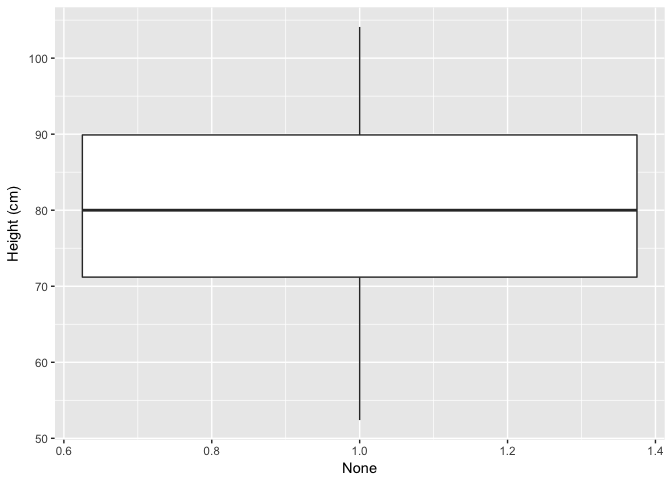
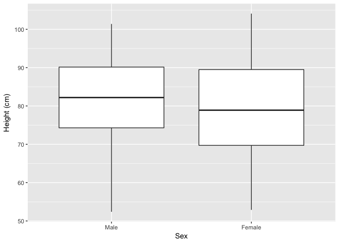

# Building Data Visualization Tools (Part 1)
Pier Lorenzo Paracchini, 06.07.2017  


# Basic Plotting with R and ggplot2

Notes/ experiments related to the material presented in the "Building Data Visualization Tools" module of the "[Mastering Software Development in R](https://www.coursera.org/specializations/r)" Specialization (Coursera) created by __Johns Hopkins University__. 

## Introduction

Visualization remains one of the most powerful ways to draw conclusions from data, visualize patterns present in the data. Visualization has an important role when performing EDA and when presenting findings/ conclusions in a report/ presentation/ pubblication.

## The Data

Datasets used in the following examples are:

* __Titanic__ dataset (`titanic` package), information on the survival of passengers on the ‘Titanic’, with information to economic status (class), sex, age and survival (see `?Titanic` for more information),
* __worldcup__ dataset (`faraway` package), information about footbal players from the 2010 World Cup (see `?worldcup` for more information)
* __nepali__ dataset (`faraway` package), information collected from a public health study on Nepalese children (see `?nepali` for more information)

__How to install the packages...__  


```r
install.packages("titanic") #for the Titanic dataset
install.packages("faraway") #for the worldcup/ nepali dataset
```

__How to load the datasets...__  


```r
require(titanic)
require(faraway)

data("titanic_train", package="titanic") 
titanic <- titanic_train
data("worldcup") 
data("nepali")
```


## Plotting with `ggplot2` package

The `ggplot2` package allows to create __useful__ & __attractive__ graphics that can be used to explore and visualize the data withing different context, e.g. EDA and final reports/ data products. __Useful__ graphics are mainly used when performing exploratory data analysis, while __attractive__ graphics are used within the final data products. The `dplyr` package is used for manipulating the datasets.

__How to install the packages...__  


```r
install.packages("ggplot2", dependencies = TRUE)
install.packages("dplyr")
```

__Remember to load the packages before actually using them...__ 


```r
require(dplyr)
require(ggplot2)
```


### Basic Plotting: creating basic graphs

In order to create a basic plot using `ggplot2`

* create an object of the `ggplot` class
    * the __canvas__ of the plot
* add on __geoms__ and other elements to __create__ and __customize__ the plot (using a layering approach)

#### How to create the canvas...

The `ggplot2::ggplot` function is used to create an empty canvas, to construct the initial plot object and provide some initial settings for the plot/ graph. From the _R Documentation_ 

    `ggplot() initializes a ggplot object. It can be used to declare the input data frame for a graphic and to specify the set of plot aesthetics intended to be common throughout all subsequent layers unless specifically overridden.` R Documentation

The `data` argument is used to provide the __default dataframe__ that will be used for the graph/ plot, while the `mapping` argument is used to provide the __default list of aesthetic mappings__ to use for plot. 

__Aesthetics__ are properties of the plot linked to certain elements in the dataframe or a value (__constant aesthetic__). __The aesthetics required for a plot depends on the type__ of __geoms__ used for the plot, some aesthetics are mandatory others are optional. More information about aesthetics can be found in the R documentation for each __geom__ (see `?geom_bar` as example).

Common aesthetics are:

* `x`, the position on the x-axis
* `y`, the position on the y-axis
* `shape`, shape
* `color`, the color of border of elements
* `fill`, the color of inside of elements
* `size`, size

The default settings of the canvas, `data` and `mapping` arguments, are moved done to the added layers/ __geoms__ and, can be overwritten at the __geom__ level.

```
# PSEUDO CODE
# Create the empty canvas
# No default data/ mapping have been provided
ggplot()

# Create the empty canvas
# With a default dataframe and dataframe/mapping
ggplot(data = dataframe)
ggplot(data = dataframe, mapping = aes(x = col_a, y = col_b))
```

#### How to create basic plots...

__Example__

Visualize the distribution of `Fare` (Passenger Fare) in the `titanic` dataset__. The plot uses the `geom_histogram()`function to visualise the distribution of a single continuous variable by dividing the x-axis into bins and counting the number of observations in each bin. 


```r
#Mapping aesthetics x to the Fare column (default setting)
#The default setting is inherither by the geom_*** functions
#if not overridden
ggplot(data = titanic, mapping = aes(x = Fare)) +
    geom_histogram(binwidth = 5)
```

<!-- -->

Adding the `Sex` dimension in the visualization using the `fill` aesthetic...


```r
#Adding the fill aesthetic 
ggplot(data = titanic, mapping = aes(x = Fare, fill = Sex)) +
    geom_histogram(binwidth = 5)
```

<!-- -->

__Example__

Visualize the distribution of `Survived` in the `titanic` dataset.


```r
#Transforming into a factor
titanic$Survived <- as.factor(titanic$Survived)
ggplot(data = titanic, mapping = aes(x = Survived)) +
    geom_bar()
```

<!-- -->

Adding the `Sex` dimension ...


```r
#Transforming into a factor
titanic$Sex <- as.factor(titanic$Sex)
ggplot(data = titanic, mapping = aes(x = Survived, fill = Sex)) +
    geom_bar()
```

<!-- -->

__Example__

Visualize how many passes football players have done vs. the actual playing time in World Cup 2010. The plot uses the `geom_point()` function to create the __scatterplot__.


```r
ggplot(data = worldcup, mapping = aes(x = Time, y = Passes)) +
    geom_point()
```

<!-- -->

Using the `color` aesthetic is possible to add more information in the plot, for example the role/ position of each football player...


```r
ggplot(data = worldcup, mapping = aes(x = Time, y = Passes, color = Position)) +
    geom_point()
```

<!-- -->

#### How to create more sophisticated plots...

The creation of sophisticated plot is done using multiple __geoms__. Several __geoms__ can be added on top of the same __canvas__, adding up new visual information layer by layer.

Each layer can use the default `data` and `mapping` settings, the ones provided in the `ggplot(....)`, or it can overwrite such settings using a new dataset and different aesthetics.

__Example__

Visualize passes vs. shots football players have done during the Wordl Cup 2010, adding labels for noteworthy players.


```r
#Identify the noteworthy players 
#noteworthy player is a player having the max number of shots or passes done
#during the world cup. A new dataset is created with limited content
#specifically Shots and Passes (from the original dataset) and a new
#feature point_label (the text to be added to the plot)

#(filter) get the players where Shots == max(Shots) or Passes == max(Passes)
#add a new feature "point_label" with the relevant label

noteworthy_players <- worldcup %>% 
    filter(Shots == max(Shots) | Passes == max(Passes)) %>%
    mutate(point_label = paste(Team, Position, sep =", "))

#Create the canvas using the worldcup dataset
#and mapping aesthetic x to Passes, and y to Shots
#(layer) create a scatterplot using the default aesthetics x and y
#(layer) (geom_text) add the labels using noteworthy_player as a new dataset
#       using the default aesthetic for x and y, setting aesthetic label to
#       point_label

ggplot(data = worldcup, mapping = aes(x = Passes, y = Shots)) +
    geom_point() +
    geom_text(data = noteworthy_players, mapping = aes(label = point_label), vjust = "inward", hjust = "inward")
```

<!-- -->

When creating more sophisticated plots, there are also a number of elements, other than __geoms__, that can be added to a plot like:

* `ggtitle()`, adding a plot title
* `xlab()`, `ylab()`, add a lable on an axis
* `xlim()`, `ylim()`, limit the value range for an axis


#### Some Other Examples...


```r
#Data preparation/ transformation
#select id, sex, weight, height and age
#transform id and sex into factor
#a child (identified by a unique ID) can have multiple observation
#keep only the first observation (and all of the other data)
data(nepali)
nepali <- nepali %>%
    select(id,sex,wt,ht,age) %>%
    mutate(id = factor(id),
           sex = factor(sex, 
                        levels = c(1,2), 
                        labels = c("Male", "Female"))) %>%
    distinct(id, .keep_all = TRUE)

head(nepali,2)
##       id    sex   wt    ht age
## 1 120011   Male 12.8  91.2  41
## 2 120012 Female 14.9 103.9  57
```


```r
#Heigth distribution
ggplot(data = nepali, mapping = aes(x = ht)) +
    geom_histogram(fill = "lightblue", color = "red") +
    ggtitle("Height of children") +
    xlab("cm") + xlim(c(0,120))
## `stat_bin()` using `bins = 30`. Pick better value with `binwidth`.
## Warning: Removed 15 rows containing non-finite values (stat_bin).
```

<!-- -->


```r
#Heigth vs. Weight plot
ggplot(data = nepali, mapping = aes(x = ht, y = wt)) +
    geom_point(color = "blue", size = 0.5) +
    ggtitle("Weight vs. Height") +
    xlab("cm") + ylab("kg")
## Warning: Removed 15 rows containing missing values (geom_point).
```

<!-- -->

```r

#Heigth vs. Weight plot adding the Sex dimension
ggplot(data = nepali, mapping = aes(x = ht, y = wt, color = sex)) +
    geom_point(size = 0.5) +
    ggtitle("Weight vs. Height") +
    xlab("cm") + ylab("kg")
## Warning: Removed 15 rows containing missing values (geom_point).
```

<!-- -->


```r
#Height Boxplot
#Note how x has been set to 1 in order to use all of the observations within
#the same boxplot
ggplot(data = nepali, mapping = aes(x = 1, y = ht)) +
    geom_boxplot() +
    xlab("None") + ylab("Height (cm)")
## Warning: Removed 15 rows containing non-finite values (stat_boxplot).
```

<!-- -->

```r

#Adding the sex dimension..
ggplot(data = nepali, mapping = aes(x = sex, y = ht)) +
    geom_boxplot() +
    xlab("Sex") + ylab("Height (cm)")
## Warning: Removed 15 rows containing non-finite values (stat_boxplot).
```

<!-- -->

## `ggplot2` extensions 

There are some packages that extend the `ggplot2` package and allow to create interesting plots. An example the `GGally` package and the `ggpairs()` function for the creation of a matrix of plots based on the given dataset.


```r
#How to install the package
#install.packages("GGally")
library(GGally)
ggpairs(nepali %>% select(sex, wt, ht, age))
```

<!-- -->

More examples can be found at [http://www.ggplot2-exts.org/](http://www.ggplot2-exts.org/).

## References

* Chapter 4, "[Mastering Software Development in R](https://bookdown.org/rdpeng/RProgDA/building-data-visualization-tools.html)" book by Roger D. Peng, Sean Kross, and Brooke Anderson
 
