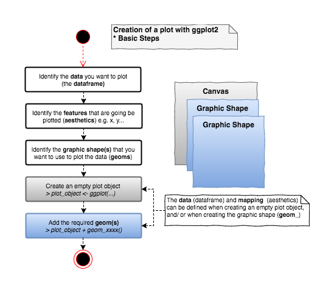
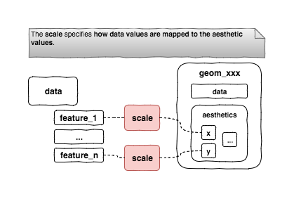
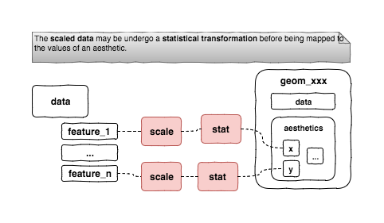

```{r setup, include=FALSE}
knitr::opts_chunk$set(echo = TRUE, warning = FALSE, message = FALSE, collapse = TRUE)
library(gridExtra)
library(ggplot2)
require(datasets)
require(faraway)
data("worldcup") 

```

The `ggplot2` package is described as _"a system for 'declaratively' creating graphics based on 'The Grammar of Grapics'_ [CRAN](https://cran.r-project.org/web/packages/ggplot2/index.html). 

The `ggplot2` package represents a __complete graphic system__ completely separated, and uncompatible, from the traditional `graphic` package in R. The `ggplot2` is built on the `grid` package, it provides high level functions to generate complete plots within the __grid__ world.

<!-- -->

The `ggplot2`package is not part of the standard R installation so it must be first installed and then loaded into R

```
#Install
install.packages("ggplot2")
#Load
library(ggplot2)
```

## The `ggplot2` graphics model

The `ggplot2`package provides a __set of functions__ that can be used to __create simple graphic components__, like __lego blocks__, that __can be combined to create complete plots__.

The essential steps to create a plot are:

<!-- -->

__An example of a basic plot__...

```{r basicExample}
# using the mtcars dataset in the 'datasets' package
# Data was extracted from rom the 1974 Motor Trend US magazine, 
# includes fuel consumption and 10 aspects of automobile design 
# and performance for 32 automobiles (1973–74 models).
#?mtcars #for more information

# Suppose that we want to visualize how the consuption changes 
# based on the weight -> Plotting the Miles/ per gallon 
# vs. weight

# when creating the plot object information about the data and 
# mappings (aesthetic) is provided. These setting will be the
# default settings for the other components (geom_) added to the
# plot
plot_object <- ggplot(data = mtcars, mapping = aes(y = mpg, x = wt))
# geom_point does not need to specify the data and mapping because
# it has already specified at the plot object level (note they can
# be overwritten at the geom_ level)
plot_object + geom_point()
```

Some essential concepts to understand when working with `ggplot2` are

* geoms & aesthetics,
* scales,
* statistical transformations,
* the `group` aesthetic
* position adjustments,
* coordinate transformations,
* facets,
* themes, and
* annotating.

### Geoms and aesthetics

__Geoms__ and __aesthetics__ help to specify what sort of graph will be used in the plot and some more details about the graph. Specifically, each __geom__ has a set of required and optional __aesthetics__ that are used to control the graphic shape. 

__Required aesthetics__ must be provided or an exception is going to be thrown when creating the plot. More information can be found in the R documentation for each specific __geom__  (see `?geom_xxxx`). __Geoms and aesthetics provides the basis for creating a wide variety of plots with ggplot2.__

<!-- -->

__Example__ if we want to create a scatterplot the `geom_point` must be used. From the R documentation we can see that this __geom__ understands the following __aesthetics__:

* x, y (mandatory), define what is going to be actually plotted on the x- y- axis
* alpha, colour, fill, group, shape, size, stroke (optional)

Using the __aesthetics__ we are able to __define__ & __customize__ the plot see the example below on how to create a plot and add more and more information to it.

```{r basicGeomAesthetics}
#shape needs to be mapped to a categorical value
#gear is categorical by nature
mtcars$gear <- factor(mtcars$gear)

plot_object <- ggplot(data = mtcars, mapping = aes(y = mpg, x = wt))
plot_11 <- plot_object + geom_point()
plot_12 <- plot_object + geom_point(aes(shape = gear))
plot_21 <- plot_object + geom_point(aes(colour = gear))
plot_22 <- plot_object + geom_point(aes(colour = gear, size = disp), alpha = 0.5)

gridExtra::grid.arrange(plot_11, plot_12, plot_21, plot_22, ncol = 2)
```

### Scales

Another important component in `ggplot2` if the __scale__ component. The __scale__ component allows to customize the axis and legends on plots.

Scales are normally automatically managed by `ggplot2` but sometimes we want to have more control in order to optimize our plot. `ggplot2` provides a number of different scale functions that can be used for this purpose, those functions follow the pattern below

```
# Pseudo-code
scale_[aesthetic]_[vector type]

# Some examples in ggplot2
# scale_x_continuous, scale_x_date, scale_x_datetime, scale_x_discrete
# scale_shape_continuous, scale_shape_discrete
...
```

<!-- -->

```{r basicScales}
plot_object <- ggplot(data = mtcars, mapping = aes(y = mpg, x = wt))
plot_11 <- plot_object + geom_point()

# scale_x_ and scale_y_ can be used to change the title
plot_12 <- plot_object + geom_point() +
  scale_x_continuous(name = "Weight (1000 lbs)") +
  scale_y_continuous(name = "Miles Per Gallon")

# scale_x_ and scale_y_ can also be used to control the range of the axis
plot_21 <- plot_object + geom_point() +
  scale_x_continuous(limits = c(0,10)) + 
  scale_y_continuous(limits = c(0,100))

# scale_color_manual can be used to control "manually" your own color sets
plot_22 <- plot_object + geom_point(aes(colour = gear)) +
  scale_color_manual(values = c("blue", "red", "yellow"))

gridExtra::grid.arrange(plot_11, plot_12, plot_21, plot_22, ncol = 2)
```

Some more examples ...

```{r scaleExample1}
plot_object <- ggplot(data = worldcup, mapping = aes(x = Time, y = Passes, color = Position, size = Shots))
plot_basic <- plot_object + geom_point(alpha = 0.5)

# using the scale_ functions to change some x-axis settings
# the title
# and breaks
plot_scale_x <- plot_basic +
  scale_x_continuous(name = "Time Played (mins)",
                     breaks = 90 * c(2,4,6),
                     minor_breaks = 90 * c(1,3,5))

gridExtra::grid.arrange(plot_basic, plot_scale_x, ncol = 2)
```

```{r scaleExample2}
# Customizing the size aesthetic, specifically
# the title
# the breaks used
plot_scale_size <- plot_scale_x +
  scale_size_continuous(name = "Shots on goal",
                        breaks = c(0,10,20,30))

gridExtra::grid.arrange(plot_basic, plot_scale_size, ncol = 2)
```

### Statistical Transformations (stat)

Every __geom__ has a __stat__ associated to it and every __stat__ has a __geom__ associated to it (see `?geom_xxxx`). A __stat__ defines a transformation to be used on the data before being mapped to aesthetics.

<!-- -->

Some examples  

  * the `geom_point` has the `stat = "identity"` associated to it (default setting),
      * the `stat_identity` is a special transformation that leaves the data unchanged, the data values are mapped directly to the aesthetics (without any actual transformation)
  * the `geom_bar` has the `stat = "count"` associated to it (default setting),
      * the `stat_count` is a transformation that counts the number of cases at each x position
  * the `geom_smooth`has the `stat = 'smooth'` associated to it (default setting),
      * the `stat_smooth` is a transformation that iads to see patterns in the plot.

```{r basicStaticTransformation}
plot_object <- ggplot(data = mtcars)
# example using the geom_point (and the stat_identity)
plot_11 <- plot_object + geom_point(mapping = aes(y = mpg, x = wt))

# example using the geom_bar (and the stat_count)
plot_12 <- plot_object + 
  geom_bar(mapping = aes(x = factor(am)))

# example using the geom_smooth (and the stat_smooth)
plot_21 <- plot_object + geom_smooth(mapping = aes(y = mpg, x = wt))

# example using explicitly the stat_smooth (and the geom_smooth)
plot_22 <- plot_object + stat_smooth(mapping = aes(y = mpg, x = wt))

gridExtra::grid.arrange(plot_11, plot_12, plot_21, plot_22, ncol = 2)
```

It is also possible to use explicitly the __stat__ component instead of the __geom__, this works because __stat__ components automatically have a geom associated with them. The advantage of using directly the  __stat__ component is that parameters of the stat can be specified clearly as part of the stat (not possible when using the __geom__).

```{r basicStaticTransformation_ext}
plot_object <- ggplot(data = mtcars)
# example using explicitly the stat_smooth (and the geom_smooth)
plot_11 <- plot_object + stat_smooth(mapping = aes(y = mpg, x = wt))

# example using explicitly the stat_smooth (and the geom_smooth)
# setting explicitly the method we want to use
plot_12 <- plot_object + stat_smooth(mapping = aes(y = mpg, x = wt), method = "lm")

gridExtra::grid.arrange(plot_11, plot_12, ncol = 2)
```

### The `group` aesthetic

`ggplot2` automatically handles plotting of multiple groups of data using the `shape`, `color`, ... aesthetics. Sometimes it would be useful to be able to explicitly force a grouping for a plot. This can be achieved via the `group` aesthetic.

```{r groupAesthetic}
plot_object <- ggplot(data = mtcars, mapping = aes(y = mpg, x = wt))
plot_object + geom_point() +
  geom_smooth(mapping = aes(group = am))
```

### Position Adjustment

`ggplot2` often handles automatically how to arrage overlapping __geoms__. The __position adjustment__ can be controlled using the `position` argument for the __geom__ (see example below).

```{r positionAdjustment}
plot_object <- ggplot(data = mtcars, mapping = aes(x = factor(am), fill = factor(cyl)))
plot_1 <- plot_object + geom_bar(color = "black") + ggtitle("stack") #default position is stack
plot_2 <- plot_object + geom_bar(color = "black", position = "dodge") + ggtitle("dodge")
plot_3 <- plot_object + geom_bar(color = "black", position = "fill") + ggtitle("fill")
grid.arrange(plot_1, plot_2, plot_3, ncol = 3, layout_matrix = rbind(c(NA,1,NA), c(2,NA,3)))
```
