# Building Data Visualization Tools (Part 2)
Pier Lorenzo Paracchini, 14.07.2017  


#

The content of this blog is based on notes/ experiments related to the material presented in the "Building Data Visualization Tools" module of the "[Mastering Software Development in R](https://www.coursera.org/specializations/r)" Specialization (Coursera) created by __Johns Hopkins University__ [1] and _"chapter 5: The Grammar of Graphics: The ggplot2 Package"_ of [2].

## 'ggplot2' package, essential concepts

The `ggplot2` package is described as "a system for 'declaratively' creating graphics based on 'The Grammar of Grapics'" [CRAN](https://cran.r-project.org/web/packages/ggplot2/index.html). It represents a __complete graphic system__ completely separated, and uncompatible, from the traditional `graphic` package in R. Actually the `ggplot2` is built on the `grid` package and provides high level functions to generate complete plots within the __grid__ world.

<!-- -->

The `ggplot2`package is not part of the standard R installation so it must be first installed and then loaded into R...

```
#Install
install.packages("ggplot2")
#Load
library(ggplot2)
```

## The `ggplot2` Graphics Model

The `ggplot2`package provides a __set of components__ that can be used to __create simple graphic components__, like __lego blocks__, that __can be combined to create complete and complex plots__.

The essential steps to create a plot are:

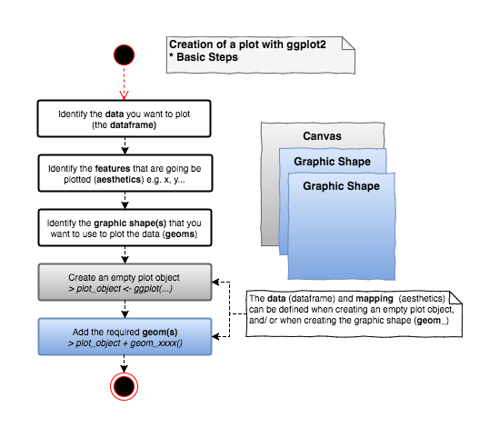<!-- -->

__An example of a basic plot__...


```r
# Using the mtcars dataset in the 'datasets' package
# Data was extracted from 1974 Motor Trend US magazine, 
# includes fuel consumption and 10 aspects of automobile design 
# and performance for 32 automobiles (1973–74 models).
#?mtcars #use for more information

# Suppose that we want to visualize how the consuption changes 
# based on the weight -> Plotting the Miles/ per gallon 
# vs. weight

# when creating the plot object information about the data and 
# mappings (aesthetic) is provided. These setting will be the
# default settings for the other components (geom_) added to the
# plot
plot_object <- ggplot(data = mtcars, mapping = aes(y = mpg, x = wt)) + ggtitle("Basic example")
# geom_point does not need to specify the data and mapping because
# it has already specified at the plot object level (note they can
# be overwritten at the geom_ level)
plot_object + geom_point()
```

<!-- -->

Some __essential concepts__ to master when working with `ggplot2` are

* _geoms & aesthetics_,
* _scales_,
* _statistical transformations_,
* _coordinate transformations_.
* _the `group` aesthetic_,
* _position adjustments_,
* _facets_,
* _themes_.

### Geoms and aesthetics

__Geoms__ help to specify what sort of graph (type of graph) will be used in the plot, while __aesthetics__ help to add some more low level details about the graph. 

Specifically, each __geom__ has a set of __required__ and __optional__ __aesthetics__ that are used to control the specific parts of the graph. __Required aesthetics__ must be provided or an exception is going to be thrown when creating the plot. For each specific __geom__ more information can be found in the R documentation (see `?geom_xxxx`). __Geoms and aesthetics provides the basis for creating a wide variety of plots with ggplot2.__

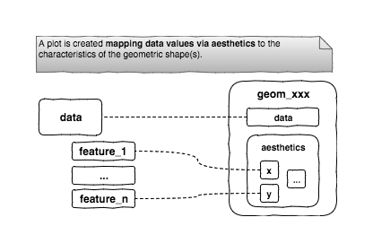<!-- -->

For example, if we want to create a __scatterplot__ the `geom_point` __geom__ must be used. From the R documentation this __geom__ understands the following __aesthetics__:

* x, y (__mandatory__), define what is going to be actually plotted on the x- y- axis,
* alpha, colour, fill, group, shape, size, stroke (__optional__).

Using the __aesthetics__ we are able to __define__ & __customize__ the plot adding more and more information to it (see example below).


```r
#shape needs to be mapped to a categorical value
#gear is categorical by nature
mtcars$gear <- factor(mtcars$gear)

plot_object <- ggplot(data = mtcars, mapping = aes(y = mpg, x = wt))
plot_11 <- plot_object + geom_point() + ggtitle("plot_11")
plot_12 <- plot_object + geom_point(aes(shape = gear)) + ggtitle("plot_12")
plot_21 <- plot_object + geom_point(aes(colour = gear)) + ggtitle("plot_21")
plot_22 <- plot_object + geom_point(aes(colour = gear, size = disp), alpha = 0.5) + ggtitle("plot_22")

gridExtra::grid.arrange(plot_11, plot_12, plot_21, plot_22, ncol = 2)
```

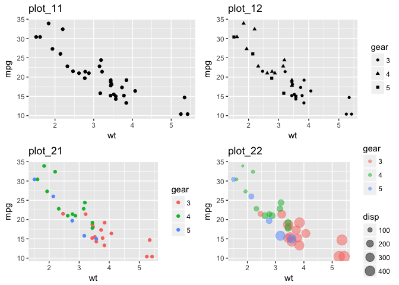<!-- -->

### Scales

Another important component in `ggplot2` is the __scale__ component. The __scale__ component allows to customize the axis and legends information on plots. __Scales are normally automatically managed by `ggplot2`__ but sometimes more control is needed in order to optimize our plot. `ggplot2` provides a number of different scale functions that can be used for this purpose, those functions follow the following naming-pattern

```
# Pseudo-code
scale_[aesthetic]_[vector type]

# Some examples in ggplot2
# scale_x_continuous, scale_x_date, scale_x_datetime, scale_x_discrete
# scale_shape_continuous, scale_shape_discrete
...
```

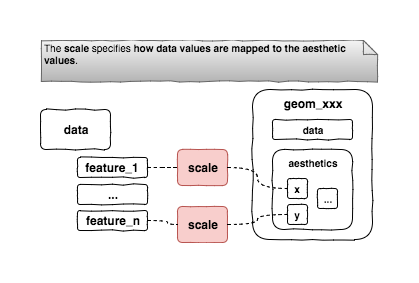<!-- -->


```r
plot_object <- ggplot(data = mtcars, mapping = aes(y = mpg, x = wt))
plot_11 <- plot_object + geom_point() + ggtitle("plot_11")

# scale_x_ and scale_y_ can be used to change the title
plot_12 <- plot_object + geom_point() +
  scale_x_continuous(name = "Weight (1000 lbs)") +
  scale_y_continuous(name = "Miles Per Gallon") + ggtitle("plot_12")

# scale_x_ and scale_y_ can also be used to control the range of the axis
plot_21 <- plot_object + geom_point() +
  scale_x_continuous(limits = c(0,10)) + 
  scale_y_continuous(limits = c(0,100)) + ggtitle("plot_21")

# scale_color_manual can be used to control "manually" your own color sets
plot_22 <- plot_object + geom_point(aes(colour = gear)) +
  scale_color_manual(values = c("blue", "red", "yellow")) + ggtitle("plot_22")

gridExtra::grid.arrange(plot_11, plot_12, plot_21, plot_22, ncol = 2)
```

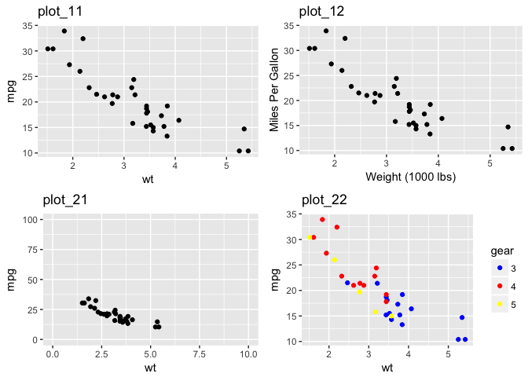<!-- -->

Some more examples ...


```r
plot_object <- ggplot(data = worldcup, mapping = aes(x = Time, y = Passes, color = Position, size = Shots))
plot_basic <- plot_object + geom_point(alpha = 0.5) + ggtitle("plot_basic")

# using the scale_ functions to change some x-axis settings
# the title
# and breaks
plot_scale_x <- plot_basic +
  scale_x_continuous(name = "Time Played (mins)",
                     breaks = 90 * c(2,4,6),
                     minor_breaks = 90 * c(1,3,5)) + ggtitle("plot_scale_x")

gridExtra::grid.arrange(plot_basic, plot_scale_x, ncol = 2)
```

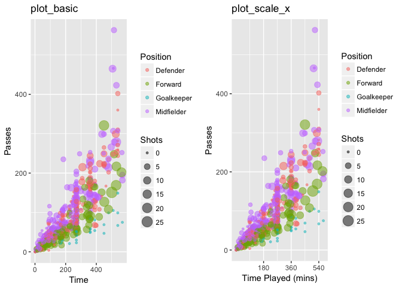<!-- -->


```r
# Customizing the size aesthetic, specifically
# the title
# the breaks used
plot_scale_size <- plot_scale_x +
  scale_size_continuous(name = "Shots on goal",
                        breaks = c(0,10,20,30)) + ggtitle("plot_scale_size")

gridExtra::grid.arrange(plot_basic, plot_scale_size, ncol = 2)
```

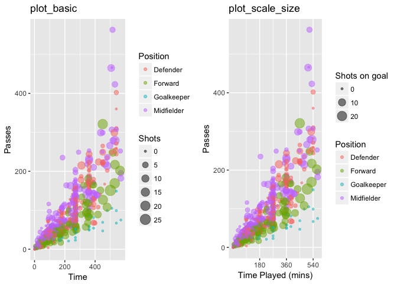<!-- -->

### Statistical Transformations

Every __geom__ has a __stat__ associated to it (default setting) and every __stat__ has a __geom__ associated to it (see `?geom_xxxx`). A __stat__ defines a __transformation to be used on the data before being mapped to aesthetics__.

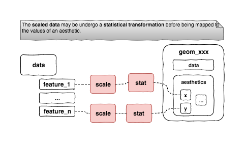<!-- -->

Some examples  

  * the `geom_point` has the `stat = "identity"` associated to it (default setting),
      * the `stat_identity` is a special transformation that leaves the data unchanged, the data values are mapped directly to the aesthetics (without any actual transformation)
  * the `geom_bar` has the `stat = "count"` associated to it (default setting),
      * the `stat_count` is a transformation that counts the number of cases at each x position
  * the `geom_smooth`has the `stat = 'smooth'` associated to it (default setting),
      * the `stat_smooth` is a transformation that iads to see patterns in the plot.


```r
plot_object <- ggplot(data = mtcars)
# example using the geom_point (and the stat_identity)
plot_11 <- plot_object + geom_point(mapping = aes(y = mpg, x = wt)) + ggtitle("plot_11")

# example using the geom_bar (and the stat_count)
plot_12 <- plot_object + 
  geom_bar(mapping = aes(x = factor(am))) + ggtitle("plot_12")

# example using the geom_smooth (and the stat_smooth)
plot_21 <- plot_object + geom_smooth(mapping = aes(y = mpg, x = wt)) + ggtitle("plot_21")

# example using explicitly the stat_smooth (and the geom_smooth)
plot_22 <- plot_object + stat_smooth(mapping = aes(y = mpg, x = wt)) + ggtitle("plot_22")

gridExtra::grid.arrange(plot_11, plot_12, plot_21, plot_22, ncol = 2)
```

<!-- -->

It is also __possible to use explicitly__ the __stat__ component __instead of__ the __geom__, this works because __stat__ components automatically have a geom associated with them. The advantage of using directly the  __stat__ component is that parameters of the stat can be specified clearly as part of the stat (not possible when using the __geom__).


```r
plot_object <- ggplot(data = mtcars)
# example using explicitly the stat_smooth (and the geom_smooth)
plot_11 <- plot_object + stat_smooth(mapping = aes(y = mpg, x = wt)) + ggtitle("plot_11")

# example using explicitly the stat_smooth (and the geom_smooth)
# setting explicitly the method we want to use
plot_12 <- plot_object + stat_smooth(mapping = aes(y = mpg, x = wt), method = "lm") + ggtitle("plot_12")

gridExtra::grid.arrange(plot_11, plot_12, ncol = 2)
```

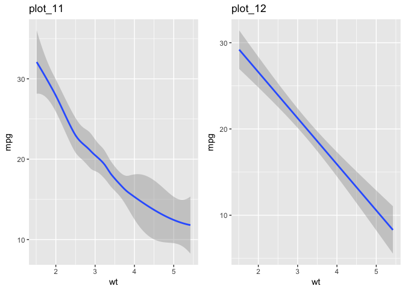<!-- -->

### Coordinate Transformations

Another type of transformation available in `ggplot2` is thhe __coordinate transformation__. There is a __coordinate system component__, by default set to a __simple linear cartesian coordinates__, that could be explicitly set to something else. The __peculiarity__ of this type of transformation is that it does __occur after the geoms have been created__ and __control how the graphs (geoms) are drawn on the screen__.  

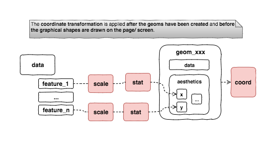<!-- -->


```r
plot_object <- ggplot(data = mtcars)

#Apply a log scale both on x and y
#logged data with linear axes
plot_11 <- plot_object + geom_point(mapping = aes(y = mpg, x = wt)) + 
  scale_x_continuous(trans = "log") +
  scale_y_continuous(trans = "log") +
  geom_line(mapping = aes(y = mpg, x = wt), stat = "smooth", method = "lm") +
  ggtitle("log data with linear axes")

#Apply an "exp" coordinate transformation to x & y 
#before actually plotting the graphs/ geoms
#logged data with exponential axes
plot_12 <- plot_11 +
  coord_trans(x = "exp", y = "exp") + ggtitle("log data with exponential axes")

gridExtra::grid.arrange(plot_11, plot_12, ncol = 2)
```

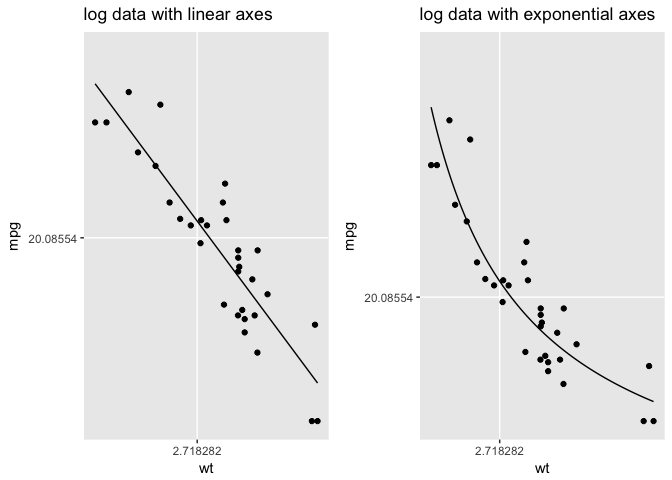<!-- -->

### The `group` aesthetic

`ggplot2` automatically handles plotting of multiple groups of data using the `shape`, `color`, ... aesthetics. Sometimes it would be useful to be able to explicitly force a grouping for a plot. This can be achieved via the `group` aesthetic.


```r
plot_object <- ggplot(data = mtcars, mapping = aes(y = mpg, x = wt))
plot_object + geom_point() +
  geom_smooth(mapping = aes(group = am))
```

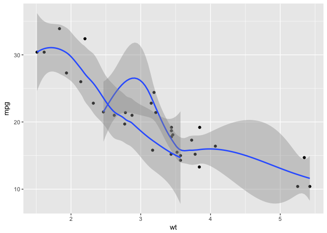<!-- -->

### Position Adjustment

`ggplot2` often handles automatically how to arrage overlapping __geoms__. The __position adjustment__ can be controlled using the `position` argument for the __geom__ (see example below).


```r
plot_object <- ggplot(data = mtcars, mapping = aes(x = factor(am), fill = factor(cyl)))
plot_1 <- plot_object + geom_bar(color = "black") + ggtitle("stack") #default position is stack
plot_2 <- plot_object + geom_bar(color = "black", position = "dodge") + ggtitle("dodge")
plot_3 <- plot_object + geom_bar(color = "black", position = "fill") + ggtitle("fill")
grid.arrange(plot_1, plot_2, plot_3, ncol = 3, layout_matrix = rbind(c(NA,1,NA), c(2,NA,3)))
```

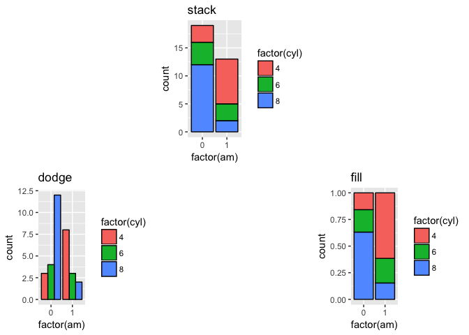<!-- -->

### Facets

__Facets__/ __faceting__ means to __break the data into several subsets__ and __create a separate plot for each subset__ (also known as __small multiples__). `ggplot2` provides two different functions fro creating __small multiples__: the `facet_grid()` and the `facet_wrap()` functions.

`facet_grid` forms a matrix of panels defined by row and column facetting variables, in other words the `fact_grid` can facet by one or (max) two variables.

```
#Pseudo code
facet_grid(facets = [factor for rows] ~ [factor for columns],....)
```


```r
plot_base  <- ggplot(data = mtcars, mapping = aes(x = disp, y = mpg)) + geom_point()
plot_1 <- plot_base + facet_grid(. ~ cyl) + ggtitle("plot_1") #only feature for columns
plot_2 <- plot_base + facet_grid(cyl ~ .) + ggtitle("plot_2") #only feature for rows
plot_3 <- plot_base + facet_grid(am ~ cyl) + ggtitle("plot_3") #both feature for rows & columns
grid.arrange(plot_1, plot_2, plot_3, ncol = 4, layout_matrix = rbind(c(1,1,2,2), c(3,3,3,3)))
```

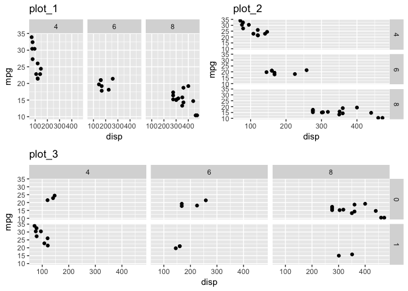<!-- -->

`facet_wrap` can facet by one or more variables and it wraps a 1-dimensiona sequence of panels into 2 dimension.
```
#Pseudo code
facet_wrap(facets = ~[formula with factor(s) for faceting], ncol = [number of columns],....)
```


```r
plot_base  <- ggplot(data = mtcars, mapping = aes(x = disp, y = mpg)) + geom_point()
#faceting by one variable
plot_1 <- plot_base + facet_wrap(~ cyl) + ggtitle("plot_1") 
#faceting by one variable controlling the no fo columns 
plot_2 <- plot_base + facet_wrap(~ cyl, ncol = 2) + ggtitle("plot_2")
#faceting by multi variables 
plot_3 <- plot_base + facet_grid(~ cyl + am) + ggtitle("plot_3") 
grid.arrange(plot_1, plot_2, plot_3, ncol = 4, layout_matrix = rbind(c(1,1,2,2), c(3,3,3,3)))
```

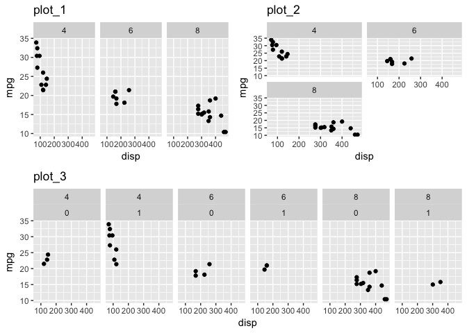<!-- -->

### Themes

In `ggplot2` there is a distinction between __data related__ and __non-data related__ elements. Specifically, __geoms__ are __data related elements__ while labels, lines used to create axes and legends, etc are __non-data related__ elements. 

The collection of graphical parameters that control __non-data related elements__ is called a _theme_. A _theme_ can be added as another component to a plot to change the appearance of graphical objects. A number of _theme_ functions are provided in `ggplot2` like `theme_bw()`, `theme_minimal()`, `theme_dark()`, `theme_classic()`, etc (see `?theme_bw` for more information) and more can be found in other packages like `ggthemes`.

A _theme_ controls all non-data display in a plot, a _theme_ is useful when standardization is necessary when plotting for all plots in the same report, publication, company, etc.


```r
plot_object <- ggplot(data = mtcars) + geom_point(mapping = aes(y = mpg, x = wt)) 
# example using the geom_point (and the stat_identity)
plot_theme_no <- plot_object + ggtitle("no theme")
plot_theme_void <- plot_object + ggtitle("theme void") + theme_void()
plot_theme_bw <- plot_object + ggtitle("theme bw") + theme_bw()
plot_theme_dark <- plot_object + ggtitle("theme dark") + theme_dark()

grid.arrange(plot_theme_no, plot_theme_void, plot_theme_bw, plot_theme_dark, ncol = 2)
```

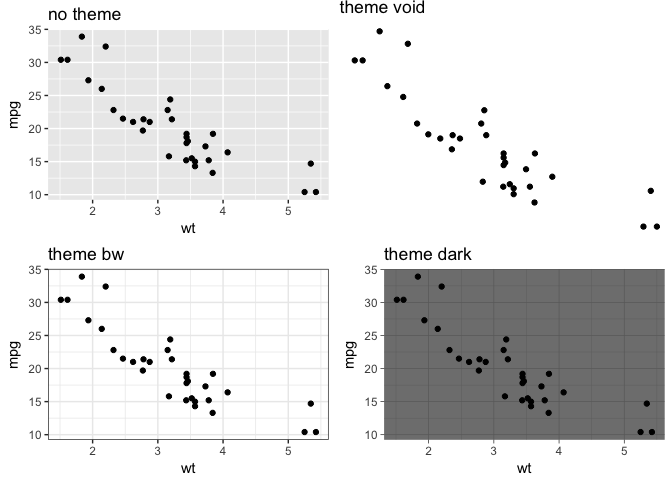<!-- -->

# References
[1] "[Mastering Software Development in R](https://bookdown.org/rdpeng/RProgDA/)" by Roger D. Peng, Sean Cross and Brooke Anderson, 2017  
[2] "[R Graphics, Second Edition](https://www.crcpress.com/R-Graphics-Second-Edition/Murrell/p/book/9781439831762)" by Paul Murrell, (2011) CRC Press  
[3] "[Building Data Visualization Tools (Part 1): basic plotting with R and ggplot2](https://pparacch.github.io/2017/07/06/plotting_in_R_ggplot2_part_1.html)" by Pier Lorenzo Paracchini


