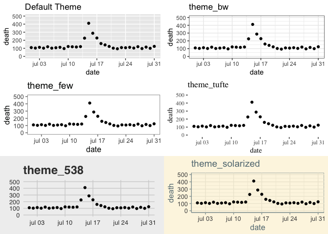
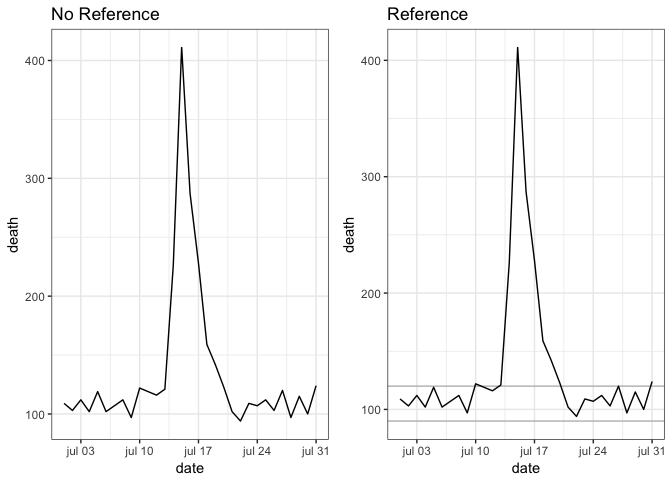

# Building Data Visualization Tools (Part 3)
Pier Lorenzo Paracchini, `r format(Sys.time(), '%d.%m.%Y')`  


The content of this blog is based on examples/ notes/ experiments related to the material presented in the "Building Data Visualization Tools" module of the "[Mastering Software Development in R](https://www.coursera.org/specializations/r)" Specialization (Coursera) created by __Johns Hopkins University__ [1].

__TODO__ __Packages used for running the examples__
```
library(ggplot2)
library(dplyr)
library(gridExtra)
library(ggthemes)
```

__TODO__ __Data used for the examples__


```r
# Data used for this example in chicagoNMMAPS
# contained in the dlnm package
# Daily Mortality Weather and Pollution Data for Chicago (dataset)
# ?chicagoNMMAPS #for more info about the data

#install.packages("dlnm")
library(dlnm)
data("chicagoNMMAPS") #?chicagoNMMAPS
chic <- chicagoNMMAPS
chic_july <- chic %>%
  filter(month == 7 & year == 1995)
```
## Data Visualization 

The main objective of a visualization is to tell a story with data, to tell an *interesting* and *engaging* story. Plots/ graphs can help to visualize what the data have to say.

Data is a representation of real life, data is the manifestation of specific behaviors/ events. There are stories and meanings behind the data. Sometimes those stories are simple and straighforward, other times they are complex and difficult to understand.

Data can be used to tell amazing stories, plots/graphics are one of the means that can be used to tell these stories or part of them. See examples below 

* [Examples of NASA graphics](http://flowingdata.com/?s=nytimes)
* [Examples of New York Times graphics](http://flowingdata.com/?s=nytimes)
* Data sings, a great example ["New Insights on poverty" by Hans Rosling, TED](https://www.ted.com/talks/hans_rosling_reveals_new_insights_on_poverty)

When exploring the data, there are two main things to look for: **patterns** and **relationships**. These are the things that good graphics/ plots tries to capture.

## Simple guidelines

There are six simple guidelines that can be used to create good graphics/ plots (based on the works of Edward Tufte, Howard Wainer, Stephen Few, Nathan Yau):

* 1\# Aim for high data density.
* 2\# Use clear and meaningful labels.
* 3\# Provide useful references.
* 4\# Highlight interesting aspect of the data.
* 5\# Use small multiples.
* 6\# Make order meaningful.

### 1\# Aim for high data density

  _'... try to increase, as much as possible, the **data to ink ratio** in your graph ... the ratio of "ink" providing information to all ink used in the figure ...'_ [1]

Increasing the **data to ink** ratio makes it easier for users to see the message in the data, see example below.


```r
base_plot <- ggplot(data = chic_july, mapping = aes(x = date, y = death)) + scale_y_continuous(limits = c(0, 500))

# Lower Data Density
plot_1 <- base_plot +
  geom_area(fill = "black") + ggtitle("Lower Data Density")

# Higher Data Density
plot_2 <- base_plot +
  geom_line() + ggtitle("Higher Data Density")

grid.arrange(plot_1, plot_2, ncol = 2)
```

<!-- -->

**Themes** can be used to manipulate the data density in a graphic/ plot, specifically increasing the data-to-ink ratio, see examples below.


```r
plot_1 <- base_plot +
  geom_point() + ggtitle("Default Theme")

plot_2 <- base_plot +
  geom_point() + ggtitle("theme_bw") + theme_bw()

plot_3 <- base_plot +
  geom_point() + ggtitle("theme_few") + theme_few()

plot_4 <- base_plot +
  geom_point() + ggtitle("theme_tufte") + theme_tufte()

plot_5 <- base_plot +
  geom_point() + ggtitle("theme_538") + theme_fivethirtyeight()

plot_6 <- base_plot +
  geom_point() + ggtitle("theme_solarized") + theme_solarized()

grid.arrange(plot_1, plot_2, plot_3, plot_4, plot_5, plot_6, ncol = 2)
```

<!-- -->

### 2\# Use clear and meaningful labels

The default behavior of `ggplot2` is to use the column names as labels for the x- and y-axis. This behavior is acceptable when performing __EDA__, but it is not adequate for graphics/ plots used within reports, presentations, papers. Labels should be clear and meaningful.

Strategies that can be used to make labels clearer and meaningful:

* use `xlab`, `ylab` functions to customize your labels (alternatively e.g. `scale_x_continuous`).
* Include units of measures and scales in your labels when relevant.
* Change the values of categorical data to meaningful values. 

### 3\# Provide useful references

  _'Data is easier to interpret when you add references ...."_


```r
base_plot <- ggplot(data = chic_july, mapping = aes(x = date, y = death))

# Lower Data Density
plot_1 <- base_plot +
  geom_line() + theme_bw() + ggtitle("No Reference")

# Higher Data Density
plot_2 <- base_plot +
  geom_hline(yintercept = 120, color = "gray") +  
  geom_hline(yintercept = 90, color = "gray")  +
  geom_line() + theme_bw() + 
  ggtitle("Reference")

grid.arrange(plot_1, plot_2, ncol = 2)
```

<!-- -->

Strategies to add references to a graphic/ plot:

* Add a linear or smooth fit to the data using `geom_smooth`function.
* Using lines and polygons to add references
    * `geom_hline` and `geom_vline`,to add horizontal or vertical lines
    * `geom_abline`, to add a line with an intercept and slope
    * `geom_polygon`, to add a filled polygon
    * `geom_path`, to add an unfilled polygon.
* Add the reference elements first, so teh data will be plotted on top of it.
* Use `alpha` to add transparency to the reference elements.
* Use colors that are not attracting attention.

-----------------------


Remember to question what you see, "Does it make sense?". Data checking and verification is one of the most important task when looking for stories in the data.


### Some guidelines

* (explicitly) explain encodings used in the visualization - What does these circles, bars and colors represent?
* label your axes - What are they about? Is it logarithmic, exponential,...?
* keep the geometry in check - Are you using rectangles properly in a bar plot? Does elements in a pie chart sum up t0 100%?
* include your sources, give the data some context - Where does your data come from?
* consider your audience and the purpose of the plot/ graphic

This is an R Markdown document. Markdown is a simple formatting syntax for authoring HTML, PDF, and MS Word documents. For more details on using R Markdown see <http://rmarkdown.rstudio.com>.

When you click the **Knit** button a document will be generated that includes both content as well as the output of any embedded R code chunks within the document. You can embed an R code chunk like this:


```r
summary(cars)
##      speed           dist       
##  Min.   : 4.0   Min.   :  2.00  
##  1st Qu.:12.0   1st Qu.: 26.00  
##  Median :15.0   Median : 36.00  
##  Mean   :15.4   Mean   : 42.98  
##  3rd Qu.:19.0   3rd Qu.: 56.00  
##  Max.   :25.0   Max.   :120.00
```

## Including Plots

You can also embed plots, for example:

<!-- -->

Note that the `echo = FALSE` parameter was added to the code chunk to prevent printing of the R code that generated the plot.

# References
[1] "[Mastering Software Development in R](https://bookdown.org/rdpeng/RProgDA/)" by Roger D. Peng, Sean Cross and Brooke Anderson, 2017  
[4] "[Building Data Visualization Tools (Part 1): basic plotting with R and ggplot2](https://pparacch.github.io/2017/07/06/plotting_in_R_ggplot2_part_1.html)" by Pier Lorenzo Paracchini  
[5] "[Building Data Visualization Tools (Part 2): 'ggplot2', essential concepts](https://pparacch.github.io/2017/07/14/plotting_in_R_ggplot2_part_2.html)" by Pier Lorenzo Paracchini

