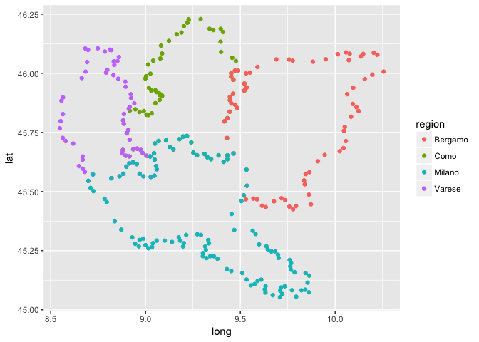
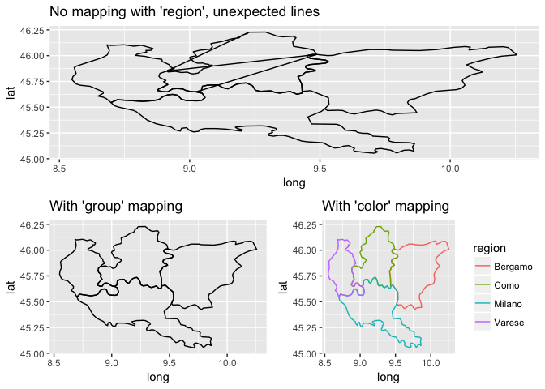

# Building Data Visualization Tools (Part 3)
Pier Lorenzo Paracchini, `r format(Sys.time(), '%d.%m.%Y')`  


The content of this blog is based on examples/ notes/ experiments related to the material presented in the "Building Data Visualization Tools" module of the "[Mastering Software Development in R](https://www.coursera.org/specializations/r)" Specialization (Coursera) created by __Johns Hopkins University__ [1].

## Setting up

### Required Packages

* `ggplot2` .....

__Packages used for running the examples...__


```r
# If necessary to install a package run
# install.packages("packageName")

# Load packages
library(ggplot2)
library(gridExtra)
library(dplyr)
```

### Data

The `ggplot2` package includes some datasets with geographic information, the `ggplot2::map_data()` function allows to get data from the `maps` package as a data frame suitable for plotting (use `?map_data` form more information):


```r
italy_map <- ggplot2::map_data(map = "italy")
italy_map_subset <- italy_map %>%
  filter(region %in% c("Bergamo" , "Como", "Lecco", "Milano", "Varese")) %>%
  arrange(group, order)

usa_state_map <- ggplot2::map_data(map = "state") 
```

The dataframe contains a set of observations, the points on the map for the selected `map`. Each observation defines a geographical point with some extra information:

* `long` & `lat`, longitude and latitude of the geographical point
* `group`, the specific polygon
    * a map can be made of different polygons (e.g. one polygon for the main land and one for each islands, one polygon for each state, ...)  
* `order`, the order of the point within the specific `group`
    * how the all of the points being part of the same `group` should be connected in order to create the polygon  
* `region`, the name of the province (Italy) or state (USA)
    * for Italy `region` is based on outdated data (1989), more regions than 
    


```r
head(italy_map, 3)
##       long      lat group order        region subregion
## 1 11.83295 46.50011     1     1 Bolzano-Bozen      <NA>
## 2 11.81089 46.52784     1     2 Bolzano-Bozen      <NA>
## 3 11.73068 46.51890     1     3 Bolzano-Bozen      <NA>
```


```r
head(usa_state_map, 3)
##        long      lat group order  region subregion
## 1 -87.46201 30.38968     1     1 alabama      <NA>
## 2 -87.48493 30.37249     1     2 alabama      <NA>
## 3 -87.52503 30.37249     1     3 alabama      <NA>
```

## Working with maps 

Having spatial information in the data gives the opportunity to map the data, in other words __visualizing the information contained in the data in a geographical context__. R has different possibilities to map data, from normal plots using **longitude**/ **latitude** as `x`/ `y` to more complex spatial data objects (e.g. shapefiles).

### Maps with `ggplot2`

The most basic way to create maps with your data is to use `ggplot2`, create a ggplot object and then, add a specific geom mapping the **longitute** to the `x` aesthetic and the **latitude** to the `y` aesthetic. This simple approach can be used to create:

* maps of geographical areas (states, country, etc.)  
* map locations as points, lines, etc.

__Create a map showing "Bergamo", Como", "Varese" and "Milano" provinces in Italy using simple points...__

When plotting simple points the `geom_point` function is used. In this case the polygon and order of the points is not important when plotting.


```r
italy_map_subset %>%
  ggplot(aes(x = long, y = lat)) +
  geom_point(aes(color = region))
```

<!-- -->

__Create a map showing "Bergamo", Como", "Varese" and "Milano" provinces in Italy using lines...__

The `geom_path` function is used  to create such plots From the R documentation, it _"... connects the observation in the order in which they appear in the data"_. When plotting using `geom_path` is important to consider the polygon and the order within the polygon for each point in the map. 

The points in the dataset are grouped by `region` and ordered by `order`. If information about the region is not provided then the order of the observations will be the order used to connect the point and, for this reason, "unexpected" lines will be drawn when moving from a `region` to the other; using the `group` or `color` aesthetic and mapping it to `region` helps removing the "unexpected" lines  (see example below). 


```r
plot_1 <- italy_map_subset %>%
  ggplot(aes(x = long, y = lat)) +
  geom_path() +
  ggtitle("No group mapping")

plot_2 <- italy_map_subset %>%
  ggplot(aes(x = long, y = lat)) +
  geom_path(aes(group = region)) +
  ggtitle("With group mapping")

plot_3 <- italy_map_subset %>%
  ggplot(aes(x = long, y = lat)) +
  geom_path(aes(color = region)) +
  ggtitle("With color mapping")

grid.arrange(plot_1, plot_2, plot_3, ncol = 2, layout_matrix = rbind(c(1,1), c(2,3)))
```

<!-- -->


### Maps with `ggmap`, Google Maps API

TO BE DEFINED

### Maps using spatial objects in R 

TO BE DEFINED


## More on mapping

TO BE DEFINED

# References

[1] "Mapping" chapter in "[Mastering Software Development in R](https://bookdown.org/rdpeng/RProgDA/mapping.html/)" by Roger D. Peng, Sean Cross and Brooke Anderson, 2017  


## Previous "Building Data Visualization Tools" blogs

[2] "[Basic plotting with R and ggplot2](https://pparacch.github.io/2017/07/06/plotting_in_R_ggplot2_part_1.html)", Part 1  
[3] "['ggplot2', essential concepts](https://pparacch.github.io/2017/07/14/plotting_in_R_ggplot2_part_2.html)", Part 2  
[3] "[Guidelines for good plots](https://pparacch.github.io/2017/07/18/plotting_in_R_ggplot2_part_3.html)", Part 3

