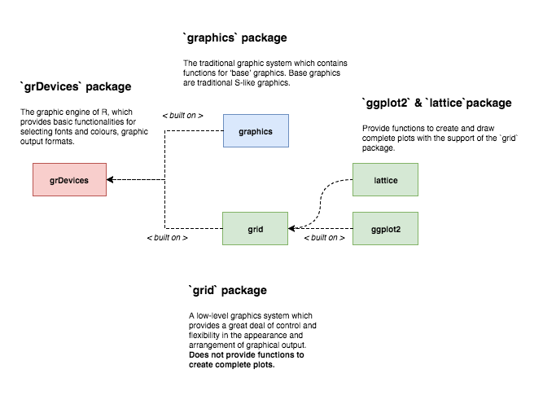

```{r setup, include=FALSE}
knitr::opts_chunk$set(echo = TRUE, warning = FALSE, message = FALSE, collapse = TRUE)
```

The content of this blog is based on examples/ notes/ experiments related to the material presented in the "Building Data Visualization Tools" module of the "[Mastering Software Development in R](https://www.coursera.org/specializations/r)" Specialization (Coursera) created by __Johns Hopkins University__ [1].

```{r libraries}
# Note that the grid package is a base package
# it is installed automatically when installing R
library(grid)
```

## Introduction

__TODO__ Set up a scenario for...  
__TODO__ Add an example on how to add details into your graphs/ visualization using ggplot2 and grid  
    __??__ Example from the course

## How to create custom graphics/ visualizations

The core package behind the graphics capabilities in R is the `grDevices` package, considered as the __engine__ for graphics/ visualizations in R. Two packages are built directly on this engine, the `graphics` and the `grid` packages, representing two __different__ and __incompatible__ graphic systems (see picture below for more information).

<!-- -->

The `ggplot2` package is built on top of the `grid` graphic system. And the `grid` package provides the primitive functions that are used by `ggplot2` for creating and drawing complete plots. While it is not required to interact directly with the `grid` package, it is necessary to understand how it does work in order to be able to add customization not supported by `ggplot2`.

### The `grid` package and the `grid` graphic system

As stated in the "Introduction to grid" vignette [3]  

> "__grid__ is a low-level graphics system which provides a great deal of control and flexibility in the appearance and arrangement of graphical output. grid does not provide high-level functions which create complete plots. What it does provide is a basis for developing such high-level functions (e.g., the lattice and ggplot2 packages), the facilities for customising and manipulating lattice output, the ability to produce high-level plots or non-statistical images from scratch, and the ability to add sophisticated annotations to the output from base graphics functions (see the gridBase package)."

The `grid` graphic system provides only low-level graphic functions that can be used to create basic graphical features and it does not provide __high level functions__ for producing complete plots. Please note that there are two different families of functions in the `grid` package

- `*Grob()` family of functions, used to create __grobs__ as R objects, and
- `grid.*()` family of functions, used to create __grobs__ as graphical output.

The main focus in this blog is to use __grobs__ as R objects. The __list of the `*Grob()` family of functions__ used for such purpouse can be found below

```{r grobFamily}
ls(name = "package:grid", pattern = ".*Grob")
```

__Note!__ It is possible to use these low-level functions to create complete plots (not recommended), see the following (grid) scatterplot example (adapted from [2]).

```{r scatterplotExample}
# create a scatterplots equivalent to 
# plot(1:10)

# create and draw a rectangle - line type = dashed
gRect1 <- grid::rectGrob(gp = grid::gpar(lty = "dashed"))
grid.draw(gRect1)
# create the data points
x <- y <- 1:10
# create a viewport providing the margins as number of text lines
vp1 <- grid::plotViewport(c(5.1,4.1,4.1,2.1))
# navigate into the created viewport
grid::pushViewport(vp1)
# create a viewport with x and y scales
# based on provided values
dvp1 <- grid::dataViewport(x,y)
# navigate into the created viewport
grid::pushViewport(dvp1)
# create and draw a rectangle
gRect2 <- grid::rectGrob()
grid.draw(gRect2)
# create and draws the x and y axis
gXaxis <- grid::xaxisGrob()
grid.draw(gXaxis)
gYaxis <- grid::yaxisGrob()
grid.draw(gYaxis)
# create and draw the data points
gPoints <- grid::pointsGrob(x,y)
grid.draw(gPoints)
# create and draw text
gYText <- grid::textGrob("y = 1:10", x = grid::unit(-3, "lines"), rot = 90)
grid.draw(gYText)
gXText <- grid::textGrob("x = 1:10", y = grid::unit(-3, "lines"))
grid.draw(gXText)
# exit the 2 viewports
grid::popViewport(2)
```


### The `grid` graphic system: basic concepts

#### __Grobs__: graphical objects

The most critical concept to understand is the concept of __grob__. A __grob__ is a __grid graphical object__ that can be created, changed and plotted using the grid graphic functions. __Grobs__ can be created and then 

- added or removed from larger grid objects including ggplot objects and 
- drawn on a graphic device when a grid graphic plot is printed.

Possible __grobs__ that can be created include circles, lines, points, rectangles, polygons, etc. Once a __grob__ is created, it can be modified (using the `editGrob` function) and then drawn (using the `grid.draw` function). 

Most of these functions accepts as arguments the location where the glob should be places. As an examples the `circleGrob` accepts the following arguments (see `?circleGrob` for more details):

- `x`, a numeric vectors specifying the x location (center of the circle)
- `y`, a numeric vectors specifying the y location (center of the circle)
- `r`, , a numeric vectors specifying the radius of the circle
- `default.units`, a string indicating the default units to use. 

See examples below for some examples. 

```{r circleExample1}
# Create a circle grob object and draw it in the current device
# See ?circleGrob for possible arguments and default values

grid.newpage() # Erase/ clear the current device
the_circle <- circleGrob() # Create the circe grob
grid.draw(the_circle) # Draw the grob (current device)
```

```{r circleExample2}
# Create a circle grob object with specific settings (center and radius)
# modify the object (center and radius) and draw it
grid.newpage()
the_circle <- circleGrob(x = 0.2, y = 0.2, r = 0.2)
the_circle <- editGrob(the_circle, 
                       x = unit(0.8, "npc"), 
                       y = unit(0.8, "npc"), 
                       r = unit(0.2, "npc"))
grid.draw(the_circle)
```

```{r circleExample3}
# Create a circle grob object
# using the power of vectorization 
grid.newpage() # Erase/ clear the current device
the_circle <- circleGrob(
  x = seq(0.1, 0.9, length = 100),
  y = 0.5 + 0.3 * sin(seq(0, 2*pi, length = 100)),
  r = abs(0.1 * cos(seq(0, 2*pi, length = 100)))
)
grid.draw(the_circle)
```

More grob objects can be plot on the same device as part of the same visualization/ graph, your fantasy becomes your limit ...

```{r grobsExample1}
grid.newpage() # Erase/ clear the current device

outer_rectangle <- rectGrob()
my_circle <- circleGrob(x = 0.5, y = 0.5, r = 0.4)
my_rect <- rectGrob(width = 0.9, height = 0.2)

grid.draw(outer_rectangle)
grid.draw(my_circle)
grid.draw(my_rect)
```


```{r grobsExample2}
grid.newpage() # Erase/ clear the current device
outer_rectangle <- rectGrob(gp = gpar(lty = 3))
curve_1 <- curveGrob(x1 = 0.1, y1 = 0.25, x2 = 0.3, y2 = 0.75)
curve_2 <- curveGrob(x1 = 0.4, y1 = 0.25, x2 = 0.6, y2 = 0.75, square = F, ncp = 8, curvature = 0.5)
curve_3 <- curveGrob(x1 = 0.7, y1 = 0.25, x2 = 0.9, y2 = 0.75, square = F, angle = 45, shape = -1)

grid.draw(outer_rectangle)
grid.draw(curve_1)
grid.draw(curve_2)
grid.draw(curve_3)
```

__A special argument: `gp`__

All these functions accept a `gp` argument, defined as 

> "... an object of class gpar, typically the output from a call to the function gpar. This is basically a list of graphical parameter settings." (from R Documentation)

The `gp` argument is used to control some aspects of the graphical parameter settings like colour of lines and borders, the colour for fillings of rectangles and polygons, line type, trasparency, .... To seee the list of the valid apsects that can be controlled using the `gp` argument see `?gpar` help page.

```{r grobsExampleWith_gp}
grid.newpage() # Erase/ clear the current device

outer_rectangle <- rectGrob()
my_circle <- circleGrob(x = 0.5, y = 0.5, r = 0.4, 
                        gp = gpar(col = "black", lty = 1, fill = "blue"))
my_rect <- rectGrob(width = 0.9, height = 0.2,
                    gp = gpar(col = "black", lty = 1, fill = "red"))

grid.draw(outer_rectangle)
grid.draw(my_circle)
grid.draw(my_rect)
```


##### Viewports

__TBD__

##### Coordinate systems

__TBD__

##### `ggplot2` and the `grid` system

__TBD__

##### Others ...

__TBD__

### Other packages

__TBD__

### The `gridExtra` package

__TBD__

# Session Info

```{r information}
sessionInfo()
```


# References

[1] "The grid package" chapter in "[Mastering Software Development in R](http://rdpeng.github.io/RProgDA/the-grid-package.html)" by Roger D. Peng, Sean Cross and Brooke Anderson, 2017  
[2] Vignette ["grid Graphics"](https://stat.ethz.ch/R-manual/R-devel/library/grid/doc/grid.pdf), by Paul Murrell, April 2017 
[3] "R Graphics" 2nd Edition, by Paul Murrell, September 2015

## Previous "Building Data Visualization Tools" blogs

[4] "[Basic plotting with R and ggplot2](https://pparacch.github.io/2017/07/06/plotting_in_R_ggplot2_part_1.html)", Part 1  
[5] "['ggplot2', essential concepts](https://pparacch.github.io/2017/07/14/plotting_in_R_ggplot2_part_2.html)", Part 2  
[6] "[Guidelines for good plots](https://pparacch.github.io/2017/07/18/plotting_in_R_ggplot2_part_3.html)", Part 3  
[7] "[How to work with maps](https://pparacch.github.io/2017/08/28/plotting_in_R_ggplot2_part_4.html)", Part 4
