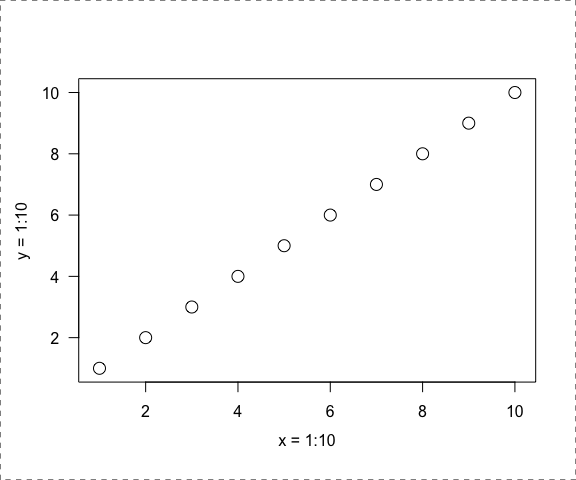

# Building Data Visualization Tools (Part 5)
Pier Lorenzo Paracchini, `r format(Sys.time(), '%d.%m.%Y')`  


The content of this blog is based on examples/ notes/ experiments related to the material presented in the "Building Data Visualization Tools" module of the "[Mastering Software Development in R](https://www.coursera.org/specializations/r)" Specialization (Coursera) created by __Johns Hopkins University__ [1].


```r
# Note that the grid package is a base package
# it is installed automatically when installing R
library(grid)
```

# How to create custom graphics

The `ggplot2` package is built on top of the `grid` graphic system. The `grid` package provides the primitive functions that are used by `ggplot2`. While it is not required to interact directly with the `grid` package, it is necessary to understand how it does work in order to be able to create/ implement new __geom__ or __graphical elements__ in `ggplot2`.

## The `grid` package and the `grid` graphic system

As stated in the "Introduction to grid" vignette [3]  

> "__grid__ is a low-level graphics system which provides a great deal of control and flexibility in the appearance and arrangement of graphical output. grid does not provide high-level functions which create complete plots. What it does provide is a basis for developing such high-level functions (e.g., the lattice and ggplot2 packages), the facilities for customising and manipulating lattice output, the ability to produce high-level plots or non-statistical images from scratch, and the ability to add sophisticated annotations to the output from base graphics functions (see the gridBase package)."

The `grid` graphic system provides only low-level graphic functions that can be used to create basic graphical features and it does not provide __high level functions__ for producing complete plots. The following examples (from [2]) shows how these low-level functions can be used to build a simple scatterplot.


```r
# create a scatterplots equivalent to 
# plot(1:10)

# create and draw a rectangle - line type = dashed
grid::grid.rect(gp = grid::gpar(lty = "dashed"))
# create the data points
x <- y <- 1:10
# create a viewport providing the margins as number of text lines
vp1 <- grid::plotViewport(c(5.1,4.1,4.1,2.1))
# navigate into the created viewport
grid::pushViewport(vp1)
# create a viewport with x and y scales
# based on provided values
dvp1 <- grid::dataViewport(x,y)
# navigate into the created viewport
grid::pushViewport(dvp1)
# create and draw a rectangle
grid::grid.rect()
# create and draws the x and y axis
grid::grid.xaxis()
grid::grid.yaxis()
# create and draw the data points
grid::grid.points(x,y)
# create and draw text
grid::grid.text("y = 1:10", x = grid::unit(-3, "lines"), rot = 90)
grid::grid.text("x = 1:10", y = grid::unit(-3, "lines"))
# exit the 2 viewports
grid::popViewport(2)
```

<!-- -->

### Basic concepts

#### Grobs

The most critical concept to understand is the concept of __grob__. A __grob__ is a __grid graphical object__ that can be created and changed using the grid graphic functions (`*Grob()` family of functions). __Grobs__ can be created and then added or removed from larger grid objects including ggplot objects and drawn on a graphic device when a grid graphic plot is printed.

Possible __grobs__ that can be created include circles, lines, points, rectangles, polygons, ... Once a __grob__ is created can be modified (using the `editGrob` function) and then drawn (using the `grid.draw` function).


```r
# Create a circle grob object and draw it
# See ?circleGrob for possible arguments and default values

the_circle <- circleGrob()
grid.draw(the_circle)
```

<!-- -->


```r
# Create a circle grob object and draw it
# See ?circleGrob for possible arguments

the_circle <- circleGrob(x = 0.2, y = 0.2, r = 0.2)
grid.draw(the_circle)
```

<!-- -->


```r
# Create a circle grob object
# using the vectorization 

the_circle <- circleGrob(
  x = seq(0.1, 0.9, length = 100),
  y = 0.5 + 0.3 * sin(seq(0, 2*pi, length = 100)),
  r = abs(0.1 * cos(seq(0, 2*pi, length = 100)))
)
grid.draw(the_circle)
```

<!-- -->
---

There is a distinction between __grobs__ which can be stored in R objects (created using `*Grob()` family of functions) and __grobs__ which represent graphical output (created using `grid.*()` family of functions).

A simple example of a __grob__ created as an object...


```r
# Create a grob and stored it as an object
# modify the graphical object (changing the color)
# no drawing

# create a grob
g1 <- linesGrob()
# modify the grob
g1 <- editGrob(g1, gp = gpar(col = "green"))
```

A simple example of a __grob__ created as a graphical output...


```r
# Create a grob (output) & modify it
# the grob is automatically drawn 

# create a grob
grid.lines(name = "lines", gp = gpar(col = "green"))
```

<!-- -->


#### Viewports

__TBD__

#### Coordinate systems

__TBD__

#### Others ...

## Other packages

__TBD__

### The `gridExtra` package

__TBD__

# References

[1] "The grid package" chapter in "[Mastering Software Development in R](http://rdpeng.github.io/RProgDA/the-grid-package.html)" by Roger D. Peng, Sean Cross and Brooke Anderson, 2017  
[2] Vignette ["grid Graphics"](https://stat.ethz.ch/R-manual/R-devel/library/grid/doc/grid.pdf), by Paul Murrell, April 2017 
[3] "R Graphics" 2nd Edition, by Paul Murrell, September 2015

## Previous "Building Data Visualization Tools" blogs

[4] "[Basic plotting with R and ggplot2](https://pparacch.github.io/2017/07/06/plotting_in_R_ggplot2_part_1.html)", Part 1  
[5] "['ggplot2', essential concepts](https://pparacch.github.io/2017/07/14/plotting_in_R_ggplot2_part_2.html)", Part 2  
[6] "[Guidelines for good plots](https://pparacch.github.io/2017/07/18/plotting_in_R_ggplot2_part_3.html)", Part 3
[7] "[How to work with maps](https://pparacch.github.io/2017/08/28/plotting_in_R_ggplot2_part_4.html)", Part 4
