# Building Data Visualization Tools (Part 5)
Pier Lorenzo Paracchini, `r format(Sys.time(), '%d.%m.%Y')`  


---

The content of this blog is based on examples/ notes/ experiments related to the material presented in the "Building Data Visualization Tools" module of the "[Mastering Software Development in R](https://www.coursera.org/specializations/r)" Specialization (Coursera) created by __Johns Hopkins University__ [1].

Required packages:

- the `grid` package,
- the `ggplot2` package,
- ...


```r
# Note that the grid package is a base package
# it is installed automatically when installing R
library(grid)

# If ggplot2 package is not installed
# install.packages("ggplot2")
library(ggplot2)
```

# Introduction

The __core package__, supporting the __graphics capabilities in R__, is the `grDevices` package. Two packages are built directly on this engine, the `graphics` and the `grid` packages - two __different__ and __incompatible__ graphic systems (see picture below for more information).

<!-- -->

The `ggplot2` package is built on top of the `grid` graphic system. The `grid` package provides the primitive functions that are used by `ggplot2` for creating and drawing complete plots. __While it is not required to interact directly with the `grid` package, it is necessary to understand how it does work in order to be able to create and add customizations not supported by `ggplot2`__.

## The `grid` package and the `grid` graphic system

As stated in [2]  

> "__grid__ is a low-level graphics system which provides a great deal of control and flexibility in the appearance and arrangement of graphical output. grid does not provide high-level functions which create complete plots. What it does provide is a basis for developing such high-level functions (e.g., the lattice and ggplot2 packages), the facilities for customising and manipulating lattice output, the ability to produce high-level plots or non-statistical images from scratch, and the ability to add sophisticated annotations to the output from base graphics functions (see the gridBase package)."

The `grid` graphic system provides only low-level graphic functions that can be used to create basic graphical features and it does not provide __high level functions__ for producing complete plots. Please note that there are two different families of functions in the `grid` package

- `*Grob()` family of functions, used to create __grobs__ as R objects, and
- `grid.*()` family of functions, used to create __grobs__ as graphical output.

The main focus in this blog is to use __grobs__ as R objects. The __list of the `*Grob()` family of functions__ used for such purpouse can be found below


```r
ls(name = "package:grid", pattern = ".*Grob")
##  [1] "addGrob"       "arrowsGrob"    "bezierGrob"    "circleGrob"   
##  [5] "clipGrob"      "curveGrob"     "editGrob"      "forceGrob"    
##  [9] "frameGrob"     "functionGrob"  "getGrob"       "legendGrob"   
## [13] "linesGrob"     "lineToGrob"    "moveToGrob"    "nullGrob"     
## [17] "packGrob"      "pathGrob"      "placeGrob"     "pointsGrob"   
## [21] "polygonGrob"   "polylineGrob"  "rasterGrob"    "rectGrob"     
## [25] "removeGrob"    "reorderGrob"   "roundrectGrob" "segmentsGrob" 
## [29] "setGrob"       "showGrob"      "textGrob"      "xaxisGrob"    
## [33] "xsplineGrob"   "yaxisGrob"
```

It is possible to combine these low-level functions to create complete plots (__even if not not recommended__). See the following example (adapted from [2])


```r
# scatterplot example
# create scatterplot plot(1:10) 
# using the grid package

# create and draw a rectangle - line type = dashed
gRect1 <- rectGrob(gp = gpar(lty = "dashed"))
grid.draw(gRect1)
# create the data points
x <- y <- 1:10
# create a viewport providing the margins as number of text lines
vp1 <- plotViewport(c(5.1,4.1,4.1,2.1))
# navigate into the created viewport
pushViewport(vp1)
# create a viewport with x and y scales
# based on provided values
dvp1 <- dataViewport(x,y)
# navigate into the created viewport
pushViewport(dvp1)
# create and draw a rectangle
gRect2 <- rectGrob()
grid.draw(gRect2)
# create and draws the x and y axis
gXaxis <- xaxisGrob()
grid.draw(gXaxis)
gYaxis <- yaxisGrob()
grid.draw(gYaxis)
# create and draw the data points
gPoints <- pointsGrob(x,y)
grid.draw(gPoints)
# create and draw text
gYText <- textGrob("y = 1:10", x = unit(-3, "lines"), rot = 90)
grid.draw(gYText)
gXText <- textGrob("x = 1:10", y = unit(-3, "lines"))
grid.draw(gXText)
# exit the 2 viewports
popViewport(2)
```

<!-- -->

## The `grid` graphic system: __basic concepts__

### __Grobs__: graphical objects

The most critical concept to understand is the __grob__. A __grob__ is a __grid graphical object__ that can be created, changed and plotted using the grid graphic functions. __Grobs__ are 

- created,
- modified,
- added or removed from larger grid objects (optionally) and 
- drawn on a graphics device.

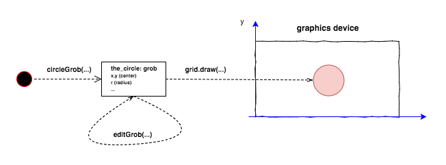<!-- -->

Possible __grobs__ include circles, lines, points, rectangles, polygons, etc. Once a __grob__ is created, it can be modified (using the `editGrob` function) and then drawn (using the `grid.draw` function) on a graphics device. 

When creating a __grob__ the location where the grob should be places/ located must be provided. As an examples the `circleGrob` accepts the following arguments (see `?circleGrob` for more details):

- `x`, a numeric vectors specifying the x location (center of the circle)
- `y`, a numeric vectors specifying the y location (center of the circle)
- `r`, , a numeric vectors specifying the radius of the circle
- `default.units`, a string indicating the default units to use. 

See examples below for some examples. 


```r
# Create a circle grob object and draw it in the current device
# See ?circleGrob for possible arguments and default values
grid.newpage() # Erase/ clear the current device
the_circle <- circleGrob() # Create the circe grob
grid.draw(the_circle) # Draw the grob (current device)
```

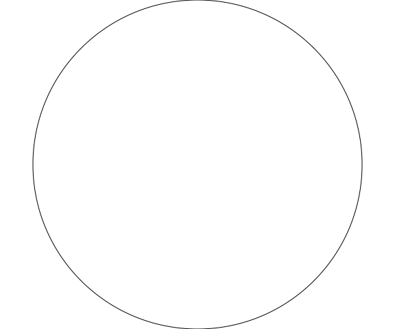<!-- -->


```r
# Create a circle grob object with specific settings (center and radius)
# modify the object (center and radius) and draw it
grid.newpage()
the_circle <- circleGrob(x = 0.2, y = 0.2, r = 0.2)
the_circle <- editGrob(the_circle, 
                       x = unit(0.8, "npc"), 
                       y = unit(0.8, "npc"), 
                       r = unit(0.2, "npc"))
grid.draw(the_circle)
```

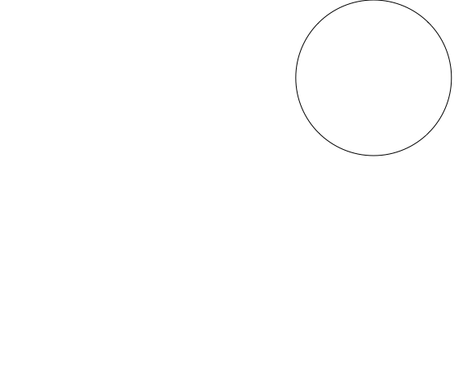<!-- -->


```r
# Create a circle grob object
# using the power of vectorization 
grid.newpage() # Erase/ clear the current device
the_circle <- circleGrob(
  x = seq(0.1, 0.9, length = 100),
  y = 0.5 + 0.3 * sin(seq(0, 2*pi, length = 100)),
  r = abs(0.1 * cos(seq(0, 2*pi, length = 100)))
)
grid.draw(the_circle)
```

<!-- -->

More grob objects can be plot on the same device as part of the same visualization/ graph, __your fantasy becomes your limit__ ...


```r
grid.newpage() # Erase/ clear the current device

outer_rectangle <- rectGrob()
my_circle <- circleGrob(x = 0.5, y = 0.5, r = 0.4)
my_rect <- rectGrob(width = 0.9, height = 0.2)

grid.draw(outer_rectangle)
grid.draw(my_circle)
grid.draw(my_rect)
```

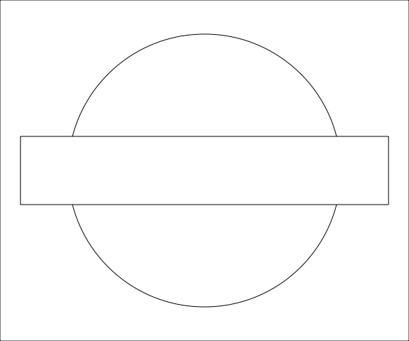<!-- -->


```r
grid.newpage() # Erase/ clear the current device
outer_rectangle <- rectGrob(gp = gpar(lty = 3))
curve_1 <- curveGrob(x1 = 0.1, y1 = 0.25, x2 = 0.3, y2 = 0.75)
curve_2 <- curveGrob(x1 = 0.4, y1 = 0.25, x2 = 0.6, y2 = 0.75, square = F, ncp = 8, curvature = 0.5)
curve_3 <- curveGrob(x1 = 0.7, y1 = 0.25, x2 = 0.9, y2 = 0.75, square = F, angle = 45, shape = -1)

grid.draw(outer_rectangle)
grid.draw(curve_1)
grid.draw(curve_2)
grid.draw(curve_3)
```

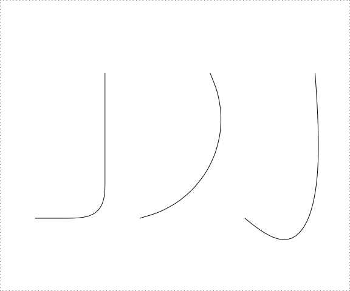<!-- -->

#### Controlling the appearance of a grob: the argument: `gp`

All these functions, used to create __grobs__, accept a `gp` argument that is used to __control some aspects of the graphical parameter__ like 

- colour of lines and borders, 
- colour for fillings of rectangles and polygons, 
- line type, 
- trasparency, 
- etc. 

To see the list of the possible aspects that can be controlled using the `gp` argument see the `?gpar` help page.


```r
grid.newpage() # Erase/ clear the current device

outer_rectangle <- rectGrob()
my_circle <- circleGrob(x = 0.5, y = 0.5, r = 0.4, 
                        gp = gpar(col = "black", lty = 1, fill = "blue"))
my_rect <- rectGrob(width = 0.9, height = 0.2,
                    gp = gpar(col = "black", lty = 1, fill = "red"))

grid.draw(outer_rectangle)
grid.draw(my_circle)
grid.draw(my_rect)
```

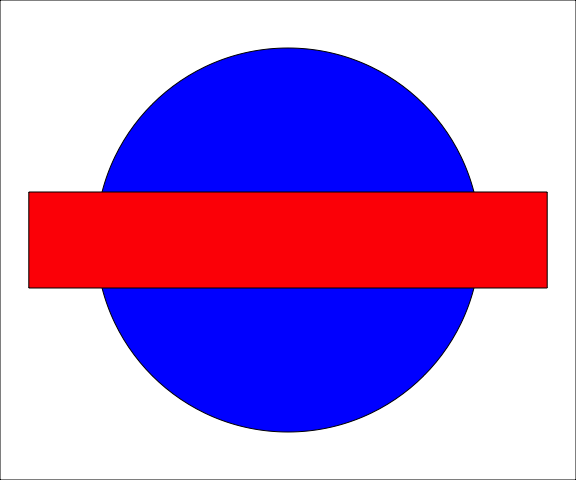<!-- -->

#### The `gTree` object

A `gTree` object is a __grob__ that can have other __grobs__ as children. It is useful to create __grobs__ that are made of multiple elements (e.g. like a scatterplot). When a `gTree` object is drawn, all of its children are drawn. See the example below...


```r
grid.newpage() # Erase/ clear the current device
circle_1_1 <- circleGrob(name = "circle_1_1", 
                         x = 0.1, y = 0.8, r = 0.1)
circle_1_2 <- circleGrob(name = "circle_1_2", 
                         x = 0.1, y = 0.8, r = 0.05,
                         gp = gpar(fill = "red"))
circle_1 <- gTree(name = "circle_1_tree", children = gList(circle_1_1, circle_1_2))


circle_2_1 <- circleGrob(x = 0.9, y = 0.8, r = 0.1)
circle_2_2 <- circleGrob(x = 0.9, y = 0.8, r = 0.05,
                         gp = gpar(fill = "red"))
circle_2 <- gTree(children = gList(circle_2_1, circle_2_2))

circle_3_1 <- circleGrob(x = 0.5, y = 0.2, r = 0.1)
circle_3_2 <- circleGrob(x = 0.5, y = 0.2, r = 0.05,
                         gp = gpar(fill = "red"))
circle_3 <- gTree(children = gList(circle_3_1, circle_3_2))

line_1 <- linesGrob(x = c(0.1, 0.5), 
                    y = c(0.8,0.6),
                    gp = gpar(lwd = 4))
line_2 <- linesGrob(x = c(0.9, 0.5), 
                    y = c(0.8,0.6),
                    gp = gpar(lwd = 4))
line_3 <- linesGrob(x = c(0.5, 0.5), 
                    y = c(0.6,0.2),
                    gp = gpar(lwd = 4))
the_text <- textGrob("Flux Capacitator",
                     x = 0.5, y = 0.9)

flux_capacitator <- gTree(
  children = gList(circle_1, circle_2, circle_3,
                   line_1, line_2, line_3, the_text)
  )
grid.draw(flux_capacitator)
```

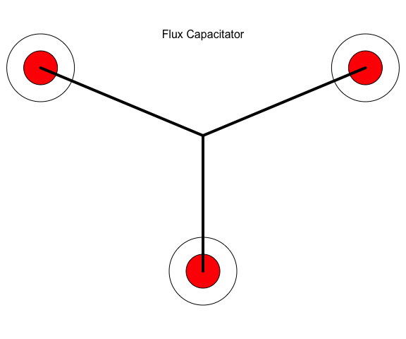<!-- -->

The function `grid.ls()` can be used to have a listing of the grobs that are part of the structure in the current graphic device. __Note__  how the grobs __name__ is used in the returned listing, if a `name` parameter was provided when creating a __grob__ such name is used to identify the grob in the listing (e.g. the __circle_1__ `gTree` and its children).


```r
grid.ls(flux_capacitator)
## GRID.gTree.31
##   circle_1_tree
##     circle_1_1
##     circle_1_2
##   GRID.gTree.23
##     GRID.circle.21
##     GRID.circle.22
##   GRID.gTree.26
##     GRID.circle.24
##     GRID.circle.25
##   GRID.lines.27
##   GRID.lines.28
##   GRID.lines.29
##   GRID.text.30
```

### __Viewports__

A __viewport__ is a rectangular region that provides a __context__ for drawing, specifically, 

- a __geometric context__ consisting in a coordinate system for location and 
- a __graphical context__ consisting of explicit graphical parameter settings to control the appearance of the output.

As stated in the vignettes [2,3], a __viewport__ is defined as a graphics region that you can __move into and out__ of to customize plots. __Viewports__ can be created inside another __viewport__ and so on. 

By default `grid` creates a __root viewport__ that correspond to the entire device, so the actual drawing is within the full device till __another viewport__ is added (creating a viewport tree). __There is always one and only one current viewport at any time__.

#### How to create a viewport

A __viewport__ can be created using the `Viewport` function. A __viewport__ has a location (`x, y` arguments), a size (`width, height` arguments) and a justification (`just` argument) - see `?Viewport` for more information. No region is created on the device till the viewport is navigated into. 


```r
grid.newpage() # Erase/ clear the current device
viewport_1 <- viewport(x = 0.5, y = 0.5,
                       width = 0.5, height = 0.5,
                       just = c("left", "bottom"))

# viewport_1 is a "viewport" object
# No region has been actually created on the device
viewport_1
## viewport[GRID.VP.3]
class(viewport_1)
## [1] "viewport"
```

#### How to work with viewports

Using the `grid` graphic system, plots can be created using __viewports__ (viewports and nested viewports), specifically creating new viewports, navigating into them and drawing grobs and then moving to a different viewport, so on and on.

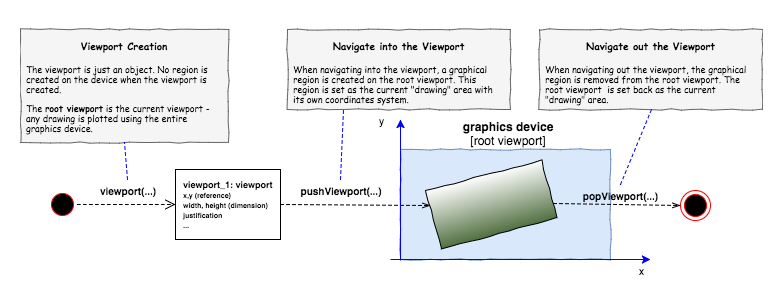<!-- -->

The `pushViewport()` and `popViewport()` functions can be used, respectively, to navigate into a viewport (changing the current viewport), and to navigate out of the current viewport.  When a viewport is popped, the drawing context reverts to the parent viewport and the viewport is removed from the device.


```r
grid.newpage() # Erase/ clear the current device
# By default a root viewport is created
# and set as the current one

# Create a new viewport
viewport_1 <- viewport(name = "vp1",
                       width = 0.5, height = 0.3,
                       angle = 10)

# Working on the root viewport
grid.draw(rectGrob(name = "root_rect"))
grid.draw(textGrob(name = "root_text",
          "Board", x = unit(1, "mm"), 
          y = unit(1, "npc") - unit(1, "mm"),
          just = c("left", "top")))

# Move into the created viewport
# Current viewport is switch to vp1
pushViewport(viewport_1)
# Draw into the current viewport
grid.draw(rectGrob(name = "vp1_rect"))
grid.draw(textGrob(name = "vp1_text",
          "Task 1", x = unit(1, "mm"), 
          y = unit(1, "npc") - unit(1, "mm"),
          just = c("left", "top")))

pushViewport(viewport_1)
# Draw into the current viewport
grid.draw(rectGrob(name = "vp1_vp1_rect"))
grid.draw(textGrob(name = "vp1_vp1_text",
          "Task 1", x = unit(1, "mm"), 
          y = unit(1, "npc") - unit(1, "mm"),
          just = c("left", "top")))
# Move out of the current viewport 
# back to the root (set as current)
popViewport()

# Move out of the current viewport 
# back to the root (set as current)
popViewport()
```

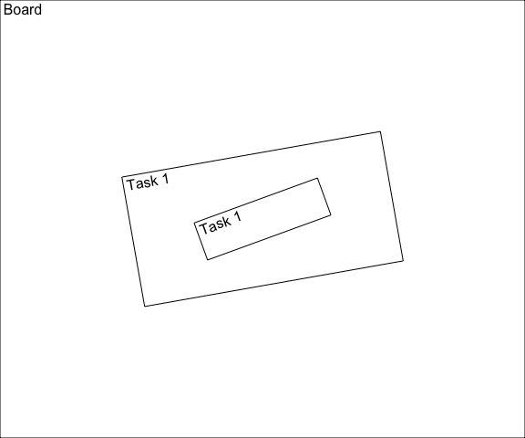<!-- -->

Another way to change the current viewport is by using the `upViewport()` and `downViewport()` functions. The `upViewport()` function is similar to `popViewport()`with the difference that `upViewport()` does not remove the current viewport from the device (more efficient and fast).

### __Coordinate systems__

When creating a __grid graphical object__ or a __viewport object__, the location of where this object should be located and its size must be provided (e.g. through `x`, `y`, `default.units` arguments). All drawing occurs relative to the current viewport and the location and size are used within that viewport to draw the object. 

The `grid` graphic system provides different coordinate systems according to the used unit of measurement like

- `npc`, the normalised paranet coordinates (the default) where 
    - the bottom-lef as the location (0, 0) and 
    - the top-right corner as location (1, 1);
- `cm`, measurements in centimeters;
- `inches`, measurements in inches;
- `mm`, measurements in millimetres;
- `points`, measurements in points;
- `lines`, measurements in number of lines of text
- `native`, measurements are relative to the `xscale` and `yscale` of the viewport
- ...

More information about coordinate systems can be found in the R documentation (see `?unit`). 

__Picking the right units for this coordinate system will make it much easier to create the plot you want__, for example the `native` unit is often the most useful when creating extensions for ggplot2.

The coordinate system to be used when locating an object is provided by the `unit` function (`unit([numeric vector], units = "native")`). Different values can be provided with different units of measurement for the same object.

As example, a viewport with the x-scale going from 0 to 100 and the y-scale going from 0 to 10 (specified using `xscale` and `yscale` in `viewport`), the `native` unit can be used when locating a grob in that viewport on these scale values see example below


```r
grid.newpage()# Erase/ clear the current device
# By default a root viewport is created
# and set as the current one

# Visualize the root viewport area 
grid.draw(rectGrob())

# Create a new viewport
# default unit is set to "npc" so
# location of the viewport is normalized (0,1)
# with a xscale covering from 0 to 100
vp_1 <- viewport(name = "vp1",
                       width = 0.5, height = 0.5,
                       just = c("center", "center"),
                       xscale = c(0,100), yscale = c(0,10))
# Navigate into the viewport
pushViewport(vp_1)
# Visualize the vp_1 area 
grid.draw(rectGrob())

# Draw some circles with location x, y , r (native)
grid.draw(circleGrob(x = unit(0, "native"), y = unit(5, "native"),
                     r = unit(5, "native"), gp = gpar(fill = "red")))
grid.draw(circleGrob(x = unit(10, "native"), y = unit(5, "native"),
                     r = unit(5, "native"), gp = gpar(fill = "orange")))
grid.draw(circleGrob(x = unit(100, "native"), y = unit(5, "native"),
                     r = unit(5, "native"), gp = gpar(fill = "green")))

popViewport()
```

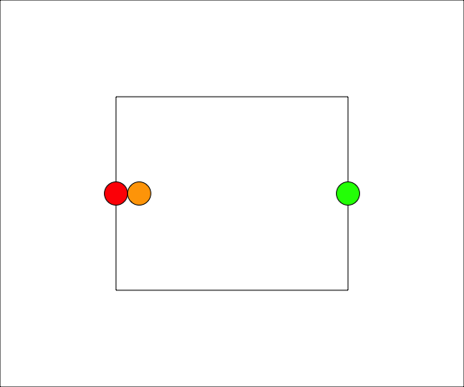<!-- -->

## `ggplot2` and the `grid` system: __customize `ggplot2` output__

It is possible to use low-level functions in `grid` to customize/ manipulate the `ggplot2` output. See the examples below.


```r
grid.newpage()# Erase/ clear the current device

temp <- mtcars
temp[temp$am == 0,]$am <- "automatic"
temp[temp$am == 1,]$am <- "manual"
temp$am <- as.factor(temp$am)

basePlot <- ggplot(data = temp, mapping = aes(x = disp, y = mpg)) +
  geom_point()

grid.draw(ggplotGrob(basePlot))

vp_1 <- viewport(x = 1, y = 1, 
                 just = c("right", "top"),
                 width = 0.5, height = 0.35)

pushViewport(vp_1)
miniPlot <- ggplot(data = temp, mapping = aes(x = am)) +
  geom_bar() + xlab("Transmission") 
grid.draw(ggplotGrob(miniPlot))
popViewport()
```

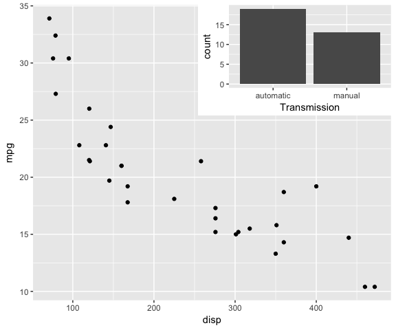<!-- -->


```r
grid.newpage()# Erase/ clear the current device

vp_1 <- viewport(x = 0,  
                 just = "left",
                 width = 1/3)

pushViewport(vp_1)
plot_r <- ggplot(data = temp, mapping = aes(x = am)) +
  geom_bar() + xlab("Transmission") 
grid.draw(ggplotGrob(plot_r))
popViewport()

vp_2 <- viewport(x = 1/3,   
                 just = "left",
                 width = 2/3)
pushViewport(vp_2)
plot_l <- ggplot(data = temp, mapping = aes(x = disp, y = mpg)) +
  geom_point() 
grid.draw(ggplotGrob(plot_l))
popViewport()
```

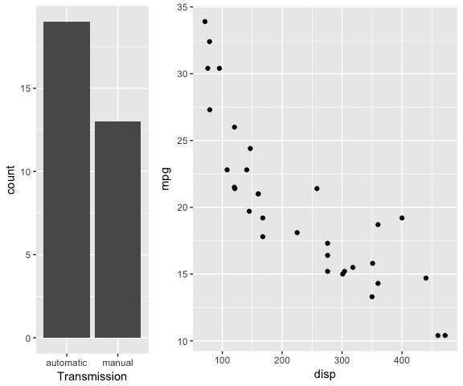<!-- -->

## Other packages

### The `gridExtra` package

The `gridExtra` package provides useful extensions to the grid system focusing on higher-level functions to work with grid graphic objects. Interesting functions:

- arranging multiple grobs on a page [4],
- creating and manupilating layouts with graphical elements [5],
- adding tabular data alongside graphics [6].

# Session Info


```r
sessionInfo()
## R version 3.3.3 (2017-03-06)
## Platform: x86_64-apple-darwin13.4.0 (64-bit)
## Running under: macOS Sierra 10.12.6
## 
## locale:
## [1] no_NO.UTF-8/no_NO.UTF-8/no_NO.UTF-8/C/no_NO.UTF-8/no_NO.UTF-8
## 
## attached base packages:
## [1] grid      stats     graphics  grDevices utils     datasets  methods  
## [8] base     
## 
## other attached packages:
## [1] ggplot2_2.2.1
## 
## loaded via a namespace (and not attached):
##  [1] Rcpp_0.12.12     digest_0.6.12    rprojroot_1.2    plyr_1.8.4      
##  [5] gtable_0.2.0     backports_1.1.0  magrittr_1.5     evaluate_0.10.1 
##  [9] scales_0.5.0     rlang_0.1.2      stringi_1.1.5    lazyeval_0.2.0  
## [13] rmarkdown_1.6    labeling_0.3     tools_3.3.3      stringr_1.2.0   
## [17] munsell_0.4.3    yaml_2.1.14      colorspace_1.3-2 htmltools_0.3.6 
## [21] knitr_1.17       tibble_1.3.4
```


# References

[1] "The grid package" chapter in "[Mastering Software Development in R](http://rdpeng.github.io/RProgDA/the-grid-package.html)" by Roger D. Peng, Sean Cross and Brooke Anderson, 2017  
[2] Vignette ["Introduction to grid"](https://stat.ethz.ch/R-manual/R-devel/library/grid/doc/grid.pdf) by Paul Murrell, April 2017   
[3] Vignette ["Working with grid viewports"](https://stat.ethz.ch/R-manual/R-devel/library/grid/doc/viewports.pdf) by Paul Murrell, November 2016   
[4] Vignette ["Arranging multiple grobs on a page"](https://cran.r-project.org/web/packages/gridExtra/vignettes/arrangeGrob.html) by Baptiste Auguie, September 2017  
[5] Vignette ["(Unofficial) overview of gtable"](https://cran.r-project.org/web/packages/gridExtra/vignettes/gtable.html) by Baptiste Auguie, September 2017  
[6] Vignette ["Displaying tables as grid graphics"](https://cran.r-project.org/web/packages/gridExtra/vignettes/tableGrob.html) by Baptiste Auguie, September 2017  

__Interesting book__:

- "R Graphics" 2nd Edition, by Paul Murrell, September 2015

__Previous "Building Data Visualization Tools" blogs__: 

- Part 1: "[Basic plotting with R and ggplot2](https://pparacch.github.io/2017/07/06/plotting_in_R_ggplot2_part_1.html)"  
- Part 2: "['ggplot2', essential concepts](https://pparacch.github.io/2017/07/14/plotting_in_R_ggplot2_part_2.html)"  
- Part 3: "[Guidelines for good plots](https://pparacch.github.io/2017/07/18/plotting_in_R_ggplot2_part_3.html)"  
- Part 4: "[How to work with maps](https://pparacch.github.io/2017/08/28/plotting_in_R_ggplot2_part_4.html)"  
