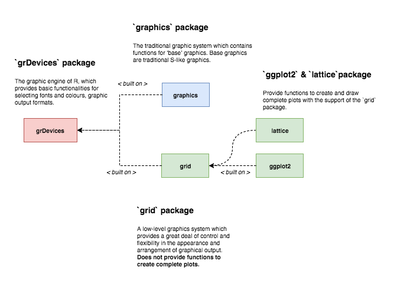
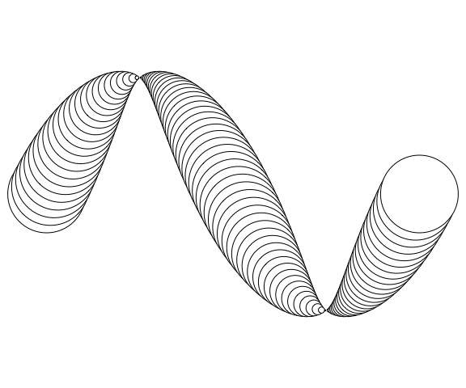

# Building Data Visualization Tools (Part 5)
Pier Lorenzo Paracchini, `r format(Sys.time(), '%d.%m.%Y')`  


The content of this blog is based on examples/ notes/ experiments related to the material presented in the "Building Data Visualization Tools" module of the "[Mastering Software Development in R](https://www.coursera.org/specializations/r)" Specialization (Coursera) created by __Johns Hopkins University__ [1].


```r
# Note that the grid package is a base package
# it is installed automatically when installing R
library(grid)
```

## Introduction

__TODO__ Set up a scenario for...  
__TODO__ Add an example on how to add details into your graphs/ visualization using ggplot2 and grid  
    __??__ Example from the course

## How to create custom graphics/ visualizations

The core package behind the graphics capabilities in R is the `grDevices` package, considered as the __engine__ for graphics/ visualizations in R. Two packages are built directly on this engine, the `graphics` and the `grid` packages, representing two __different__ and __incompatible__ graphic systems (see picture below for more information).

<!-- -->

The `ggplot2` package is built on top of the `grid` graphic system. And the `grid` package provides the primitive functions that are used by `ggplot2` for creating and drawing complete plots. While it is not required to interact directly with the `grid` package, it is necessary to understand how it does work in order to be able to add customization not supported by `ggplot2`.

### The `grid` package and the `grid` graphic system

As stated in the "Introduction to grid" vignette [3]  

> "__grid__ is a low-level graphics system which provides a great deal of control and flexibility in the appearance and arrangement of graphical output. grid does not provide high-level functions which create complete plots. What it does provide is a basis for developing such high-level functions (e.g., the lattice and ggplot2 packages), the facilities for customising and manipulating lattice output, the ability to produce high-level plots or non-statistical images from scratch, and the ability to add sophisticated annotations to the output from base graphics functions (see the gridBase package)."

The `grid` graphic system provides only low-level graphic functions that can be used to create basic graphical features and it does not provide __high level functions__ for producing complete plots. Please note that there are two different families of functions in the `grid` package

- `*Grob()` family of functions, used to create __grobs__ as R objects, and
- `grid.*()` family of functions, used to create __grobs__ as graphical output.

The main focus in this blog is to use __grobs__ as R objects. The __list of the `*Grob()` family of functions__ used for such purpouse can be found below


```r
ls(name = "package:grid", pattern = ".*Grob")
##  [1] "addGrob"       "arrowsGrob"    "bezierGrob"    "circleGrob"   
##  [5] "clipGrob"      "curveGrob"     "editGrob"      "forceGrob"    
##  [9] "frameGrob"     "functionGrob"  "getGrob"       "legendGrob"   
## [13] "linesGrob"     "lineToGrob"    "moveToGrob"    "nullGrob"     
## [17] "packGrob"      "pathGrob"      "placeGrob"     "pointsGrob"   
## [21] "polygonGrob"   "polylineGrob"  "rasterGrob"    "rectGrob"     
## [25] "removeGrob"    "reorderGrob"   "roundrectGrob" "segmentsGrob" 
## [29] "setGrob"       "showGrob"      "textGrob"      "xaxisGrob"    
## [33] "xsplineGrob"   "yaxisGrob"
```

__Note!__ It is possible to use these low-level functions to create complete plots (not recommended), see the following (grid) scatterplot example (adapted from [2]).


```r
# create a scatterplots equivalent to 
# plot(1:10)

# create and draw a rectangle - line type = dashed
gRect1 <- grid::rectGrob(gp = grid::gpar(lty = "dashed"))
grid.draw(gRect1)
# create the data points
x <- y <- 1:10
# create a viewport providing the margins as number of text lines
vp1 <- grid::plotViewport(c(5.1,4.1,4.1,2.1))
# navigate into the created viewport
grid::pushViewport(vp1)
# create a viewport with x and y scales
# based on provided values
dvp1 <- grid::dataViewport(x,y)
# navigate into the created viewport
grid::pushViewport(dvp1)
# create and draw a rectangle
gRect2 <- grid::rectGrob()
grid.draw(gRect2)
# create and draws the x and y axis
gXaxis <- grid::xaxisGrob()
grid.draw(gXaxis)
gYaxis <- grid::yaxisGrob()
grid.draw(gYaxis)
# create and draw the data points
gPoints <- grid::pointsGrob(x,y)
grid.draw(gPoints)
# create and draw text
gYText <- grid::textGrob("y = 1:10", x = grid::unit(-3, "lines"), rot = 90)
grid.draw(gYText)
gXText <- grid::textGrob("x = 1:10", y = grid::unit(-3, "lines"))
grid.draw(gXText)
# exit the 2 viewports
grid::popViewport(2)
```

<!-- -->

#### Basic concepts: __Grobs__

The most critical concept to understand is the concept of __grob__. A __grob__ is a __grid graphical object__ that can be created, changed and plotted using the grid graphic functions. __Grobs__ can be created and then 

- added or removed from larger grid objects including ggplot objects and 
- drawn on a graphic device when a grid graphic plot is printed.

Possible __grobs__ that can be created include circles, lines, points, rectangles, polygons, etc. Once a __grob__ is created, it can be modified (using the `editGrob` function) and then drawn (using the `grid.draw` function).

__How to plot a circle...__


```r
# Create a circle grob object and draw it
# See ?circleGrob for possible arguments and default values
grid.newpage()
the_circle <- circleGrob()
grid.draw(the_circle)
```

<!-- -->


```r
# Create a circle grob object
# modify the object and draw it
grid.newpage()
the_circle <- circleGrob(x = 0.2, y = 0.2, r = 0.2)
the_circle <- editGrob(the_circle, 
                       x = unit(0.8, "npc"), 
                       y = unit(0.8, "npc"), 
                       r = unit(0.2, "npc"))
grid.draw(the_circle)
```

<!-- -->


```r
# Create a circle grob object
# using the vectorization 
grid.newpage()
the_circle <- circleGrob(
  x = seq(0.1, 0.9, length = 100),
  y = 0.5 + 0.3 * sin(seq(0, 2*pi, length = 100)),
  r = abs(0.1 * cos(seq(0, 2*pi, length = 100)))
)
grid.draw(the_circle)
```

<!-- -->
---


##### Viewports

__TBD__

##### Coordinate systems

__TBD__

##### Others ...

### Other packages

__TBD__

### The `gridExtra` package

__TBD__

# References

[1] "The grid package" chapter in "[Mastering Software Development in R](http://rdpeng.github.io/RProgDA/the-grid-package.html)" by Roger D. Peng, Sean Cross and Brooke Anderson, 2017  
[2] Vignette ["grid Graphics"](https://stat.ethz.ch/R-manual/R-devel/library/grid/doc/grid.pdf), by Paul Murrell, April 2017 
[3] "R Graphics" 2nd Edition, by Paul Murrell, September 2015

## Previous "Building Data Visualization Tools" blogs

[4] "[Basic plotting with R and ggplot2](https://pparacch.github.io/2017/07/06/plotting_in_R_ggplot2_part_1.html)", Part 1  
[5] "['ggplot2', essential concepts](https://pparacch.github.io/2017/07/14/plotting_in_R_ggplot2_part_2.html)", Part 2  
[6] "[Guidelines for good plots](https://pparacch.github.io/2017/07/18/plotting_in_R_ggplot2_part_3.html)", Part 3
[7] "[How to work with maps](https://pparacch.github.io/2017/08/28/plotting_in_R_ggplot2_part_4.html)", Part 4
