# Building Data Visualization Tools (Part 6)
Pier Lorenzo Paracchini, `r format(Sys.time(), '%d.%m.%Y')`  


---

The content of this blog is based on examples/ notes/ experiments related to the material presented in the "Building Data Visualization Tools" module of the "[Mastering Software Development in R](https://www.coursera.org/specializations/r)" Specialization (Coursera) created by __Johns Hopkins University__ [1] and supporting documentation on extending `ggplot2` [2].

Required packages:

- the `ggplot2` package, the fundation for building new __stat__(s)/ __geom__(s)
- the `grid` package, a catalog of building blocks for building new __geom__(s) 
- the `gridExtra` package, used for combined different plots. 


```r
# If a package is not locally installed
# install.packages("packageName")

library(ggplot2)
library(grid)
library(gridExtra)
```

# Building new graphical elements: basic concepts

Key elements in `ggplot2` are _geoms_ and _stats_, which allow to create interesting and rich data graphics and visualizations. The building new _geoms_ or _stats_ is the plotting equivalent of writing functions and it can be achieved using the __extending__ mechanism/ framework provided by the `ggplot2` package [2]. 

The building of a new __geom__/ __stat__ feature follows a two step process:

1. use the `ggplot2::ggproto()` function to create a new class corresponding to your new feature,
    - inheriting from the `Geom` or `Stat` class  
    
2. implement the `geom_*` or `stat_*` function returning a graphic layer that can be added to a plot previously created using the `ggplot()` function.

All `ggplot2` objects are created using the __ggproto Object-Oriented System__ which allows the creation of mutable objects (for some more info about ggproto OOS see [2]). 

A simple example of how to create a `ggproto` object can be found below  ...


```r
# Create a ggproto object
A <- ggplot2::ggproto("_class" = "MyClass", "_inherit" = NULL,
                       x = 1,
                       inc = function(self){
                           self$x <- self$x + 1
                       })

# Check the structure of the object
str(A)
## Classes 'MyClass', 'ggproto' <ggproto object: Class MyClass>
##     inc: function
##     x: 1

# Visualize the value of x
A$x
## [1] 1

# Increment & visualize x
A$inc()
A$x
## [1] 2
```

## How to create a new __stat__

All of the `stat_*` functions return a layer object, that is a combination of data, __stat__ and __geom__ with a potential position adjustment. The new `Stat*` class is a `ggproto` class and a `Stat` class (inheritance), overriding some specific methods (see `?Stat` for more information).

Some examples from [2] ...


```r
# Stat used for the creation of a convex hull
# stat implementation
# (override) compute_group, called once per group
# (override) required_aes, aesthetics needed to render the geom

StatConvexHull <- ggproto("_class" = "StatConvexHull", "_inherit" = Stat, 
                          compute_group = function(data, scales){
                              data[chull(data$x, data$y),, drop = FALSE]
                          },
                          required_aes = c("x", "y"))

# Implement the relevant stat_* function
# The function creates a new layer using the layer function
# note that the GeomPolygon geom is used with this stat

stat_convexHull <- function(geom = "polygon", data = NULL, mapping = NULL, 
                            position = "identity", na.rm = F, inherit.aes = TRUE, show.legend = NA,
                            ...){
    
    layer(geom = geom, stat = StatConvexHull, 
          data = data, mapping = mapping, position = position, 
          inherit.aes = inherit.aes, show.legend = show.legend,
          params = list(na.rm = na.rm, ...))
}

ggplot(data = mpg, mapping = aes(x = displ, y = hwy)) + 
    geom_point() +
    stat_convexHull(fill = NA, colour = "black")
```

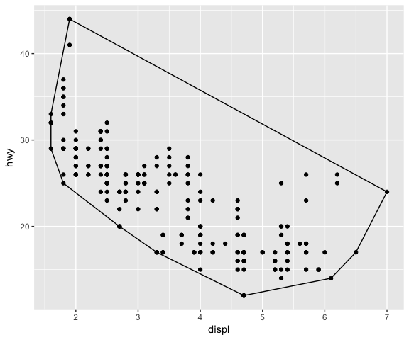<!-- -->

```r

ggplot(data = mpg, mapping = aes(x = displ, y = hwy, colour = drv)) + 
    geom_point() +
    stat_convexHull(fill = NA)
```

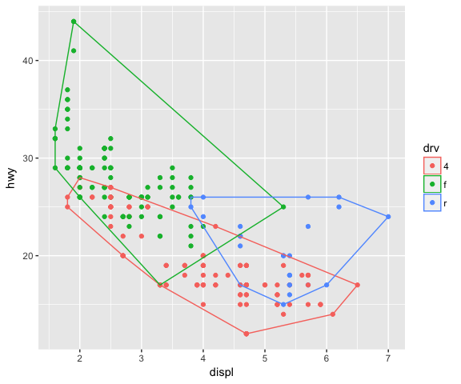<!-- -->

```r

# Using a different geom (GeomPoint) with the new stat
ggplot(data = mpg, mapping = aes(x = displ, y = hwy)) + 
    geom_point() +
    stat_convexHull(geom = "point", size = 4, colour = "red")
```

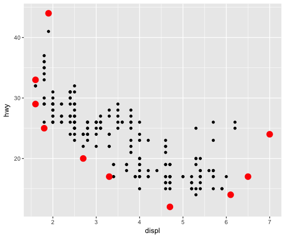<!-- -->

```r

# Using a different geom (GeomPoint) with the new stat
ggplot(data = mpg, mapping = aes(x = displ, y = hwy, colour = drv)) + 
    geom_point() +
    stat_convexHull(geom = "point", size = 4)
```

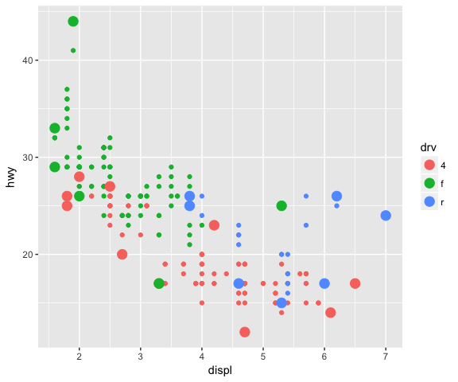<!-- -->

Another example from [2] ...


```r
# creation of a simple version of geom_smooth

StatLm <- ggproto("_class" = "StatLm", "_inherit" = Stat,
                  
                  compute_group = function(data, scales, n = 100, formula = y ~ x){
                      rng <- range(data$x, na.rm = T)
                      grid <- data.frame(x = seq(rng[1], rng[2], length = n))
                      
                      mod <- lm(formula, data = data)
                      grid$y <- predict(object = mod, newdata = grid)
                      grid
                  },
                  
                  required_aes = c("x", "y")
                  )

# note that the GeomLine geom is used with this stat
stat_lm <- function(mapping = NULL, data = NULL, geom = "line",
                    position = "identity", na.rm = F, show.legend = NA,
                    inherit.aes = T, n = 50, formula = y ~ x, ...){
    
    layer(stat = StatLm, data = data, mapping = mapping, geom = geom, position = position, 
          show.legend = show.legend, inherit.aes = inherit.aes, 
          params = list(n = n, formula = formula, na.rm = na.rm, ...))
    
}

ggplot(data = mpg, mapping = aes(x = displ, y = hwy)) +
    geom_point() +
    stat_lm()
```

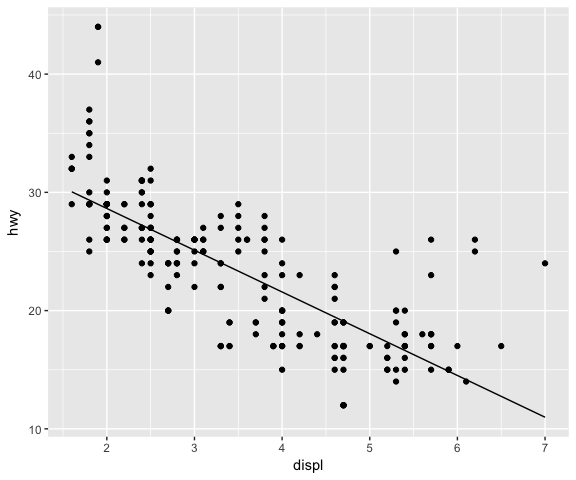<!-- -->

```r


ggplot(data = mpg, mapping = aes(x = displ, y = hwy)) +
    geom_point() +
    stat_lm(formula = y ~ poly(x, 6), colour = "red")  +
    # Using a different geom (GeomPoint) with the new stat
    stat_lm(formula = y ~ poly(x, 6), geom = "point", n = 50, colour = "red")
```

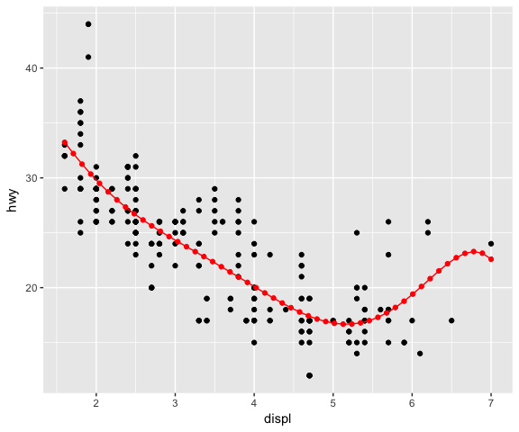<!-- -->

Sometimes there are calculations that need to be __performed only once for the dataset__, not for each group. The `setup_params` function, defined in the `Stat` class, can be used for this purpose (see example below from [2]).


```r
StatDensityCommon <- ggproto("_class" = "StatDensityCommon", "_inherit" = Stat,
                             required_aes = "x",
                             setup_params = function(data, params){
                                 # print("Running set_up....")
                                 if(!is.null(params$bandwidth)) return(params)
                                 
                                 xs <- split(data$x, data$group)
                                 bws <- vapply(xs, bw.nrd0, numeric(1))
                                 bw <- mean(bws)
                                 # message("Picking bandwidth of ", signif(bw, 3))
                                 
                                 params$bandwidth <- bw
                                 # print("End set_up....")
                                 params
                                 
                             },
                             
                             compute_group = function(data, scales, bandwidth = 1){
                                 # print(paste("Running compute_group [", unique(data$group), "] ..."))
                                 # str(data)
                                 # print(bandwidth)
                                 d <- density(data$x,bandwidth)
                                 # print("End compute_group....")
                                 data.frame(x = d$x, y = d$y)
                             })

# note that the GeomLine geom is used with this stat
stat_densityCommon <- function(data = NULL, mapping = NULL, geom = "line",
                               position = "identity", na.rm = FALSE, show.legend = NA,
                               inherit.aes = T, bandwidth = NULL, ...){
    layer(geom = geom,  stat = StatDensityCommon, data = data, mapping = mapping, position = position,
          params = list(bandwidth = bandwidth, na.rm = na.rm, ...), inherit.aes = inherit.aes, show.legend = show.legend)
}

ggplot(data = mpg, mapping = aes(x = displ)) +
    stat_densityCommon(bandwidth = 0.25)
```

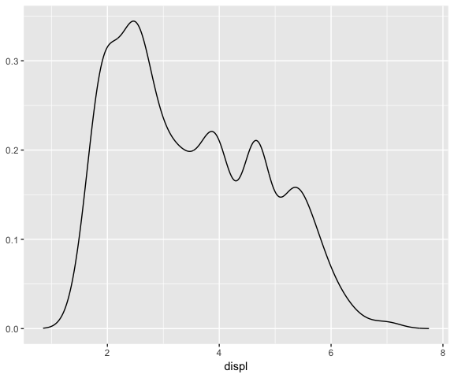<!-- -->

```r

# Bandwidth is calculated from the data (once) 
ggplot(data = mpg, mapping = aes(x = displ)) +
    stat_densityCommon()
```

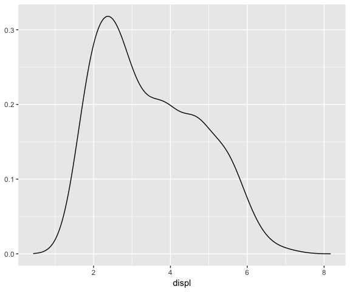<!-- -->

```r


ggplot(data = mpg, mapping = aes(x = displ, colour = drv)) +
    stat_densityCommon()
```

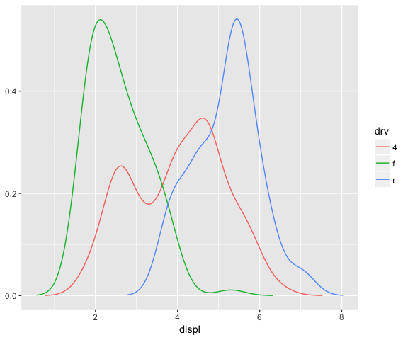<!-- -->

Important aspects to consider: __variable names__ and __default aesthetics__. If you want to make a _stat_ usable with other _geoms_ we need to be careful with the chosen names.

> _"If we want to make this stat usable with other geoms, we should return a variable called density instead of y. Then we can set up the default_aes to automatically map density to y, which allows the user to override it to use with different geoms."_


```r
StatDensityCommon <- ggproto("StatDensityCommonE", Stat, 
  required_aes = "x",
  default_aes = aes(y = ..density..),

  compute_group = function(data, scales, bandwidth = 1) {
    # print(paste("Running compute_group [", unique(data$group), "] ..."))
    d <- density(data$x, bw = bandwidth)
    # print(paste("x (range):", paste(range(d$x), collapse = " - "), "- bw:", bandwidth))
    data.frame(x = d$x, density = d$y)
  }  
)

ggplot(mpg, aes(displ, drv, colour = ..density..)) + 
  stat_densityCommon(bandwidth = 1, geom = "point")
```

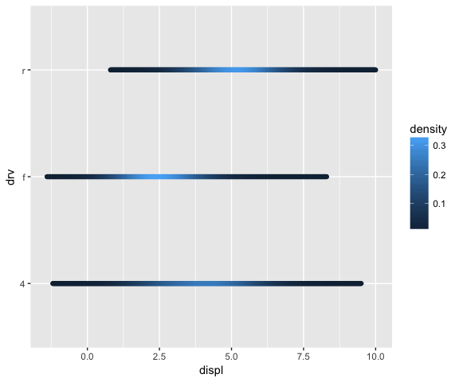<!-- -->

```r

# Using this stat with the area geom doesn’t work quite right. 
# The areas don’t stack on top of each other because each density 
# is computed independently, and the estimated x-ranges don’t line up.
ggplot(mpg, aes(displ, fill = drv)) + 
  stat_densityCommon(bandwidth = 0.75, geom = "area", position = "stack", alpha = 0.4)
```

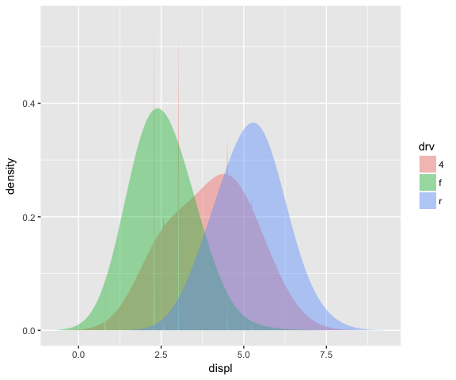<!-- -->

The `setup_params` function can be used to line up the x-ranges for the different groups. See example below from [2]...


```r
StatDensityCommon <- ggproto("StatDensityCommonF", Stat, 
  required_aes = "x",
  default_aes = aes(y = ..density..),
  
  setup_params = function(data, params){
      # print("Running set_up....")
      min <- min(data$x) - 3 * params$bandwidth
      max <- max(data$x) + 3 * params$bandwidth
      # print(paste("min:", min, "- max:", max, "- bw:", params$bandwidth))
      # print("End set_up....")
      list(
        bandwidth = params$bandwidth,
        min = min,
        max = max,
        na.rm = params$na.rm
      )
  },
  
  compute_group = function(data, scales, min, max, bandwidth = 1) {
    # print(paste("Running compute_group [", unique(data$group), "] ..."))
    d <- density(data$x, bw = bandwidth, from = min, to = max)
    # print(paste("x (range):", paste(range(d$x), collapse = " - "), "- bw:", bandwidth))
    # print("End compute_group....")
    data.frame(x = d$x, density = d$y)
  }  
)

ggplot(mpg, aes(displ, fill = drv)) + 
  stat_densityCommon(bandwidth = 0.75, geom = "area", position = "stack", alpha = 0.4)
```

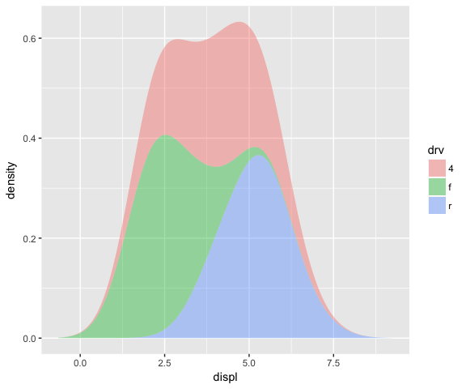<!-- -->

```r

ggplot(mpg, aes(displ, drv, fill = ..density..)) + 
  stat_densityCommon(bandwidth = 0.75, geom = "raster")
```

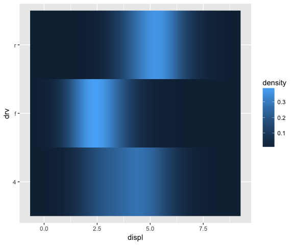<!-- -->

## How to create a new __geom__

All of the `geom_*` functions return a layer that contains a `Geom*` object (instance of the `Geom*` class), responsible for rendering the data in the plot.  The `Geom*` class is a `ggproto` class and a `Geom` class (inheritance), overriding some specific methods/ fields (see `?Geom` for more information).

Specific methods/ fields are

- `required_aes`, a character vector of needed aesthetics
- `default_aes`, a list of default values for aesthetics
- `draw_key`, a function used to draw key in the legend
- either `draw_panel` or `draw_group` function returning a grid grob to be plotted


The `draw_panel` function can be used when data is plot by panels and, each row in `data` represents a graphic element in a panel. See examples below from [2]...


```r
GeomMyPoint <- ggproto("_class" = "GeomMyPoint", Geom,
                       required_aes = c("x", "y"),
                       default_aes = aes(shape = 1),
                       draw_key = draw_key_point,
                       draw_panel = function(data, panel_scales, coord){
                           # Transform the data first
                           coords <- coord$transform(data, panel_scales)
                           
                           # Construct & return a grid object
                           pointsGrob(x = coords$x,
                                      y = coords$y,
                                      pch = coords$shape)
                       })

geom_mypoint <- function(mapping = NULL, data = NULL, stat = "identity",
                         position = "identity", na.rm = FALSE, 
                         show.legend = NA, inherit.aes = TRUE, ...) {
        ggplot2::layer(
                geom = GeomMyPoint, mapping = mapping,  
                data = data, stat = stat, position = position, 
                show.legend = show.legend, inherit.aes = inherit.aes,
                params = list(na.rm = na.rm, ...)
        )
}

base_plot <- ggplot(data = mpg, mapping= aes(x = displ, y = hwy))

one_panel <- base_plot  + geom_mypoint()

multi_panels_by_cyl <- base_plot  + 
    geom_mypoint() +
    facet_grid(. ~ cyl)

grid.arrange(one_panel, multi_panels_by_cyl, nrow = 1)
```

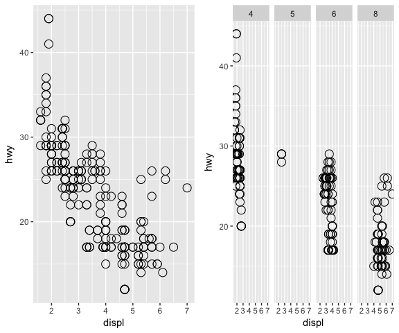<!-- -->

The `draw_group` function can be used when the data is plot by groups and, one graphic element must be plot per each group. See example below (inspired by [2]) used to create a Geom that is plotting the convex hull of the provided polygon with its centroid  ...


```r

GeomCentroidPolygon <- ggproto("GeomCentroidPolygon", Geom,
                               
                               required_aes = c("x", "y"),
                               
                               default_aes = aes(colour = "black", fill = "grey70", size = 0.5,
                                                 linetype = 1, alpha = 1),
                               
                               draw_key = draw_key_polygon,
                               
                               draw_group = function(data, panel_scales,coord){
                                 n <- nrow(data)
                                 if(n <= 2) return(grid::nullGrob())
                                 
                                 coords <- coord$transform(data, panel_scales)
                                     first_row <- coords[1, , drop = FALSE]
                                 
                                 centroid_x <- mean(coords$x, na.rm = T)
                                 centroid_y <- mean(coords$y, na.rm = T)
                                 
                                 poly_elem <- grid::polygonGrob(name = "polygonChull",
                                   x = coords$x, y = coords$y, 
                                   default.units = "native",
                                   gp = grid::gpar(
                                     col = first_row$colour,
                                     fill = scales::alpha(first_row$fill, first_row$alpha),
                                     lwd = first_row$size * .pt,
                                     lty = first_row$linetype
                                   )
                                 )
                                 
                                 centroid_elem <- grid::pointsGrob(name = "centroid",
                                                                   x = centroid_x, y = centroid_y,
                                                                   gp = grid::gpar(col = first_row$colour),
                                                                   pch = 4)
                                 
                                 gTree(children = gList(poly_elem, centroid_elem))
                                 
                               })

geom_centroid_polygon <- function(mapping = NULL, data = NULL, stat = "convexHull",
                                position = "identity", na.rm = FALSE, show.legend = NA, 
                                inherit.aes = TRUE, ...) {
  layer(
    geom = GeomCentroidPolygon, mapping = mapping, data = data, stat = stat, 
    position = position, show.legend = show.legend, inherit.aes = inherit.aes,
    params = list(na.rm = na.rm, ...)
  )
}

ggplot(mpg, aes(displ, hwy)) + 
  geom_centroid_polygon()+
  geom_point()
```

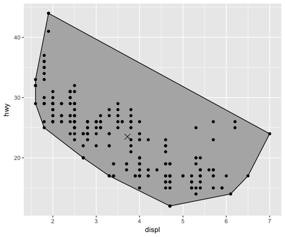<!-- -->

```r

ggplot(mpg, aes(displ, hwy, colour = class)) + 
  geom_centroid_polygon(fill = NA)
```

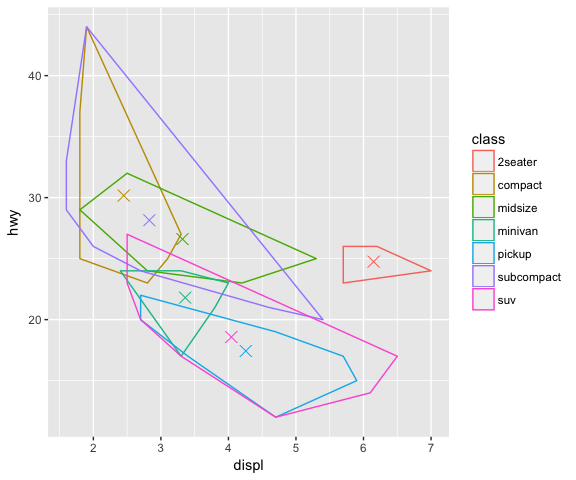<!-- -->

## Summary

Building new graphical elements, _stat_(s) or _geom_(s),can be useful if a new new graphical element is needed or to simplify a complex graphical task/ process that must be used repeatedly in many plots. The building of the new graphical element is done using the extending mechanism provided by `ggplot2` [2]. More examples of ggplot2 extension can be found at [3].

# References

[1] "Building New Graphical Elements" chapter in "[Mastering Software Development in R](http://rdpeng.github.io/RProgDA/building-new-graphical-elements.html)" by Peng, Cross and Anderson, 2017  
[2] Article ["Extending ggplot2"](http://ggplot2.tidyverse.org/articles/extending-ggplot2.html)  
[3] Some examples of [ggplot2-extensions](http://www.ggplot2-exts.org/index.html)

__Interesting book__:

- "R Graphics" 2nd Edition, by Paul Murrell, September 2015

__Previous "Building Data Visualization Tools" blogs__: 

- Part 1: "[Basic plotting with R and ggplot2](https://pparacch.github.io/2017/07/06/plotting_in_R_ggplot2_part_1.html)"  
- Part 2: "['ggplot2', essential concepts](https://pparacch.github.io/2017/07/14/plotting_in_R_ggplot2_part_2.html)"  
- Part 3: "[Guidelines for good plots](https://pparacch.github.io/2017/07/18/plotting_in_R_ggplot2_part_3.html)"  
- Part 4: "[How to work with maps](https://pparacch.github.io/2017/08/28/plotting_in_R_ggplot2_part_4.html)"  
- Part 5: "[Customise `ggplot2` output with `grid`](https://pparacch.github.io/2017/09/25/plotting_in_R_ggplot2_part_5.html)"

# Session Info


```r
sessionInfo()
## R version 3.3.3 (2017-03-06)
## Platform: x86_64-apple-darwin13.4.0 (64-bit)
## Running under: macOS  10.13
## 
## locale:
## [1] no_NO.UTF-8/no_NO.UTF-8/no_NO.UTF-8/C/no_NO.UTF-8/no_NO.UTF-8
## 
## attached base packages:
## [1] grid      stats     graphics  grDevices utils     datasets  methods  
## [8] base     
## 
## other attached packages:
## [1] gridExtra_2.3 ggplot2_2.2.1
## 
## loaded via a namespace (and not attached):
##  [1] Rcpp_0.12.12     digest_0.6.12    rprojroot_1.2    plyr_1.8.4      
##  [5] gtable_0.2.0     backports_1.1.0  magrittr_1.5     evaluate_0.10.1 
##  [9] scales_0.5.0     rlang_0.1.2      stringi_1.1.5    reshape2_1.4.2  
## [13] lazyeval_0.2.0   rmarkdown_1.6    labeling_0.3     tools_3.3.3     
## [17] stringr_1.2.0    munsell_0.4.3    yaml_2.1.14      colorspace_1.3-2
## [21] htmltools_0.3.6  knitr_1.17       tibble_1.3.4
```
