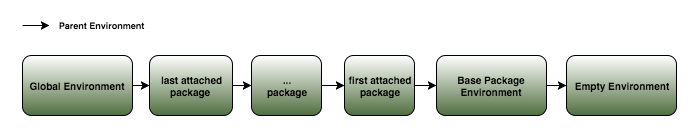
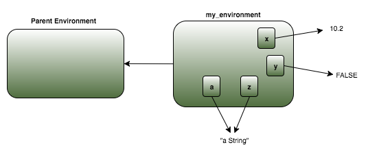
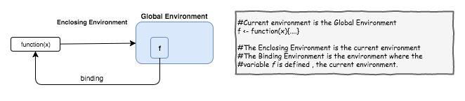
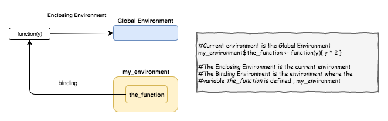

# Environments in R: an exploration
Pier Lorenzo Paracchini, 21.05.2017  

The content of this blog is based on notes collected and experiments performed while reading the __["Environments"](http://adv-r.had.co.nz/Environments.html) chapter__ in [__"Advanced R"__](http://adv-r.had.co.nz/) by __Hadley Wickham__ [1] in order to better understand the basic concepts behind environments.

# Introduction

All of the variables that created need to be stored somewhere, that special place is an __environment__.  As Hadley Wickham simply stated 

    "The job of an environment is to associate/ bind a set of names to a set of values." [1]

Usually there is no need to explicitly deal with environments but it is __usefull to understand the basic concepts behind environments__ especially when __writing iteractive code__, __debugging__ and __building R packages__.

## Environment Basics

An __environment__ is just another type of variable - it can be __created__, __assigned__, __manipulated__. An environment is represented as a list and is characterized by

* __a frame__ containing the name-object bindings and
    * every name is unique and the names are not ordered
* __a parent environment__.


Note _'Unfortunately “frame” is used inconsistently in R. For example, parent.frame() doesn’t give you the parent frame of an environment. Instead, it gives you the calling environment.'_ [1]

As a general rule __every environment has a parent environment__, and the parent environment plays a key role in the implementation of __lexical scoping__. If a name is not found in an environment then it will searched in the parent environment (and so on).

There are 4 special environments to be aware of:

* the __global environment__, aka the __interactive user's workspace__. The parent of the global environment is the last package attached using `library()` or `require()`.
    * `globalenv()` function can be used to get the global environment. 
* the __environment of the base package__. Its parent is the __empty environment__.
    * `baseenv()` function can be use to get the base environment. 
* the __empty environment__ or the ultimate ancestor of all environments. It is the only environment without a parent (exception to the general rule).
    `emptyenv()` function can be used to get the empty environment.
* the __current environment__, accessible via `environment()` function.

When working interactively, the `search()` function can be used to list all parents of the __global environment__. All objects in these environments are accessible from the interactive workspace.




```r
#How to see the search path
search()
## [1] ".GlobalEnv"        "package:stats"     "package:graphics" 
## [4] "package:grDevices" "package:utils"     "package:datasets" 
## [7] "package:methods"   "Autoloads"         "package:base"
```
## Environment Management

__How to create a new environment...__

The __creation of a new environment__ is done using the `new.env()` function. Variables can be added to this new environment using the __$__ notation. 


```r
#Create a new environment using new.env()
#the function returs a new empty environment with
#parent set by parent.frame() (default setting)
#that is the calling environment.
my_environment <- new.env()

#Add some variables to the new environment
my_environment$x <- 10.2
my_environment$y <- FALSE
my_environment$z <- "a string"

#Note that actual values are stored outside of the environment
#two variables can point to the same values
my_environment$a <- my_environment$z
```



__How to get the parent environment...__


```r
#How to get the parent environment
#the default parent is the environment from which it is called (default) 
parent.env(my_environment)
## <environment: R_GlobalEnv>
```

__How to get information about variables defined within an environment...__


```r
#Which name of objects reside in such environment
#By default names starting with . are not shown (use all.names = TRUE)
ls(my_environment, all.names = TRUE)
## [1] "a" "x" "y" "z"

#To have have more information about the variables
ls.str(my_environment ,all.names = TRUE)
## a :  chr "a string"
## x :  num 10.2
## y :  logi FALSE
## z :  chr "a string"
```

__How to extract the value given to a certain variable in an environment...__


```r
#There are different ways to get the value...
my_environment$z
## [1] "a string"

my_environment[["z"]]
## [1] "a string"

get("z", envir = my_environment)
## [1] "a string"
```

__How to delete an object from an environment__


```r
#Setting the value to NULL does not remove the object
#it just sets it to NULL (different bahviour from list)
my_environment$z <- NULL 
ls.str(my_environment)
## a :  chr "a string"
## x :  num 10.2
## y :  logi FALSE
## z :  NULL

#Remove the desired object using
#rm() function
rm("z", envir = my_environment)
ls(my_environment, all.names = T)
## [1] "a" "x" "y"
```

__How to check if a specific binding exists in an environment...__


```r
#See variables currently defined in the environment
ls(my_environment)
## [1] "a" "x" "y"

#x does exist in the environment
#inherits must be set to FALSE otherwise will
#looks into ancestors
exists("x", envir = my_environment, inherits = FALSE)
## [1] TRUE

#z does not exist in the environment - it was reviously deleted
exists("z", envir = my_environment, inherits = FALSE)
## [1] FALSE
```

__How to compare if environments are identical...__


```r
#to compare two environments the 
#identical function needs to be used
#remember that the environment() function
#return teh current environemnt (global environment)
identical(globalenv(), environment())
## [1] TRUE
```

__How to view the ancestors of a given environment...__


```r
#The function does navigate all parents environment till it
#reach the empty environment, printing out the each environment
#to console
ancestors <- function(the_env){
    print(the_env)
    if (!identical(the_env, emptyenv())){
        ancestors(parent.env(the_env))
    }
}

#Show the ancestors for my environment
ancestors(my_environment)
## <environment: 0x7f9623056660>
## <environment: R_GlobalEnv>
## <environment: package:stats>
## attr(,"name")
## [1] "package:stats"
## attr(,"path")
## [1] "/Library/Frameworks/R.framework/Versions/3.3/Resources/library/stats"
## <environment: package:graphics>
## attr(,"name")
## [1] "package:graphics"
## attr(,"path")
## [1] "/Library/Frameworks/R.framework/Versions/3.3/Resources/library/graphics"
## <environment: package:grDevices>
## attr(,"name")
## [1] "package:grDevices"
## attr(,"path")
## [1] "/Library/Frameworks/R.framework/Versions/3.3/Resources/library/grDevices"
## <environment: package:utils>
## attr(,"name")
## [1] "package:utils"
## attr(,"path")
## [1] "/Library/Frameworks/R.framework/Versions/3.3/Resources/library/utils"
## <environment: package:datasets>
## attr(,"name")
## [1] "package:datasets"
## attr(,"path")
## [1] "/Library/Frameworks/R.framework/Versions/3.3/Resources/library/datasets"
## <environment: package:methods>
## attr(,"name")
## [1] "package:methods"
## attr(,"path")
## [1] "/Library/Frameworks/R.framework/Versions/3.3/Resources/library/methods"
## <environment: 0x7f961f0fe278>
## attr(,"name")
## [1] "Autoloads"
## <environment: base>
## <environment: R_EmptyEnv>
```

__How to find if a specific binding exists in an environment and in which environment...__

Environments form a tree. In order to find where a bind is defined, in which environment, a function recursing over environments is `pryr::where()`, given a name the function finds where that name is defined using regular scoping rules of R.


```r
#Print basic environment info connected with
print(my_environment)
## <environment: 0x7f9623056660>

#Create a variable in the current environment (global environment)
x <- 10
#By default in where the env is set to parent.frame(),
#the current environment
pryr::where("x")
## <environment: R_GlobalEnv>
pryr::where("mean")
## <environment: base>
pryr::where("x", env = my_environment)
## <environment: 0x7f9623056660>
pryr::where("mean", env = my_environment)
## <environment: base>
```

Or we could define out own function... 


```r
#Implement our own version of where using recursion
where_local_r <- function(name, env = parent.frame()){
    if(identical(env, emptyenv())){
        #Leaf1 condition
        stop("Cant find ", name, call. = FALSE)
    }else if(exists(name, envir = env, inherits = FALSE)){
        #Leaf2 condition
        env
    }else{
        #Navigate up the tree
        where_local_r(name, parent.env(env))
    }
}

#By default env is set to the parent.frame(),
#the current environment
where_local_r("x")
## <environment: R_GlobalEnv>
where_local_r("mean")
## <environment: base>
where_local_r("x", env = my_environment)
## <environment: 0x7f9623056660>
where_local_r("mean", env = my_environment)
## <environment: base>
```

## Function Environments

Most environments are created as a consequence of using functions - not because of `new.env()`. There are __4 types of environments__ associated with a function: 

* the __enclosing environment__, the environment where the function was created 
* binding a function to a name using `<-` creates a __binding environment__
* calling a function creates an __execution environment__ that stores variable created during execution
* every __execution environment__ is associated to a __calling environment__ which tells you where the function was called

Every function has __one and only one enclosing environment__, but there __could be many environments of the other types__.

### The Enclosing Environment

When a function is created it gains a reference to the environment where it was made. This environment is called the __Enclosing Environment__ and it has the following characteristics

* there is always one and only one for a function,
* it plays a key role for __lexical scoping__.

__How to find out the enclosing environment associated to a function...__


```r
#To find the enclosing environment for the function
#returns the environment associated with that function
environment(function(x){ x + 1})
## <environment: R_GlobalEnv>
```


__How to change the enclosing environment associated to a function...__


```r
print(my_environment)
## <environment: 0x7f9623056660>

f <- function(x){ x + 1}
environment(f)
## <environment: R_GlobalEnv>

#Change the enclosing environment
environment(f) <- my_environment
environment(f)
## <environment: 0x7f9623056660>
```

### Binding Environments

Naming a function creates a binding. The binding environments of a function are all of the environments which have a binding to it. There can be many binding environments for the same function.


```r
#Naming the function to f, a bind is created in the current environment
#The enclosing environment is the current environment
#The binding environment is the current environment
f <- function(x){ x + 1}

#In this case enclosing and binding are the same environment
#Enclosing environment is
environment(f)
## <environment: R_GlobalEnv>

#Binding environment is
pryr::where("f")
## <environment: R_GlobalEnv>
```




```r
#Info about my_environment
print(my_environment)
## <environment: 0x7f9623056660>

#Create a new function in my_environment
my_environment$the_function <- function(y){ y * 2 }

#The enclosing environment
environment(my_environment$the_function)
## <environment: R_GlobalEnv>

#The binding environment
pryr::where("the_function", env = my_environment)
## <environment: 0x7f9623056660>
```



### Side Track: Package Namespaces

The difference between the enclosing environment and binding environments is fundamental for understanding package namespaces.

__Package namespaces__ are __implemented using environments__, taking advantage of the fact that functions don’t have to live in their enclosing environments.


```r
#The mean() function, the enclosing environment and 
#binding environment are different

#The enclosing environment is ...
environment(mean)
## <environment: namespace:base>

#Binding environment
pryr::where("sd")
## <environment: package:stats>
## attr(,"name")
## [1] "package:stats"
## attr(,"path")
## [1] "/Library/Frameworks/R.framework/Versions/3.3/Resources/library/stats"
```

    "... every package has two environments associated with it: the package environment and the namespace environment. The package environment contains every publicly accessible function, and is placed on the search path. The namespace environment contains all functions (including internal functions), and its parent environment is a special imports environment that contains bindings to all the functions that the package needs. Every exported function in a package is bound into the package environment, but enclosed by the namespace environment..." [1]


### Execution Environments

A new __execution environment__ is created every time a function is executed and the parent of this execution environment is the __enclosing environment__ of the function. The life of the __execution environment__ is connected to the execution of the function, when the function terminates the __execution environment__ disappears.  


```r
#clean up the current environment
rm(list = ls())
#Define the variable a in the current environment
a <- 20

g <- function(x){
    print("----Inside function----")
    print("Current Env:")
    print(environment())
    print("Parent Env:")
    print(parent.env(environment()))
    
    #lets check if the variable a is defined in the
    #current environment (the environment where the function runs)
    if(!exists("a", inherits = F)){
        message("Defining a...")
        a <- 1
    }else{
        a <- a + 1
    }
    a
}

#Check the current environment
print(environment())
## <environment: R_GlobalEnv>

g(10)
## [1] "----Inside function----"
## [1] "Current Env:"
## <environment: 0x7f962315eb50>
## [1] "Parent Env:"
## <environment: R_GlobalEnv>
## Defining a...
## [1] 1
g(10)
## [1] "----Inside function----"
## [1] "Current Env:"
## <environment: 0x7f96230da3f8>
## [1] "Parent Env:"
## <environment: R_GlobalEnv>
## Defining a...
## [1] 1
```

When you create a function within another function, a new __execution environment__ is created for the child function when executed, and the __enclosing environment__ of the child function is the __execution environment__ of the parent.


```r
#clean up the current environment
rm(list = ls())
#Define the variable a in the current environment
a <- 20

g <- function(x){
    print("----Inside function----")
    print("Current Env:")
    print(environment())
    print("Parent Env:")
    print(parent.env(environment()))

    a_function <- function(x){
        print("----Inside function::function----")
        print("Current Env:")
        print(environment())
        print("Parent Env:")
        print(parent.env(environment()))
        #lets check if the variable a is defined in the
        #current environment (the environment where the function runs)
        if(!exists("a", inherits = F)){
            message("Defining a...")
            a <- 1
        }else{
            a <- a + 1
        }
        a
    }
    a_function(x)
}

#Check the current environment
print(environment())
## <environment: R_GlobalEnv>

g(10)
## [1] "----Inside function----"
## [1] "Current Env:"
## <environment: 0x7f9622ccb1f0>
## [1] "Parent Env:"
## <environment: R_GlobalEnv>
## [1] "----Inside function::function----"
## [1] "Current Env:"
## <environment: 0x7f9622ccf260>
## [1] "Parent Env:"
## <environment: 0x7f9622ccb1f0>
## Defining a...
## [1] 1
```

### Calling Environments


```r
rm(list = ls())
#what do you expect i() to return?
h <- function(){
    x <- 10
    function(){
        x
    }
}

i <- h()
x <-20
i()
## [1] 10

#lexical scoping is used and not the calling env
#lexical scoping uses teh current env and then its enclosing env ...
#using lexical scoping h() looks for x in the 
#1. execution env associated with the child function and 
#it does not find it, 
#2. it moves to the enclosing env of the child function and
#it does find the variable x (and use this value)
```


```r
rm(list = ls())
#what do you expect i() to return?
h <- function(){
    function(){
        x
    }
}

i <- h()
x <-20
i()
## [1] 20

#lexical scoping is used and not the calling env
#lexical scoping uses teh current env and then its enclosing env ...
#using lexical scoping h() looks for x in the 
#1. execution env associated with the child function and 
#it does not find it, 
#2. it moves to the enclosing env of the child function and
#it does not find it,
#3. it move to the enclosing env of the function h and
#it does find it (use this value)
```

Note that each __execution environment__ has two parents: __a calling environment__ and __an enclosing environment__. Regular scoping rules uses only the enclosing parent. If you need to use the calling environment then use `parent.frame()` to access it. looking up variables in the calling environment is called __dynamic scoping__.


```r
#the calling environment can be accessed using the parent.frame() function

h2 <- function(){
    x <- 10
    function(){
        x <- 5
        def <- get("x", envir = environment())
        def_parent <- get("x", envir = parent.env(environment()))
        cll <- get("x", envir = parent.frame())
        list(defined = def, parent = def_parent, called = cll)
    }
}
g2 <- h2()
x <- 40
str(g2())
## List of 3
##  $ defined: num 5
##  $ parent : num 10
##  $ called : num 40
```

About __dynamic scoping__...

    "...dynamic scoping makes it much harder to reason about how a function operates: not only do you need to know how it was defined, you also need to know in what context it was called. Dynamic scoping is primarily useful for developing functions that aid interactive data analysis..."

# Binding names to values

    "An assignment is the act of binding (or rebinding) a name to a value in an environment.  ... R has extremely flexible tools for binding names to values. In fact, you can not only bind values to names, but you can also bind expressions (promises) or even functions, so that every time you access the value associated with a name, you get something different!" [1]

Name rules:

* consist of letters, digits, . and _
* cannot begin with _
* cannot be a reserved word, see `?Reserved`

The regular assignment arrow, `<-`, always creates a variable in the current environment. The deep assignment arrow, `<<-`, never creates a variable in the current environment, but instead modifies an existing variable found by walking up the parent environments. Note that if <<- doesn’t find an existing variable, it will create one in the global environment. This is usually undesirable, because global variables introduce non-obvious dependencies between functions. 

# References
[1] "Advanced R" by Hadley Wickham, ["Environments"](http://adv-r.had.co.nz/Environments.html) chapter 
