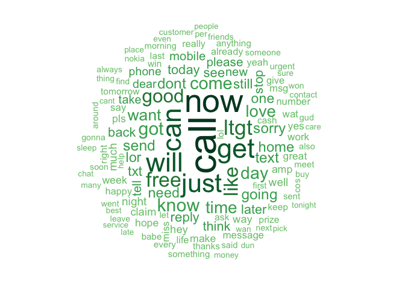
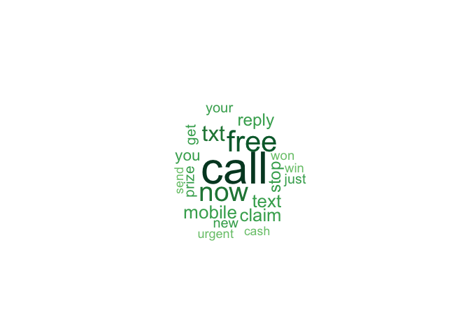
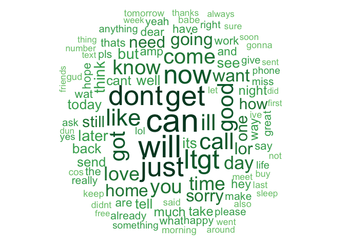

# NLP - Classification using a Naive Bayes classifier
Pier Lorenzo Paracchini  
23 December 2016  


```r
require(caret)
```

* `caret` package
    * for splitting the data

## SMS messages: spam or ham?

The story,

_'Advertisers utilize Short Message Service (SMS) messages to target potential consumers with unwanted advertising. This kind of messages are known as SMS spam. Developing a classification algorithm that could filter SMS spam provides a useful tool for cellular phone providers.'_ ... and __Naive Bayes__ classifiers can be used to classify mobile phone sms messages as spam/ ham. 


## The Data

The data used for such playground activity is the [SMS Spam Collection v. 1](http://www.dt.fee.unicamp.br/~tiago/smsspamcollection/), a public set of SMS messages that have been collected for mobile phone spam research where each message has been properly labeled as __spam__ or __ham__.

The original file has been pre-processed in order to create a CSV file and it is available in the repository

* `\t` separator has been replaced by `,`
* `"` in the free text have been replaced by `'`
* the sms text has been included in `"` (quoted text)

Loading the data ...


```r
rawData <-  read.csv("./data/smsspamcollection/SMSSpamCollection.txt", 
                     header = FALSE, 
                     stringsAsFactors = FALSE)
```

__Q__: What type of data is available in the dataset?


```r
#Show the structure of the raw dataset
str(rawData)
## 'data.frame':	5574 obs. of  2 variables:
##  $ V1: chr  "ham" "ham" "spam" "ham" ...
##  $ V2: chr  "Go until jurong point, crazy.. Available only in bugis n great world la e buffet... Cine there got amore wat..." "Ok lar... Joking wif u oni..." "Free entry in 2 a wkly comp to win FA Cup final tkts 21st May 2005. Text FA to 87121 to receive entry question(std txt rate)T&C"| __truncated__ "U dun say so early hor... U c already then say..." ...
```

The dataset includes 5574 observations (sms) and 2 features/ columns. V1 is the label, while   V2 is the message text. Both features are stored as `character` vectors.

Some __possible improvements__ in the data, before doing any exploration, are

* to change the feature names to meaningfull names as 
    * `type` and 
    * `text` respectively.
* to __encode__ the `text` feature to `utf-8`, be sure about the encoding (potential __gremlings__ problems) 
* to __transform__ the `type` feature from a `character` type to a `factor` type...


```r
#Changing the name of the features/ columns
colnames(rawData) <- c("type", "text")

#Converting the text to utf-8 format
rawData$text <- iconv(rawData$text, to = "utf-8")

#Type as factor
rawData$type <- factor(rawData$type)

summary(rawData)
##    type          text          
##  ham :4827   Length:5574       
##  spam: 747   Class :character  
##              Mode  :character
```

The data includes 5574 messages, 4827 ham messages and 747 spam messages.


```r
#Show the type of messages and their distributions
table(rawData$type)
## 
##  ham spam 
## 4827  747

#as percentage over the total messages
prop.table(table(rawData$type)) * 100
## 
##      ham     spam 
## 86.59849 13.40151
```

Please note how the data is __unbalanced__, there are lot of messages classifed as __ham__ and few messages as __spam__.

### Data Splitting

Before doing any exploration of the messages, the data is __split into a training and testing dataset__. The __training dataset__ is going to be __used for exploring the data and unserstanding the type of cleaning, transformation rules__ than need to be applied in order to create the relevant features to train the model/ classifier. 

The data splitting is done using a __stratified sampling__ approach, to keep the same proportions of the type pf messages within the training and testing datasets.


```r
set.seed(1234)
#Create a training set containing 75% of the data (with stratified sampling)
trainIndex <- createDataPartition(rawData$type, p = .75, 
                                  list = FALSE, 
                                  times = 1)
trainData <- rawData[trainIndex,]
testData <- rawData[-trainIndex,]

#proportion in train dataset
prop.table(table(trainData$type)) * 100
## 
##      ham     spam 
## 86.58537 13.41463

#proportion in test dataset
prop.table(table(testData$type)) * 100
## 
##      ham     spam 
## 86.63793 13.36207
```


##Exploring and preparing the data for analysis
Some of these messages are important (__ham__) whime some of messages are irrelevant (__spam__). Let's see the content of some messages ...


```r
head(rawData$text, 5)
## [1] "Go until jurong point, crazy.. Available only in bugis n great world la e buffet... Cine there got amore wat..."                                            
## [2] "Ok lar... Joking wif u oni..."                                                                                                                              
## [3] "Free entry in 2 a wkly comp to win FA Cup final tkts 21st May 2005. Text FA to 87121 to receive entry question(std txt rate)T&C's apply 08452810075over18's"
## [4] "U dun say so early hor... U c already then say..."                                                                                                          
## [5] "Nah I don't think he goes to usf, he lives around here though"

tail(rawData$text, 5)
## [1] "This is the 2nd time we have tried 2 contact u. U have won the £750 Pound prize. 2 claim is easy, call 087187272008 NOW1! Only 10p per minute. BT-national-rate."
## [2] "Will ü b going to esplanade fr home?"                                                                                                                            
## [3] "Pity, * was in mood for that. So...any other suggestions?"                                                                                                       
## [4] "The guy did some bitching but I acted like i'd be interested in buying something else next week and he gave it to us for free"                                   
## [5] "Rofl. Its true to its name"
```

###Creating and cleaning the corpus
SMS messages are strings of text composed of words, spaces, numbers, and punctuation. We needs to consider how to remove numbers, punctuation, handle uninteresting words such as and, but, and or, and how to break apart sentences into individual words.

__Note!__ `tm` package - Text Mining package in R - can be used for such purpose. For installing the package run `install.packages("tm")`.

__First step__ is creating the **corpus**, a R object representing a collection of text documents. In this specific case a text document refers to a single SMS message.


```r
library(tm) #loading tm library for usage
corpus <- Corpus(VectorSource(rawData$text))

#basic info about the corpus
print(corpus)
## <<VCorpus>>
## Metadata:  corpus specific: 0, document level (indexed): 0
## Content:  documents: 5574
```
Please note that the corpus contains 5559 text documents (aka sms text).


```r
#Inspect the first 4 documents
corpus[[1]]$content
## [1] "Go until jurong point, crazy.. Available only in bugis n great world la e buffet... Cine there got amore wat..."
corpus[[2]]$content
## [1] "Ok lar... Joking wif u oni..."
corpus[[3]]$content
## [1] "Free entry in 2 a wkly comp to win FA Cup final tkts 21st May 2005. Text FA to 87121 to receive entry question(std txt rate)T&C's apply 08452810075over18's"
corpus[[4]]$content
## [1] "U dun say so early hor... U c already then say..."
```

Before splitting the text into words some __cleaning steps__ need to be performed in order to remove punctuation and other characters that may create problems.

__Note!!__ Standard transformations supported by the `tm` package. 

```
## [1] "removeNumbers"     "removePunctuation" "removeWords"      
## [4] "stemDocument"      "stripWhitespace"
```


```r
#1. normalize to lowercase
corpus <- tm_map(corpus, tolower)

#2. remove numbers
corpus <- tm_map(corpus, removeNumbers)

#3. remove stopwords e.g. to, and, but, or (using predefined set of word in tm package)
corpus <- tm_map(corpus, removeWords, stopwords())

#4. remove punctuation
corpus <- tm_map(corpus, removePunctuation)

#5. normalize whitespaces
#Now that we have removed numbers, stop words, and punctuation, the text messages are left with #blank spaces where these characters used to be. The last step then is to remove additional #whitespace, leaving only a single space between words.
corpus <- tm_map(corpus, stripWhitespace)

#Be sure to use the following script once you have completed preprocessing.
#This tells R to treat your preprocessed documents as text documents because of the non standard transformations (tolower)
corpus <- tm_map(corpus, PlainTextDocument)
```


```r
#Inspect the first 4 documents
corpus[[1]]$content
## [1] "go jurong point crazy available bugis n great world la e buffet cine got amore wat"
corpus[[2]]$content
## [1] "ok lar joking wif u oni"
corpus[[3]]$content
## [1] "free entry wkly comp win fa cup final tkts st may text fa receive entry questionstd txt ratetcs apply s"
corpus[[4]]$content
## [1] "u dun say early hor u c already say"
```

###Tokenization
Now that the data are processed to our __liking__, the final step is to split the messages into individual elements through a process called __tokenization__. A __token__ is a single element of a text string; in this case, the tokens are words.

From the __corpus__ a data structured called __sparse matrix__ is created. In the __sparse matrix__, each row (observation) represents a document (SMS text message) and each column is a token/ word. The number in a cell represents the number of time the token (col) is present in the document represented by that row.


```r
sms_dtm <- DocumentTermMatrix(corpus)

#basic information about the sparse matrix
print(sms_dtm)
## <<DocumentTermMatrix (documents: 5574, terms: 7930)>>
## Non-/sparse entries: 43089/44158731
## Sparsity           : 100%
## Maximal term length: 40
## Weighting          : term frequency (tf)
```

__Note!!__ The sparse matrix has the following dimensions

* nrows = 5559 -> the number of documents
* ncols = 7868 -> the number of features/ terms found in the corpus.

###Creation of the __Training__ and __Test__ datasets
Using the `caTools` package, specifically `sample.split` function to create a test and training sets for rawData, clean corpus and sparse matrix. Advantage of using such a function is _preserving relative ratios of different labels in X_.


```r
library(caTools)
set.seed(19711004)

spl_data <- sample.split(rawData$type, SplitRatio = 0.7)

rawData_train <- subset(rawData, spl_data) #Get only where TRUE
sms_dtm_train <- sms_dtm[spl_data,] #Get only where TRUE
corpus_train <- corpus[spl_data] #Get only where TRUE

rawData_test <- subset(rawData, !spl_data) #Get only where FALSE
sms_dtm_test <- sms_dtm[!spl_data,] #Get only where FALSE
corpus_test <- corpus[!spl_data] #Get only where FALSE
```


```r
#Training dataset info
prop.table(table(rawData_train$type))
## 
##       ham      spam 
## 0.8659662 0.1340338

#Test dataset info
prop.table(table(rawData_test$type))
## 
##       ham      spam 
## 0.8660287 0.1339713
```

###(Optional) Visual Analysis
Using the `wordclod` package to visualize frequency of words in prepared text data.


```r
library(wordcloud)
pal <- brewer.pal(9,"YlGn")
pal <- pal[-(1:4)]
```

__Wordcloud for training dataset__ ....

```r
#min.freq initial settings -> around 10% of the number of docs in the corpus (40 times)
wordcloud(corpus_train, min.freq = 40, random.order = FALSE, colors = pal)
```

<!-- -->

Another interesting visualization involves comparing the clouds of SMS __spam__ and __ham__ using the raw text messages that are going to be used to train the algorith... 

```r
rawData_train_spam <- subset(rawData_train, type == "spam")
rawData_train_ham <- subset(rawData_train, type == "ham")
```

__Spam__ overview...

```r
wordcloud(rawData_train_spam$text, min.freq = 40, random.order = FALSE, colors = pal)
```

<!-- -->

__Ham__ overview...

```r
wordcloud(rawData_train_ham$text, min.freq = 40, random.order = FALSE, colors = pal)
```

<!-- -->

Spam SMS messages include words such as urgent, free, mobile, call, claim, and stop; these terms do not appear in the ham cloud at all. Instead, ham messages use words such as can, sorry, need, and time. These stark differences suggest that our naive Bayes model will have some strong key words to differentiate between the classes.

###Creating indicator features for frequent words
The next step is to transform the sparse matrix into a data structure that can be used to train a __naive Bayes classifier__.


```r
print(sms_dtm_train)
## <<DocumentTermMatrix (documents: 3902, terms: 7930)>>
## Non-/sparse entries: 30163/30912697
## Sparsity           : 100%
## Maximal term length: 40
## Weighting          : term frequency (tf)
```
 The sparse matrix used for training include 3891 documents and 7868 features (terms). __Not all of these terms will be useful for classification__. In order to reduce thenumber of features we can proceed to consider the words that appears at least a certain number of times (__frequent words__)...


```r
sms_dict <- findFreqTerms(sms_dtm_train, 5) #find words that appears at least 5 times
summary(sms_dict)
##    Length     Class      Mode 
##      1165 character character
```

There are 1152 terms/ features idendified as frequent terms. __To limit our training and test matrix to only the words in the dictionary of frequent terms__ we can use the following commands ...


```r
sms_train <- DocumentTermMatrix(corpus_train, list(dictionary = sms_dict))
print(sms_train)
## <<DocumentTermMatrix (documents: 3902, terms: 1165)>>
## Non-/sparse entries: 22174/4523656
## Sparsity           : 100%
## Maximal term length: 19
## Weighting          : term frequency (tf)

sms_test <- DocumentTermMatrix(corpus_test, list(dictionary = sms_dict))
print(sms_test)
## <<DocumentTermMatrix (documents: 1672, terms: 1165)>>
## Non-/sparse entries: 9228/1938652
## Sparsity           : 100%
## Maximal term length: 19
## Weighting          : term frequency (tf)
```

The naive Bayes classifier is typically trained on data with categorical features. This poses a problem since the cells in the sparse matrix indicate a count of the times a word appears in a message. We should change this to a factor variable that simply indicates yes or no depending on whether the word appears at all in a document.

Let's create a function for that ...

```r
convert_counts <- function(x){
  x <- ifelse(x > 0, 1, 0)
  x <- factor(x, levels = c(0,1), labels = c("No", "Yes"))
  return (x)
}
```

Let's apply the function to each column in the sparse matrices ...

```r
sms_train <- apply(sms_train, MARGIN = 2, convert_counts)
sms_test <- apply(sms_test, MARGIN = 2, convert_counts)
```

Now we have two matrixes each with a "Yes" or "No" indicating if a specific word (feature) appears in the messages (rows).

```r
head(sms_train[,1:5])
##               Terms
## Docs           abiola able abt  accept access
##   character(0) "No"   "No" "No" "No"   "No"  
##   character(0) "No"   "No" "No" "No"   "No"  
##   character(0) "No"   "No" "No" "No"   "No"  
##   character(0) "No"   "No" "No" "No"   "No"  
##   character(0) "No"   "No" "No" "No"   "No"  
##   character(0) "No"   "No" "No" "No"   "No"

head(sms_test[,1:5])
##               Terms
## Docs           abiola able abt  accept access
##   character(0) "No"   "No" "No" "No"   "No"  
##   character(0) "No"   "No" "No" "No"   "No"  
##   character(0) "No"   "No" "No" "No"   "No"  
##   character(0) "No"   "No" "No" "No"   "No"  
##   character(0) "No"   "No" "No" "No"   "No"  
##   character(0) "No"   "No" "No" "No"   "No"
```

##Train the model using the training dataset

```r
#Library implementing the naive Bayes algorithm
library(e1071)
```


```r
sms_classifier <- naiveBayes(sms_train, rawData_train$type)
```
##Test the model against the test dataset and evaluate model performance


```r
sms_test_pred <- predict(sms_classifier, sms_test)
```

```r
#table actual (row) vs. predicted (col)
table(rawData_test$type, sms_test_pred)
##       sms_test_pred
##         ham spam
##   ham  1443    5
##   spam   25  199
```
Looking at the table we can see that 29 messages out of 1467 ham messages (0.0197682) have been incorrcetly classified as spam, while 6 messages out of 201 spam messages (0.0298507) have been incorrectly classified as ham.
