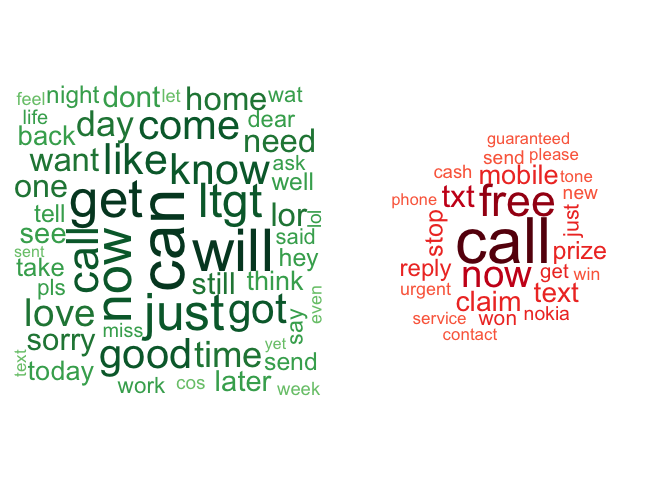

# NLP - Classification using a Naive Bayes classifier
Pier Lorenzo Paracchini  
23 December 2016  


```r
require(caret)
require(tm)
require(wordcloud)
require(e1071)
require(MLmetrics)
```

* `caret` package
    * for splitting the data
* `tm` package, for NLP tasks
* `wordcloud` package, for visualizations
* `e1071` package, for the Naive Bayes Classifier implementation
* `MLmetrics` package, for a quick calculation of the evaluation coefficients
    * confusin matrix, accuracy, F1 score

## SMS messages: spam or ham?

_'Advertisers utilize Short Message Service (SMS) messages to target potential consumers with unwanted advertising. This kind of messages are known as SMS spam. Developing a classification algorithm that could filter SMS spam provides a useful tool for cellular phone providers.'_ ... and __Naive Bayes__ classifiers can be used to classify mobile phone sms messages as spam/ ham. 


## The Data

The data used for such playground activity is the [SMS Spam Collection v. 1](http://www.dt.fee.unicamp.br/~tiago/smsspamcollection/), a public set of SMS messages that have been collected for mobile phone spam research where each message has been properly labeled as __spam__ or __ham__.

The original file has been pre-processed in order to create a CSV file and it is available in the repository

* `\t` separator has been replaced by `,`
* `"` in the free text have been replaced by `'`
* the sms text has been included in `"` (quoted text)

Loading the data ...


```r
rawData <-  read.csv("./data/smsspamcollection/SMSSpamCollection.txt", 
                     header = FALSE, 
                     stringsAsFactors = FALSE)
```

__Q__: What type of data is available in the dataset?


```r
#Show the structure of the raw dataset
str(rawData)
## 'data.frame':	5574 obs. of  2 variables:
##  $ V1: chr  "ham" "ham" "spam" "ham" ...
##  $ V2: chr  "Go until jurong point, crazy.. Available only in bugis n great world la e buffet... Cine there got amore wat..." "Ok lar... Joking wif u oni..." "Free entry in 2 a wkly comp to win FA Cup final tkts 21st May 2005. Text FA to 87121 to receive entry question(std txt rate)T&C"| __truncated__ "U dun say so early hor... U c already then say..." ...
```

The dataset includes 5574 observations (sms) and 2 features/ columns. V1 is the label, while   V2 is the message text. Both features are stored as `character` vectors.

Some __possible improvements__ in the data, before doing any exploration, are

* to change the feature names to meaningfull names as 
    * `type` and 
    * `text` respectively.
* to __encode__ the `text` feature to `utf-8`, be sure about the encoding (potential __gremlings__ problems) 
* to __transform__ the `type` feature from a `character` type to a `factor` type...


```r
#Changing the name of the features/ columns
colnames(rawData) <- c("type", "text")

#Converting the text to utf-8 format
rawData$text <- iconv(rawData$text, to = "utf-8")

#Type as factor
rawData$type <- factor(rawData$type)

summary(rawData)
##    type          text          
##  ham :4827   Length:5574       
##  spam: 747   Class :character  
##              Mode  :character
```

The data includes 5574 messages, 4827 ham messages and 747 spam messages.


```r
#Show the type of messages and their distributions
table(rawData$type)
## 
##  ham spam 
## 4827  747

#as percentage over the total messages
prop.table(table(rawData$type)) * 100
## 
##      ham     spam 
## 86.59849 13.40151
```

Please note how the data is __unbalanced__, there are lot of messages classifed as __ham__ and few messages as __spam__.

### Data Splitting

Before doing any exploration of the messages, the data is __split into a training and testing dataset__. The __training dataset__ is going to be __used for exploring the data and unserstanding the type of cleaning, transformation rules__ than need to be applied in order to create the relevant features to train the model/ classifier. 

The data splitting is done using a __stratified sampling__ approach, to keep the same proportions of the type pf messages within the training and testing datasets.


```r
set.seed(1234)
#Create a training set containing 75% of the data (with stratified sampling)
trainIndex <- createDataPartition(rawData$type, p = .75, 
                                  list = FALSE, 
                                  times = 1)
trainData <- rawData[trainIndex,]
testData <- rawData[-trainIndex,]

#proportion in train dataset
prop.table(table(trainData$type)) * 100
## 
##      ham     spam 
## 86.58537 13.41463

#proportion in test dataset
prop.table(table(testData$type)) * 100
## 
##      ham     spam 
## 86.63793 13.36207
```

# Exploratory Data Analysis

Exploratory data analysis is done on the training dataset only in order to have an hold out dataset, the testing dataset, that can be used to evaluate the trained model on a completely new set of data.  

__Q__: What is the content of the messages?


```r
#Hame messages
trainData_ham <- trainData[trainData$type == "ham",]
head(trainData_ham$text)
## [1] "Ok lar... Joking wif u oni..."                                                                                                                                   
## [2] "U dun say so early hor... U c already then say..."                                                                                                               
## [3] "Nah I don't think he goes to usf, he lives around here though"                                                                                                   
## [4] "Even my brother is not like to speak with me. They treat me like aids patent."                                                                                   
## [5] "As per your request 'Melle Melle (Oru Minnaminunginte Nurungu Vettam)' has been set as your callertune for all Callers. Press *9 to copy your friends Callertune"
## [6] "I'm gonna be home soon and i don't want to talk about this stuff anymore tonight, k? I've cried enough today."
tail(trainData_ham$text)
## [1] "Ok lor... Sony ericsson salesman... I ask shuhui then she say quite gd 2 use so i considering..."                             
## [2] "Ard 6 like dat lor."                                                                                                          
## [3] "Huh y lei..."                                                                                                                 
## [4] "Will ü b going to esplanade fr home?"                                                                                         
## [5] "The guy did some bitching but I acted like i'd be interested in buying something else next week and he gave it to us for free"
## [6] "Rofl. Its true to its name"

#spam messages
trainData_spam <- trainData[trainData$type == "spam",]
head(trainData_spam$text)
## [1] "WINNER!! As a valued network customer you have been selected to receivea £900 prize reward! To claim call 09061701461. Claim code KL341. Valid 12 hours only."
## [2] "Had your mobile 11 months or more? U R entitled to Update to the latest colour mobiles with camera for Free! Call The Mobile Update Co FREE on 08002986030"   
## [3] "SIX chances to win CASH! From 100 to 20,000 pounds txt> CSH11 and send to 87575. Cost 150p/day, 6days, 16+ TsandCs apply Reply HL 4 info"                     
## [4] "URGENT! You have won a 1 week FREE membership in our £100,000 Prize Jackpot! Txt the word: CLAIM to No: 81010 T&C www.dbuk.net LCCLTD POBOX 4403LDNW1A7RW18"  
## [5] "XXXMobileMovieClub: To use your credit, click the WAP link in the next txt message or click here>> http://wap. xxxmobilemovieclub.com?n=QJKGIGHJJGCBL"        
## [6] "England v Macedonia - dont miss the goals/team news. Txt ur national team to 87077 eg ENGLAND to 87077 Try:WALES, SCOTLAND 4txt/ú1.20 POBOXox36504W45WQ 16+"
tail(trainData_spam$text)
## [1] "Marvel Mobile Play the official Ultimate Spider-man game (£4.50) on ur mobile right now. Text SPIDER to 83338 for the game & we ll send u a FREE 8Ball wallpaper"
## [2] "PRIVATE! Your 2003 Account Statement for 07808247860 shows 800 un-redeemed S. I. M. points. Call 08719899229 Identifier Code: 40411 Expires 06/11/04"            
## [3] "You are awarded a SiPix Digital Camera! call 09061221061 from landline. Delivery within 28days. T Cs Box177. M221BP. 2yr warranty. 150ppm. 16 . p p£3.99"        
## [4] "Want explicit SEX in 30 secs? Ring 02073162414 now! Costs 20p/min Gsex POBOX 2667 WC1N 3XX"                                                                      
## [5] "Had your contract mobile 11 Mnths? Latest Motorola, Nokia etc. all FREE! Double Mins & Text on Orange tariffs. TEXT YES for callback, no to remove from records."
## [6] "This is the 2nd time we have tried 2 contact u. U have won the £750 Pound prize. 2 claim is easy, call 087187272008 NOW1! Only 10p per minute. BT-national-rate."

trainData_spam <- NULL
trainData_ham <- NULL
```

Just looking at few samples it is possible to see some challenges

* contraction like `I'm`, `don't`
* abbreviations like `u`, `r`, `fr` 
* possible internet slang
* links & numbers - especially in the spam messages
    * this could be a possible hidden source of valuable information
        * how many numbers are in the message?
        * how many links are in the message?

SMS messages are strings of text composed of words, spaces, numbers, and punctuation. 

## Cleaning the data

When looking at the messages, it is needed to understand __what is the valuable information?__ and __what is noise?__. Strategies need to be defined on how to process and transform the data, e.g. how to

* break apart messages into sentences, and sentences into individual words
* process numbers, for examples
    * remove the numbers (simplest approach)
    * transform numbers into a KEYWORD e.g. aNUMBERa
* manage contractions like `I'm`, `don't`, etc.
* manage abbreviations quite common in social media messages
* manage punctuation, 
* handle uninteresting words such as and, but, etc. - such words are usually defined as stopwords.

All of those considerations are going to define the pipeline that is going to be used to clean/ transform the data before proceeding with feature engineering.

In this experiment a simplicistic approach is going to used for cleaning/ transforming the data 

* reduce all messages to lowe case
* remove numbers
* remove stopwords
* remove punctuations
* normalize whitespeces

__Note!__ The `tm` package - Text Mining package in R - is used for such purpose. Optionally the `tidytext` package could be used for working with tidy data.


```r
#create the corpus
corpus <- Corpus(VectorSource(trainData$text))
#basic info about the corpus
print(corpus)
## <<VCorpus>>
## Metadata:  corpus specific: 0, document level (indexed): 0
## Content:  documents: 4182

#Inspect 4 documents
corpus[[1]]$content
## [1] "Ok lar... Joking wif u oni..."
corpus[[2]]$content
## [1] "U dun say so early hor... U c already then say..."
corpus[[50]]$content
## [1] "Its a part of checking IQ"
corpus[[100]]$content
## [1] "Sunshine Quiz Wkly Q! Win a top Sony DVD player if u know which country the Algarve is in? Txt ansr to 82277. £1.50 SP:Tyrone"

#1. normalize to lowercase (not a standard tm transformation)
corpus <- tm_map(corpus, content_transformer(tolower))
#2. remove numbers
corpus <- tm_map(corpus, removeNumbers)
#3. remove stopwords e.g. to, and, but, or (using predefined set of word in tm package)
corpus <- tm_map(corpus, removeWords, stopwords())
#4. remove punctuation
corpus <- tm_map(corpus, removePunctuation)
#5. normalize whitespaces
corpus <- tm_map(corpus, stripWhitespace)

#Inspect the same 4 documents to visualize how the documents have been
#transformed
corpus[[1]]$content
## [1] "ok lar joking wif u oni"
corpus[[2]]$content
## [1] "u dun say early hor u c already say"
corpus[[50]]$content
## [1] " part checking iq"
corpus[[100]]$content
## [1] "sunshine quiz wkly q win top sony dvd player u know country algarve txt ansr sptyrone"
```

## Visual Analysis of the high frequency words (ham vs. spam)

Another interesting visualization involves comparing the clouds of SMS __spam__ and __ham__ ... 


```r
pal1 <- brewer.pal(9,"YlGn")
pal1 <- pal1[-(1:4)]

pal2 <- brewer.pal(9,"Reds")
pal2 <- pal2[-(1:4)]

#min.freq initial settings -> around 10% of the number of docs in the corpus (40 times)
par(mfrow = c(1,2))
wordcloud(corpus[trainData$type == "ham"], min.freq = 40, random.order = FALSE, colors = pal1)
wordcloud(corpus[trainData$type == "spam"], min.freq = 40, random.order = FALSE, colors = pal2)
```

<!-- -->

Spam SMS messages include words such as urgent, free, mobile, call, claim, and stop; these terms do not appear in the ham cloud at all. Instead, ham messages use words such as can, sorry, need, and time. These stark differences suggest that our naive Bayes model will have some strong key words to differentiate between the classes.

# Feature Engineering

## Transforming the data: tokenization

Now that the messages are processed to our __liking__, the next step is to split the messages into individual elements through a process called __tokenization__. A __token__ is a single element of a text string; in this case, the tokens are words.

From the __corpus__ a data structured called __sparse matrix__ is created. In the __sparse matrix__, each row (observation) represents a document (SMS text message) and each column is a token/ word. The number in a cell represents the number of time the token (col) is present in the document represented by that row.


```r
#Creation of the DTM considering terms with at least 2 chars
sms_dtm <- DocumentTermMatrix(corpus, control = list(global = c(2, Inf)))
#basic information about the sparse matrix
print(sms_dtm)
## <<DocumentTermMatrix (documents: 4182, terms: 6781)>>
## Non-/sparse entries: 32419/28325723
## Sparsity           : 100%
## Maximal term length: 40
## Weighting          : term frequency (tf)
#To have an idea of the content of the document term matrix
inspect(sms_dtm[1:10, 5:13])
## <<DocumentTermMatrix (documents: 10, terms: 9)>>
## Non-/sparse entries: 0/90
## Sparsity           : 100%
## Maximal term length: 10
## Weighting          : term frequency (tf)
## 
##     Terms
## Docs aberdeen abi ability abiola abj able abnormally abstract abt
##   1         0   0       0      0   0    0          0        0   0
##   2         0   0       0      0   0    0          0        0   0
##   3         0   0       0      0   0    0          0        0   0
##   4         0   0       0      0   0    0          0        0   0
##   5         0   0       0      0   0    0          0        0   0
##   6         0   0       0      0   0    0          0        0   0
##   7         0   0       0      0   0    0          0        0   0
##   8         0   0       0      0   0    0          0        0   0
##   9         0   0       0      0   0    0          0        0   0
##   10        0   0       0      0   0    0          0        0   0
```

__Note!!__ The sparse matrix has the following dimensions 4182 documents and 6781 terms/ words where

* each row is a document/ message
* exch column is a term/ word/ feature

The sparse matrix needs to be transformed into a data structure that can be used to train a __naive Bayes classifier__. __Not all the terms/ words in the sparse matrix are useful for classification__. In order to reduce the number of features we can proceed to consider the words that appears at least a certain number of times (__frequent words__) and identify the features (terms dictionary).


```r
sms_features <- findFreqTerms(sms_dtm, 5) #find words that appears at least 5 times
summary(sms_features)
##    Length     Class      Mode 
##      1224 character character
head(sms_features)
## [1] "abiola"  "able"    "abt"     "accept"  "access"  "account"
```

There are 1224 terms/ features idendified as frequent terms. __To limit our training and test matrix to only the words in the dictionary of frequent terms__ we can use the following commands ...


```r
sms_dtm_train <- DocumentTermMatrix(corpus, list(global = c(2, Inf), dictionary = sms_features))
print(sms_dtm_train)
## <<DocumentTermMatrix (documents: 4182, terms: 1224)>>
## Non-/sparse entries: 24197/5094571
## Sparsity           : 100%
## Maximal term length: 15
## Weighting          : term frequency (tf)
```

The naive Bayes classifier is typically trained on data with categorical features. This poses a problem since the cells in the sparse matrix indicate a count of the times a word appears in a message. We should change this to a factor variable that simply indicates yes or no depending on whether the word appears at all in a document.


```r
convert_counts <- function(x){
  x <- ifelse(x > 0, 1, 0)
  x <- factor(x, levels = c(0,1), labels = c("No", "Yes"))
  return (x)
}
sms_dtm_train <- apply(sms_dtm_train, MARGIN = 2, convert_counts)
```

Now we have a matrix each with a "Yes" or "No" indicating if a specific word (feature) appears in the documents/ messages (rows).


```r
head(sms_dtm_train[,1:5])
##     Terms
## Docs abiola able abt  accept access
##    1 "No"   "No" "No" "No"   "No"  
##    2 "No"   "No" "No" "No"   "No"  
##    3 "No"   "No" "No" "No"   "No"  
##    4 "No"   "No" "No" "No"   "No"  
##    5 "No"   "No" "No" "No"   "No"  
##    6 "No"   "No" "No" "No"   "No"
```

# Train the model

The model can be train using the corpus created using the training dataset and the training classification labels


```r
sms_classifier <- naiveBayes(sms_dtm_train, trainData$type)

sms_classifier[[2]][1:5]
## $abiola
##               abiola
## trainData$type          No         Yes
##           ham  0.997514499 0.002485501
##           spam 1.000000000 0.000000000
## 
## $able
##               able
## trainData$type          No         Yes
##           ham  0.994200497 0.005799503
##           spam 1.000000000 0.000000000
## 
## $abt
##               abt
## trainData$type          No         Yes
##           ham  0.994752831 0.005247169
##           spam 1.000000000 0.000000000
## 
## $accept
##               accept
## trainData$type          No         Yes
##           ham  0.998895333 0.001104667
##           spam 1.000000000 0.000000000
## 
## $access
##               access
## trainData$type           No          Yes
##           ham  0.9997238332 0.0002761668
##           spam 0.9928698752 0.0071301248
```

For each terms/ words available in `sms_features` - the features - probabilities are given. Such probabilities are used for calculating the Bayesian probabilities of a message being __ham__ or __spam__. 

# Evaluate the model

The evaluation of the model is performed using the testing dataset. The testing dataset needs to go through the same cleaning & feature engineering processes applied to the training dataset.

## Cleaning & Feature Engineering


```r
corpus <- Corpus(VectorSource(testData$text))
#1. normalize to lowercase (not a standard tm transformation)
corpus <- tm_map(corpus, content_transformer(tolower))
#2. remove numbers
corpus <- tm_map(corpus, removeNumbers)
#3. remove stopwords e.g. to, and, but, or (using predefined set of word in tm package)
corpus <- tm_map(corpus, removeWords, stopwords())
#4. remove punctuation
corpus <- tm_map(corpus, removePunctuation)
#5. normalize whitespaces
corpus <- tm_map(corpus, stripWhitespace)

sms_dtm_test <- DocumentTermMatrix(corpus, list(global = c(2, Inf), dictionary = sms_features))
print(sms_dtm_test)
## <<DocumentTermMatrix (documents: 1392, terms: 1224)>>
## Non-/sparse entries: 7637/1696171
## Sparsity           : 100%
## Maximal term length: 15
## Weighting          : term frequency (tf)

sms_dtm_test <- apply(sms_dtm_test, MARGIN = 2, convert_counts)
sms_dtm_test[1:10, 5:12]
##     Terms
## Docs access account across actually add  added address admirer
##   1  "No"   "No"    "No"   "No"     "No" "No"  "No"    "No"   
##   2  "No"   "No"    "No"   "No"     "No" "No"  "No"    "No"   
##   3  "No"   "No"    "No"   "No"     "No" "No"  "No"    "No"   
##   4  "No"   "No"    "No"   "No"     "No" "No"  "No"    "No"   
##   5  "No"   "No"    "No"   "No"     "No" "No"  "No"    "No"   
##   6  "No"   "No"    "No"   "No"     "No" "No"  "No"    "No"   
##   7  "No"   "No"    "No"   "No"     "No" "No"  "No"    "No"   
##   8  "No"   "No"    "No"   "No"     "No" "No"  "No"    "No"   
##   9  "No"   "No"    "No"   "No"     "No" "No"  "No"    "No"   
##   10 "No"   "No"    "No"   "No"     "No" "No"  "No"    "No"
```

## Evaluate the model


```r
sms_test_pred <- predict(sms_classifier, sms_dtm_test)

#table actual (row) vs. predicted (col): confusion matrix
table(testData$type, sms_test_pred)
##       sms_test_pred
##         ham spam
##   ham  1203    3
##   spam   27  159

ConfusionMatrix(sms_test_pred, testData$type)
##       y_pred
## y_true  ham spam
##   ham  1203    3
##   spam   27  159

Accuracy(sms_test_pred, testData$type)
## [1] 0.9784483

F1_Score(sms_test_pred, testData$type)
## [1] 0.9876847
```

Looking at the table we can see that 30 messages out of 1392 messages (0.0215517) have been incorrectly classified as spam or ham. The model has an accuracy of 0.9784483 & an F1 score of 0.9876847. 

