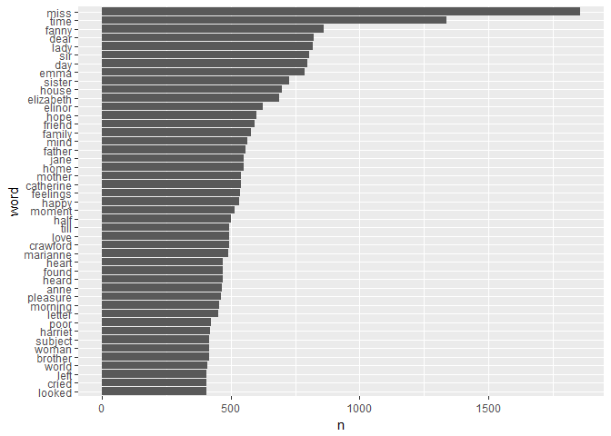
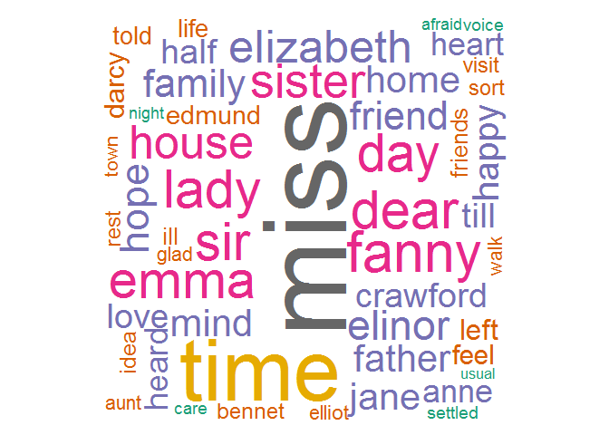
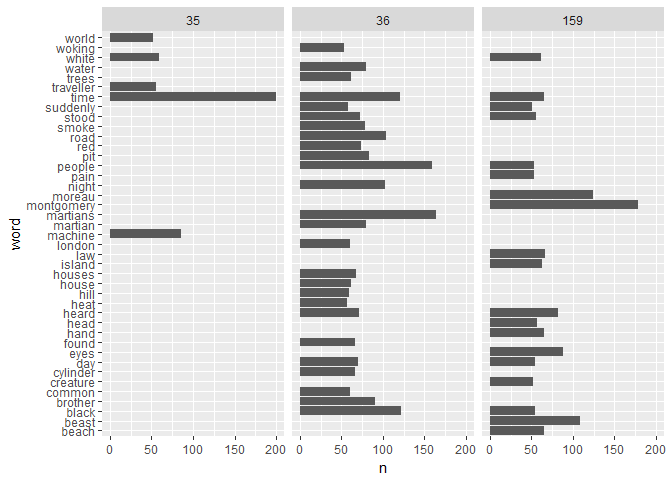
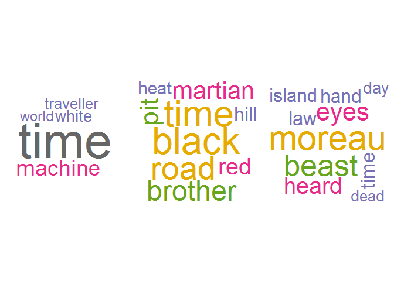

# Managing Unstructured Data with the `tidytext` package
Pier Lorenzo Paracchini  
15 december 2016  


##Required packages & supporting functions

* `tidytext` package for reading the file containing the dataset,
* `magrittr` package used for uning the piping format,
* `dplyr` package used for transformation functions,
* `ggplot2` & `wordcloud` package used for plotting and visualization,
* `stringr` package used for text manipulation (regex).


```r
visualizeWordcloud <- function(term, freq, title = "", min.freq = 50, max.words = 200){
    mypal <- brewer.pal(8,"Dark2")
    wordcloud(words = term,
          freq = freq, 
          colors = mypal, 
          scale=c(8,.3),
          rot.per=.15,
          min.freq = min.freq, max.words = max.words,
          random.order = F)
}
```


## Introduction

The idea is to play around with the `tidytext` package and perform some common text mining operations on some documents __using the available vignettes and the "Tidy Text Mining with R" book as guides__ (see References).

The `tidytext` package allows to use [tidy text priciples](https://www.jstatsoft.org/article/view/v059i10) with unstructured data/ text making possible to use the [`tidyverse` ecosystem](http://tidyverse.org/).

## The tidy text format

__Tidy text format__ is define as _'a table with one-term-per-row'_. 

### `unnest_tokens` function

Supporting document is a char vector with one element made of 3 sentences. The dataset is not yet compatible with tidy tools (not compliant with tidy data principles).


```r
document <- paste("Using tidy data principles is important.",
    "In this package, we provide functions for tidy formats.",
    "The novels of Jane Austen can be so tidy!")

df <- data.frame(text = document)
```

The `unnest_token` function splits a text column (`input`) into tokens (e.g. sentences, wors, ngrams, ect ) using the [`tokenizers` package](https://github.com/ropensci/tokenizers). 

__Tokenize__ into lines...


```r
document_lines <- unnest_tokens(df, input = text, output = line, token = "sentences", to_lower = F)
document_lines$lineNo <- seq_along(document_lines$line)
head(document_lines)
## # A tibble: 3 × 2
##                                                      line lineNo
##                                                     <chr>  <int>
## 1                Using tidy data principles is important.      1
## 2 In this package, we provide functions for tidy formats.      2
## 3               The novels of Jane Austen can be so tidy!      3
```

__Tokenize__ into words (unigrams)...


```r
df_text_to_word_tidy <- document_lines %>% 
    unnest_tokens(output = word, input = line, token = "words")

head(df_text_to_word_tidy)
## # A tibble: 6 × 2
##   lineNo       word
##    <int>      <chr>
## 1      1      using
## 2      1       tidy
## 3      1       data
## 4      1 principles
## 5      1         is
## 6      1  important
```

__Tokenize__ into bigrams...


```r
df_text_to_bigrams_tidy <- document_lines %>% 
    unnest_tokens(output = bigram, input = line, token = "ngrams", n = 2)
head(df_text_to_bigrams_tidy)
## # A tibble: 6 × 2
##   lineNo          bigram
##    <int>           <chr>
## 1      1      using tidy
## 2      1       tidy data
## 3      1 data principles
## 4      1   principles is
## 5      1    is important
## 6      2         in this
```

__Tokenize__ into trigrams...


```r
df_text_to_trigrams_tidy <- document_lines %>% 
    unnest_tokens(output = trigram, input = line, token = "ngrams", n = 3)
head(df_text_to_trigrams_tidy)
## # A tibble: 6 × 2
##   lineNo                 trigram
##    <int>                   <chr>
## 1      1         using tidy data
## 2      1    tidy data principles
## 3      1      data principles is
## 4      1 principles is important
## 5      2         in this package
## 6      2         this package we
```

__A new data structure is created that is compliant with the tidy data principles and that can be used with the standard set of tidytools (`tidyverse` package).__

### Removing stopwords: the `stop_words` dataset and the `anti_join` function

The `tidytext` package offers a data stucture containing a list of english stopwords from 3 different lexicons (onix, SMART and snowball sets) that, optionally, can be used to remove most common and meaningless words from the text under examination.


```r
head(stop_words)
## # A tibble: 6 × 2
##        word lexicon
##       <chr>   <chr>
## 1         a   SMART
## 2       a's   SMART
## 3      able   SMART
## 4     about   SMART
## 5     above   SMART
## 6 according   SMART
```

The `anti_join(x, y)` function of the `dplyr` package can be used to remove a list of words (e.g. stopwords). The function returns all rows from `x` where there is not matching value in `y` (keeping all the columns in `x`).


```r
df_tmp <- df_text_to_word_tidy %>%
    anti_join(stop_words, by = c("word" = "word"))
head(df_tmp)
## # A tibble: 6 × 2
##   lineNo       word
##    <int>      <chr>
## 1      1       tidy
## 2      2       tidy
## 3      3       tidy
## 4      1       data
## 5      1 principles
## 6      2    package
```

### Summarizing word frequencies: the `count` function

The `count` frunction in the `dplyr` package can be used on a tidy dataset to count observations.


```r
df_tmp %>%
    count(word, sort = TRUE)
## # A tibble: 10 × 2
##          word     n
##         <chr> <int>
## 1        tidy     3
## 2      austen     1
## 3        data     1
## 4     formats     1
## 5   functions     1
## 6        jane     1
## 7      novels     1
## 8     package     1
## 9  principles     1
## 10    provide     1
```


## Jan Austen Exploratory Case

Using the `janeaustenr` package containing 6 published novels.

Prepare the raw dataset adding a chapter and number of line features for each book.


```r
require(janeaustenr)
str(austen_books())
## Classes 'tbl_df', 'tbl' and 'data.frame':	73422 obs. of  2 variables:
##  $ text: chr  "SENSE AND SENSIBILITY" "" "by Jane Austen" "" ...
##  $ book: Factor w/ 6 levels "Sense & Sensibility",..: 1 1 1 1 1 1 1 1 1 1 ...

original_books <- austen_books() %>%
    group_by(book) %>%
    mutate(line = row_number(),
           chapter = cumsum(str_detect(text, regex("^chapter [\\divxlc]",
                                                 ignore_case = TRUE)))) %>%
    ungroup()

head(original_books)
## # A tibble: 6 × 4
##                    text                book  line chapter
##                   <chr>              <fctr> <int>   <int>
## 1 SENSE AND SENSIBILITY Sense & Sensibility     1       0
## 2                       Sense & Sensibility     2       0
## 3        by Jane Austen Sense & Sensibility     3       0
## 4                       Sense & Sensibility     4       0
## 5                (1811) Sense & Sensibility     5       0
## 6                       Sense & Sensibility     6       0
```

Transfor into a tidy dataset...


```r
tidy_books <- original_books %>%
    unnest_tokens(input = text, output = word, token = "words")
head(tidy_books)
## # A tibble: 6 × 4
##                  book  line chapter        word
##                <fctr> <int>   <int>       <chr>
## 1 Sense & Sensibility     1       0       sense
## 2 Sense & Sensibility     1       0         and
## 3 Sense & Sensibility     1       0 sensibility
## 4 Sense & Sensibility     3       0          by
## 5 Sense & Sensibility     3       0        jane
## 6 Sense & Sensibility     3       0      austen
```

Remove the stopwords...


```r
tidy_books <- tidy_books %>%
    anti_join(y = stop_words, by = c("word" = "word"))
```

Find the most common words...


```r
word_frequencies <- tidy_books %>%
    count(word, sort = TRUE)

head(word_frequencies)
## # A tibble: 6 × 2
##    word     n
##   <chr> <int>
## 1  miss  1855
## 2  time  1337
## 3 fanny   862
## 4  dear   822
## 5  lady   817
## 6   sir   806
```


```r
word_frequencies %>%
    filter(n > 400) %>%
    mutate(word = reorder(word, n)) %>%
    ggplot(mapping = aes(x = word, y = n)) +
    geom_col() +
    coord_flip()
```

<!-- -->


```r
visualizeWordcloud(term = word_frequencies$word, freq = word_frequencies$n)
```

<!-- -->

## H.G. Wells Exploratory Case

The [`gutenbergr` package](https://ropensci.org/tutorials/gutenbergr_tutorial.html) provides access to the __Project Gutenberg__ collection. The package contains tools for downloading books and for finding works of interest.


```r
require(gutenbergr)

gutenberg_works(str_detect(author,"Wells, H. G."))$title[1:5]
## [1] "The Time Machine"                       
## [2] "The War of the Worlds"                  
## [3] "The Island of Doctor Moreau"            
## [4] "The Door in the Wall, and Other Stories"
## [5] "Ann Veronica: A Modern Love Story"
ids <- gutenberg_works(str_detect(author,"Wells, H. G."))$gutenberg_id[1:3]
#Download the time machhine, the war of worlds, the island of doctor Moreau
hgwells <- gutenbergr::gutenberg_download(ids)
hgwells <- hgwells %>%
    group_by(gutenberg_id) %>%
    mutate(line = row_number()) %>%
    ungroup()
```

Transform into a __tidy dataset__...


```r
hgwells_tidy <- hgwells %>%
    unnest_tokens(output = word, input = text, token = "words")
```

Remove __stopwords__...


```r
hgwells_tidy <- hgwells_tidy %>%
    anti_join(stop_words, by = c("word" = "word"))
```

Calculate __word frequencies__...


```r
hgwell_word_freqs_by_book <- hgwells_tidy %>%
    group_by(gutenberg_id) %>%
    count(word, sort = TRUE) %>%
    ungroup()
```

__Visualize the words with frequency greater than 50 for each book__...


```r
hgwell_word_freqs_by_book %>%
    filter(n > 50) %>%
    ggplot(mapping = aes(x = word, y = n)) +
    geom_col() +
    coord_flip() + facet_wrap(facets = ~ gutenberg_id)
```

<!-- -->

__Visualize the words with frequency greater than 50 for each book__ using __wordclouds__. Books 35, 36, 159 respectively...


```r
par(mfrow = c(1,3), mar = c(0,0,0,0))
tmp <- hgwell_word_freqs_by_book[hgwell_word_freqs_by_book$gutenberg_id == 35,]
visualizeWordcloud(term = tmp$word, freq = tmp$n)

tmp <- hgwell_word_freqs_by_book[hgwell_word_freqs_by_book$gutenberg_id == 36,]
visualizeWordcloud(term = tmp$word, freq = tmp$n)

tmp <- hgwell_word_freqs_by_book[hgwell_word_freqs_by_book$gutenberg_id == 159,]
visualizeWordcloud(term = tmp$word, freq = tmp$n)
```

<!-- -->

## Comparing works of different authors

Let's use Jane AUten, H.G. Wells and Brontë sisters to make a comparison of the wording used in their works.


```r
austen <- original_books
austen_tidy <- austen %>%
    unnest_tokens(word, text) %>%
    anti_join(stop_words)

austen_percent <- austen_tidy %>%
    mutate(word = str_extract(word, "[a-z]+")) %>%
    count(word) %>%
    transmute(word, austen = n/ sum(n), author = "Austen")
    
```


```r
#H. G. Wells
#Let’s get The Time Machine, The War of the Worlds, The Invisible Man, and The Island of Doctor Moreau.
hgwells <- gutenberg_download(c(35, 36, 5230, 159))
hgwells_tidy <- hgwells %>%
    unnest_tokens(word, text) %>%
    anti_join(stop_words)

hgwells_percent <- hgwells_tidy %>%
    mutate(word = str_extract(word, "[a-z]+")) %>%
    count(word) %>%
    transmute(word, other = n / sum(n), author = "Wells")
```


```r
# Brontë sisters
#get Jane Eyre, Wuthering Heights, The Tenant of Wildfell Hall, Villette, and Agnes Grey

bronte <- gutenberg_download(c(1260, 768, 969, 9182, 766))
bronte_tidy <- bronte %>%
    unnest_tokens(word, text) %>%
    anti_join(stop_words)

bronte_percent <- bronte_tidy %>%
    mutate(word = str_extract(word, "[a-z]+")) %>%
    count(word) %>%
    transmute(word, other = n/ sum(n), author = "Bronte")
```


```r
#Comparing Austen to others authors, using others words as reference
others_freqs_tidy <- bind_rows(bronte_percent, hgwells_percent)
authors_frequencies <- others_freqs_tidy %>%
    left_join(austen_percent, by = c("word" = "word")) %>%
    ungroup()
    
```

Visualize the comparison...


```r
library(scales)

ggplot(data = authors_frequencies, mapping = aes(x = other, y = austen, color = abs(austen - other))) +
    geom_abline(color = "gray40", lty = 2) +
    geom_jitter(alpha = 0.1, size = 2.5, width = 0.3, height = 0.3) +
    geom_text(aes(label = word), check_overlap = T, vjust = 1.5) +
    scale_x_log10(labels = percent_format()) +
    scale_y_log10(labels = percent_format()) +
    scale_color_gradient(limits = c(0, 0.001), low = "darkslategray4", high = "gray75") +
    facet_wrap(~ author.x, ncol = 2) + 
    theme(legend.position="none") +
    labs(y = "Jane Austen", x = NULL)
```

<!-- -->

_'Words that are close to the line in these plots have similar frequencies in both sets of texts, for example, in both Austen and Brontë texts (“miss”, “time”, “day” at the upper frequency end) or in both Austen and Wells texts (“time”, “day”, “brother” at the high frequency end). Words that are far from the line are words that are found more in one set of texts than another.'_

_'Overall, notice that the words in the Austen-Brontë plot are closer to the zero-slope line than in the Austen-Wells plot and also extend to lower frequencies; Austen and the Brontë sisters use more similar words than Austen and H.G. Wells. '_

## References

["Introduction to tidytext](https://cran.r-project.org/web/packages/tidytext/vignettes/tidytext.html), `tidytext` vignette   
["Tidy Text Mining with R"](http://tidytextmining.com/), Julia Silge and David Robinson  


## Session Information


```r
sessionInfo()
## R version 3.3.1 (2016-06-21)
## Platform: x86_64-w64-mingw32/x64 (64-bit)
## Running under: Windows 7 x64 (build 7601) Service Pack 1
## 
## locale:
## [1] LC_COLLATE=Norwegian (Bokmål)_Norway.1252 
## [2] LC_CTYPE=Norwegian (Bokmål)_Norway.1252   
## [3] LC_MONETARY=Norwegian (Bokmål)_Norway.1252
## [4] LC_NUMERIC=C                              
## [5] LC_TIME=Norwegian (Bokmål)_Norway.1252    
## 
## attached base packages:
## [1] stats     graphics  grDevices utils     datasets  methods   base     
## 
## other attached packages:
##  [1] scales_0.4.1       gutenbergr_0.1.2   janeaustenr_0.1.4 
##  [4] wordcloud_2.5      RColorBrewer_1.1-2 stringr_1.1.0     
##  [7] ggplot2_2.2.0      dplyr_0.5.0        magrittr_1.5      
## [10] tidytext_0.1.2    
## 
## loaded via a namespace (and not attached):
##  [1] Rcpp_0.12.7      formatR_1.4      plyr_1.8.4       tokenizers_0.1.4
##  [5] tools_3.3.1      digest_0.6.10    evaluate_0.10    tibble_1.2      
##  [9] nlme_3.1-128     gtable_0.2.0     lattice_0.20-34  Matrix_1.2-7.1  
## [13] psych_1.6.9      DBI_0.5-1        curl_2.1         yaml_2.1.13     
## [17] parallel_3.3.1   knitr_1.14       triebeard_0.3.0  grid_3.3.1      
## [21] R6_2.2.0         foreign_0.8-67   rmarkdown_1.1    readr_1.0.0     
## [25] purrr_0.2.2      reshape2_1.4.1   tidyr_0.6.0      urltools_1.6.0  
## [29] SnowballC_0.5.1  htmltools_0.3.5  assertthat_0.1   mnormt_1.5-5    
## [33] colorspace_1.2-7 labeling_0.3     stringi_1.1.2    lazyeval_0.2.0  
## [37] munsell_0.4.3    slam_0.1-38      broom_0.4.1
```

