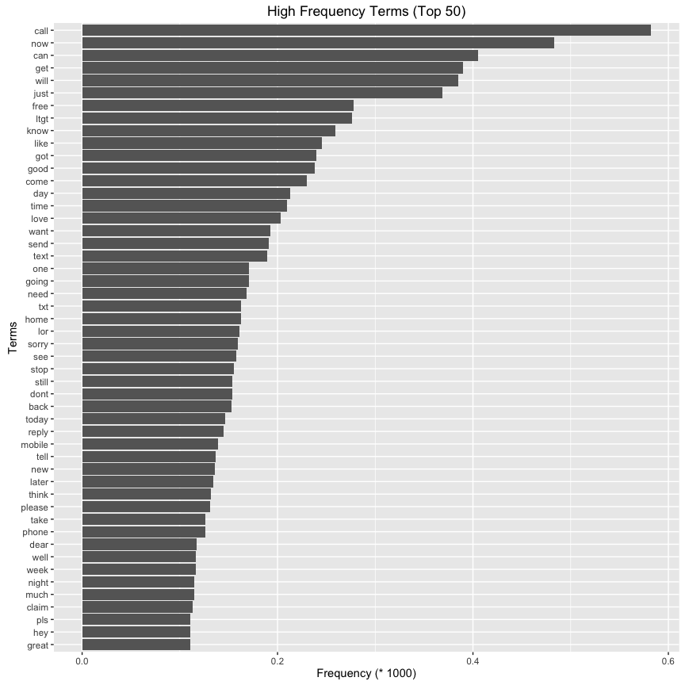

# Managing Unstructured Data with the `tm` package
Pier Lorenzo Paracchini  
03. dec. 2016  


##Required packages

* `readr` package for reading the file containing the dataset,
* `tm` package, used perform text mining operations on unstructured data,
* `snowballC`, used for stemming,
* `wordcloud`, used for visualization purpose and the creation of wordclouds,
* `ggplot2`, used for basic plotting.


## Introduction

The idea is to play around with the `tm` package and perform some common text mining operations on a set of documents, the __corpus__ under analysis in order to learn the potential of this package and, specifically, to understand how to __use the `tm` package functionality to engineer features from free text__.

## The Data

The data used for this experiment is the [SMS Spam Collection v. 1](http://www.dt.fee.unicamp.br/~tiago/smsspamcollection/), a public set of SMS labeled messages that have been collected for mobile phone spam research. 

The original file has been pre-processed in order to create a CSV file

* `\t` separator has been replaced by `,`
* `"` in the free text have been replaced by `'`
* the sms text has been included in `"` (quoted text)


```r
dataUri <- "./data/smsspamcollection/SMSSpamCollection.txt"
rawData <- read_csv(dataUri,col_names = F)
```

### A quick look at the data

The dataset contains 5574 entries/ observations, where each entry is a classified sms. The first column represents the label, while the second column represents the text of the sms, both are `character` type. The features/ columns do not have proper names (just the standard names assigned by R).


```r
str(rawData)
## Classes 'tbl_df', 'tbl' and 'data.frame':	5574 obs. of  2 variables:
##  $ X1: chr  "ham" "ham" "spam" "ham" ...
##  $ X2: chr  "Go until jurong point, crazy.. Available only in bugis n great world la e buffet... Cine there got amore wat..." "Ok lar... Joking wif u oni..." "Free entry in 2 a wkly comp to win FA Cup final tkts 21st May 2005. Text FA to 87121 to receive entry question(std txt rate)T&C"| __truncated__ "U dun say so early hor... U c already then say..." ...
##  - attr(*, "spec")=List of 2
##   ..$ cols   :List of 2
##   .. ..$ X1: list()
##   .. .. ..- attr(*, "class")= chr  "collector_character" "collector"
##   .. ..$ X2: list()
##   .. .. ..- attr(*, "class")= chr  "collector_character" "collector"
##   ..$ default: list()
##   .. ..- attr(*, "class")= chr  "collector_guess" "collector"
##   ..- attr(*, "class")= chr "col_spec"
```

Proper names are given to the columns - `label` and `text` respectively. The `label`, being a categorical variable with two only possible valiues `ham, spam`, is transformed into a factor; the `text` is kept as `character`.


```r
#Adding the column names
colnames(rawData) <- c("label", "text")
#Setting the label as a factor
rawData$label <- as.factor(rawData$label)
```

How many sms have been tagged as `spam` and `ham`?


```r
x <- table(rawData$label)
x
## 
##  ham spam 
## 4827  747

prop.table(x) * 100
## 
##      ham     spam 
## 86.59849 13.40151
```

## Importing the __corpus__

The `tm` package offers different options for importing a __corpus__. The creation of a __corpus__ is done using `tm::Corpus` class providing two different arguments

* a __source__ object, containing the documents
* a set of parameters for reading the content from teh source object
    * a __reader__, a function capable of reading in and processing the format delivered by the source object

The list of available __source__ options can be seen using `tm::getSources()`. Text documents can be imported using a dataframe, a vector, a URI, a directory, etc. 


```r
getSources()
## [1] "DataframeSource" "DirSource"       "URISource"       "VectorSource"   
## [5] "XMLSource"       "ZipSource"
```

The list of available __readers__ can be found using `tm::getReaders()` with the supported text file formats. Each __source__ has a __default reader__ that can be overriden.


```r
getReaders()
##  [1] "readDOC"                 "readPDF"                
##  [3] "readPlain"               "readRCV1"               
##  [5] "readRCV1asPlain"         "readReut21578XML"       
##  [7] "readReut21578XMLasPlain" "readTabular"            
##  [9] "readTagged"              "readXML"
```

We have a dataframe containing all of the documents that should be part of our corpus. The __corpus__  is created using `vectorSource` and the sms text `text`, using the default __reader__.


```r
theCorpus <- Corpus(VectorSource(x = rawData$text))
print(theCorpus)
## <<VCorpus>>
## Metadata:  corpus specific: 0, document level (indexed): 0
## Content:  documents: 5574
```

### Inspecting the __corpus__

In order to display detailed information on a corpus, the `tm::inspect` function can be used.


```r
inspect(head(theCorpus,2))
## <<VCorpus>>
## Metadata:  corpus specific: 0, document level (indexed): 0
## Content:  documents: 2
## 
## [[1]]
## <<PlainTextDocument>>
## Metadata:  7
## Content:  chars: 111
## 
## [[2]]
## <<PlainTextDocument>>
## Metadata:  7
## Content:  chars: 29
```

In order to access the individual documents the `[[` can be used either via position or document identifier using the relevant attribute.


```r
#Using the [[]] format and the position
#first document
theCorpus[[1]]$meta
##   author       : character(0)
##   datetimestamp: 2016-12-03 23:58:35
##   description  : character(0)
##   heading      : character(0)
##   id           : 1
##   language     : en
##   origin       : character(0)
theCorpus[[1]]$content
## [1] "Go until jurong point, crazy.. Available only in bugis n great world la e buffet... Cine there got amore wat..."

#second document
theCorpus[[2]]$content
## [1] "Ok lar... Joking wif u oni..."

#Getting the document identifier
doc_id <- meta(theCorpus[[2]], "id")
identical(theCorpus[[2]], theCorpus[[doc_id]])
## [1] TRUE
```

## Transforming the corpus

Once we have a corpus, tipically we want to transform its content in order to make it easy to extract information/ insights from it. The `tm` package offfers a variety of __predefined transformations__ that can be applied on the __corpus__. To get a list of the transformation supported use the `tm::getTransformations()` function.


```r
getTransformations()
## [1] "removeNumbers"     "removePunctuation" "removeWords"      
## [4] "stemDocument"      "stripWhitespace"
```

* `removeNumbers`, remove numbers from a text document
* `removePunctuation`, remove punctuation `[:punct:]` from a text document
* `removeWords`, remove words specified in the provided list of words from a text document
* `stemDocument`, stem words in a text document using Porter's stemming algorithm
* `stripWhitespace`, strip extra whitespace from a text document, normalized to a single whitespace


Custom transformation can be created and used on the corpus using the `tm::content_transformer` function as a wrapper e.g. `tm::content_tansform(customTransformation)`.

Usually one of the first steps is to remove the most frequently used words from the  corpus, called __stopwords__.  __Stopwords__ are the most common, short function terms, whit no important meaning. The `tm` package offers a list of such words `tm::stopwords` function.


```r
stopwords()
##   [1] "i"          "me"         "my"         "myself"     "we"        
##   [6] "our"        "ours"       "ourselves"  "you"        "your"      
##  [11] "yours"      "yourself"   "yourselves" "he"         "him"       
##  [16] "his"        "himself"    "she"        "her"        "hers"      
##  [21] "herself"    "it"         "its"        "itself"     "they"      
##  [26] "them"       "their"      "theirs"     "themselves" "what"      
##  [31] "which"      "who"        "whom"       "this"       "that"      
##  [36] "these"      "those"      "am"         "is"         "are"       
##  [41] "was"        "were"       "be"         "been"       "being"     
##  [46] "have"       "has"        "had"        "having"     "do"        
##  [51] "does"       "did"        "doing"      "would"      "should"    
##  [56] "could"      "ought"      "i'm"        "you're"     "he's"      
##  [61] "she's"      "it's"       "we're"      "they're"    "i've"      
##  [66] "you've"     "we've"      "they've"    "i'd"        "you'd"     
##  [71] "he'd"       "she'd"      "we'd"       "they'd"     "i'll"      
##  [76] "you'll"     "he'll"      "she'll"     "we'll"      "they'll"   
##  [81] "isn't"      "aren't"     "wasn't"     "weren't"    "hasn't"    
##  [86] "haven't"    "hadn't"     "doesn't"    "don't"      "didn't"    
##  [91] "won't"      "wouldn't"   "shan't"     "shouldn't"  "can't"     
##  [96] "cannot"     "couldn't"   "mustn't"    "let's"      "that's"    
## [101] "who's"      "what's"     "here's"     "there's"    "when's"    
## [106] "where's"    "why's"      "how's"      "a"          "an"        
## [111] "the"        "and"        "but"        "if"         "or"        
## [116] "because"    "as"         "until"      "while"      "of"        
## [121] "at"         "by"         "for"        "with"       "about"     
## [126] "against"    "between"    "into"       "through"    "during"    
## [131] "before"     "after"      "above"      "below"      "to"        
## [136] "from"       "up"         "down"       "in"         "out"       
## [141] "on"         "off"        "over"       "under"      "again"     
## [146] "further"    "then"       "once"       "here"       "there"     
## [151] "when"       "where"      "why"        "how"        "all"       
## [156] "any"        "both"       "each"       "few"        "more"      
## [161] "most"       "other"      "some"       "such"       "no"        
## [166] "nor"        "not"        "only"       "own"        "same"      
## [171] "so"         "than"       "too"        "very"
```

Stopwords are unimportant words that will not actually change the meaning of the documents (the sms text). Running a simple example of removing stopwords, it is possible to see that the "and" word is replaced with an empty space, but "AND" is not removed cause of the uppercase letter (case sensitive).


```r
removeWords("going and running", stopwords())
## [1] "going  running"

removeWords("going AND running", stopwords())
## [1] "going AND running"
```

In order to remove the possible challenges connected with uppercase letters, meaningless words, punctuation, numbers, common practices are to simply apply the following transformations to the corpus

* transform the uppercase to lowercase
* remove the stopwords
* remove punctuation symbols
* remove numbers
* normalize the white spaces (a words removed is transformed into a white space) 

To iteratively apply transformations to the corpus the `tm::tm_map` function is used.


```r
theCorpus <- tm_map(theCorpus, content_transformer(tolower))
#we had to wrap the tolower function in the content_transformer function, so that our transformation really complies with the tm package's object structure.This is usually required when using a transformation function outside of the tm package (custom transformation).
theCorpus <- tm_map(theCorpus, removeWords, stopwords())
theCorpus <- tm_map(theCorpus, removePunctuation)
theCorpus <- tm_map(theCorpus, removeNumbers)
theCorpus <- tm_map(theCorpus, stripWhitespace)

##see the content of 3 documents
theCorpus[[1]]$content
## [1] "go jurong point crazy available bugis n great world la e buffet cine got amore wat"
theCorpus[[50]]$content
## [1] "u know stubborn even want go hospital kept telling mark weak sucker hospitals weak suckers"
theCorpus[[100]]$content
## [1] " see cup coffee animation"
```

##  Creating the Term Document Matrix (TDM)

In order to find the most common words in the corpus we need to create a sparse matrix from the corpus using `tm::TermDocumentMatrix`.

A `tm::TermDocumentMatrix` is basically a matrix (__sparse matrix__) which includes the all of the possible words in the rows and the documents in the columns. Each cell represents tne number of occurences of that specific word in that specific document.


```r
tdm <- TermDocumentMatrix(theCorpus)
inspect(tdm[1:5, 1:20])
## <<TermDocumentMatrix (terms: 5, documents: 20)>>
## Non-/sparse entries: 0/100
## Sparsity           : 100%
## Maximal term length: 8
## Weighting          : term frequency (tf)
## 
##           Docs
## Terms      1 2 3 4 5 6 7 8 9 10 11 12 13 14 15 16 17 18 19 20
##   abbey    0 0 0 0 0 0 0 0 0  0  0  0  0  0  0  0  0  0  0  0
##   abdomen  0 0 0 0 0 0 0 0 0  0  0  0  0  0  0  0  0  0  0  0
##   abeg     0 0 0 0 0 0 0 0 0  0  0  0  0  0  0  0  0  0  0  0
##   abelu    0 0 0 0 0 0 0 0 0  0  0  0  0  0  0  0  0  0  0  0
##   aberdeen 0 0 0 0 0 0 0 0 0  0  0  0  0  0  0  0  0  0  0  0
```

To find the most frequent terms using the sparse matrix, the `tm::findFrequentTerms` function can be used. Example which terms is found at least 80 times in the corpus?


```r
#Note the bigger the number of documents, the bigger the lowfreq numer - use 100 if using all of the documents.
findFreqTerms(tdm, lowfreq = 80)
##  [1] "already"  "amp"      "ask"      "back"     "call"     "can"     
##  [7] "cash"     "claim"    "come"     "day"      "dear"     "dont"    
## [13] "free"     "get"      "give"     "going"    "good"     "got"     
## [19] "great"    "happy"    "hey"      "home"     "hope"     "just"    
## [25] "know"     "later"    "life"     "like"     "lor"      "love"    
## [31] "ltgt"     "make"     "message"  "mobile"   "msg"      "much"    
## [37] "need"     "new"      "night"    "now"      "number"   "one"     
## [43] "phone"    "please"   "pls"      "prize"    "really"   "reply"   
## [49] "right"    "said"     "say"      "see"      "send"     "sorry"   
## [55] "still"    "stop"     "take"     "tell"     "text"     "think"   
## [61] "time"     "today"    "tomorrow" "txt"      "want"     "wat"     
## [67] "way"      "week"     "well"     "will"     "work"     "yeah"    
## [73] "yes"
```

One of the limitation of the `tm::findFrequentTerms` function is that it does just return a character vector of terms. To get the number of times a term has been found in the __corpus__ the `tm::tm_term_score` function is of great help.


```r
tm_term_score(tdm, c("already", "tell", "day"), FUN = slam::row_sums)
## already    tell     day 
##      90     137     213
```

The `tm::findFrequentTerms` and `tm::tm_term_score` functions can be used to find how many times each term has been used in the __corpus__ overall.


```r
getTermsFrequency <- function(corpus.tdm){
    all.terms <- findFreqTerms(corpus.tdm)
    freq = tm_term_score(x = corpus.tdm, terms = all.terms, FUN = slam::row_sums)
    terms <- names(freq); names(freq) <- NULL
    corpora.allTermsFrequency <- data.frame(term = terms, freq = freq)
    corpora.allTermsFrequency[order(corpora.allTermsFrequency$freq, decreasing = T), ]
}

frequent_terms_df <- getTermsFrequency(tdm)
head(frequent_terms_df, 10)
##      term freq
## 945  call  582
## 4604  now  483
## 985   can  405
## 2673  get  390
## 7631 will  385
## 3522 just  369
## 2516 free  278
## 3946 ltgt  276
## 3619 know  259
## 3787 like  245
tail(frequent_terms_df, 10)
##             term freq
## 7923       zebra    1
## 7925       zeros    1
## 7926       zhong    1
## 7927      zindgi    1
## 7929   zogtorius    1
## 7930        zoom    1
## 7931        zouk    1
## 7932       zyada    1
## 7934      aaniye    1
## 7935 aaooooright    1
```

## Useful Visualizations

Visualizations allows to inspecting the list of words/ terms that are part of the __corpus__ and understand how good the transformation process is.

Visualization can help to identify 

* rules that need to be considered when removing punctuation or numbers,
* other words that can be added to the list of stopwords,
* other meaningful insights.


```r
visualizeBarPlot <- function(ftm.df, colorBars = "grey40", titleBarPlot = ""){
    ggplot(ftm.df[1:50,], aes(x = reorder(term,freq), y = freq/1000)) +
        geom_bar(stat = "identity", fill=colorBars) +
        xlab("Terms") + ylab("Frequency (* 1000)")+
        ggtitle(paste(titleBarPlot, "(Top 50)"))  + coord_flip()

}

visualizeWordcloud <- function(ftm.df){
    mypal <- brewer.pal(8,"Dark2")
    wordcloud(words = ftm.df$term,
          freq = ftm.df$freq, 
          colors = mypal, 
          scale=c(6,.5),
          random.order = F, max.words = 200)
}
```

Visualizing a boxplot with the top 50 terms in decreasing order


```r
visualizeBarPlot(frequent_terms_df, titleBarPlot = "High Frequency Terms")
```

<!-- -->

Visualizing a wordcloud with the top 200 terms


```r
visualizeWordcloud(frequent_terms_df)
```

<!-- -->

### Stemming words

[Stemming](https://en.wikipedia.org/wiki/Stemming) is the process of reducing inflected (or sometimes derived) words to their word stem, base or root form—generally a written word form. Stemming in R can be performed using the `SnowballC` package. This package has a `SnowballC::wordStem` function that support several languages based on the __Porter's stemming algorithm__.


```r
#example for word stemming
wordStem(c("cats", "mastering", "using", "modelling", "models", "model"))
## [1] "cat"    "master" "us"     "model"  "model"  "model"

#Note that the Porter's algorithm does not provide real english words in all cases
#Something to consider later when looking at the results.
wordStem(c("are", "analyst", "analyze", "analysis"))
## [1] "ar"      "analyst" "analyz"  "analysi"
```

Once the stem has been defined, it is possible to complete the stemmed words using `tm::stemCompletion` function. Be careful when performing stem completion ....


```r
a <- c("mining", "miners", "mining") #Original words
b <- stemDocument(a) #Stemmed words
d <- stemCompletion(
    b, #stemmed words that we want to complete
    dictionary = a #dictionary to be used to complete stemmed words
    )
#Original words
a
## [1] "mining" "miners" "mining"

#Stemmed words
b
## [1] "mine"  "miner" "mine"

#Completion Stemmed Words
d
##     mine    miner     mine 
## "miners" "miners" "miners"

#Do u see anything strange?
```


```r
theCorpus_stem <- theCorpus
theCorpus_stem <- tm_map(theCorpus_stem, stemDocument, language = "english")
tdm_stem <- TermDocumentMatrix(theCorpus_stem)
frequent_terms_df_stem <- getTermsFrequency(tdm_stem)
visualizeBarPlot(frequent_terms_df_stem, titleBarPlot = "High Frequency Terms")
```

<!-- -->

```r
visualizeWordcloud(frequent_terms_df_stem)
```

<!-- -->

## Analysing the Associations among terms
The `tm::TermDocumentMatrix` can be used to identify the association between the cleaned terms found in the corpus. For this purpose we can use the `tm::findAssocs` function in the `tm` package.


```r
#Lets find the associations between the term and others terms that have a correlation higher than 0.2
findAssocs(tdm, "call", 0.20)
## $call
##      prize      claim        ppm     urgent        won   landline 
##       0.27       0.26       0.25       0.25       0.25       0.21 
##      shows guaranteed       mins 
##       0.21       0.20       0.20
```


```r
#Lets find the associations between the bayesian term and others terms that have a correlation higher than 0.2
findAssocs(tdm, "big", 0.20)
## $big
##   africa     avin maturity   silver 
##     0.32     0.32     0.23     0.23
```

## References

["SMS Spam Collection v. 1"](http://dcomp.sor.ufscar.br/talmeida/smspamcollection/), Almeida, T.A., Gómez Hidalgo, J.M.  
["Introduction to the tm package"](https://cran.r-project.org/web/packages/tm/vignettes/tm.pdf), `tm` vignette  
["Text Mining Infrastructure in R"](https://www.jstatsoft.org/article/view/v025i05), Ingo Feinerer, Kurt Hornik, David Meyer

## Session Information


```r
sessionInfo()
## R version 3.3.1 (2016-06-21)
## Platform: x86_64-apple-darwin13.4.0 (64-bit)
## Running under: OS X 10.12.1 (Sierra)
## 
## locale:
## [1] no_NO.UTF-8/no_NO.UTF-8/no_NO.UTF-8/C/no_NO.UTF-8/no_NO.UTF-8
## 
## attached base packages:
## [1] stats     graphics  grDevices utils     datasets  methods   base     
## 
## other attached packages:
## [1] readr_1.0.0        ggplot2_2.1.0      wordcloud_2.5     
## [4] RColorBrewer_1.1-2 SnowballC_0.5.1    tm_0.6-2          
## [7] NLP_0.1-9         
## 
## loaded via a namespace (and not attached):
##  [1] Rcpp_0.12.7      knitr_1.14       magrittr_1.5     munsell_0.4.3   
##  [5] colorspace_1.2-6 stringr_1.1.0    plyr_1.8.4       tools_3.3.1     
##  [9] parallel_3.3.1   grid_3.3.1       gtable_0.2.0     htmltools_0.3.5 
## [13] assertthat_0.1   yaml_2.1.13      digest_0.6.10    tibble_1.2      
## [17] formatR_1.4      evaluate_0.9     slam_0.1-40      rmarkdown_1.0   
## [21] labeling_0.3     stringi_1.1.2    scales_0.4.0
```

