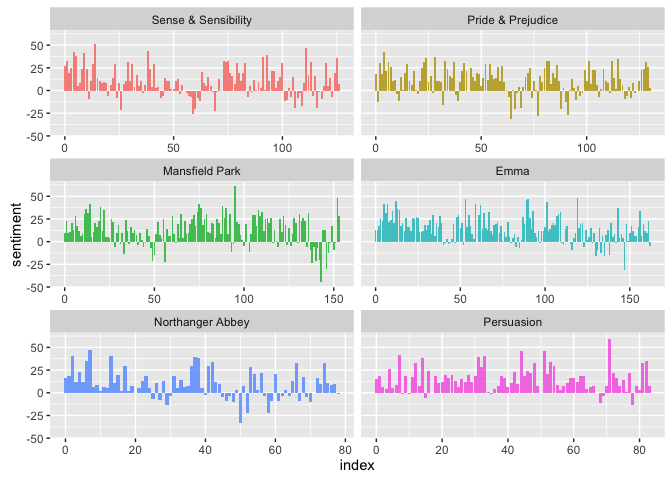
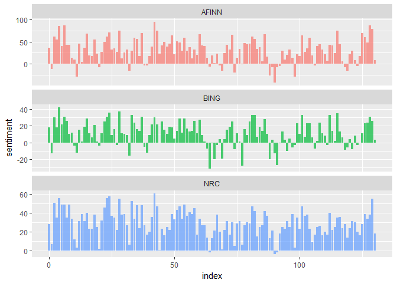
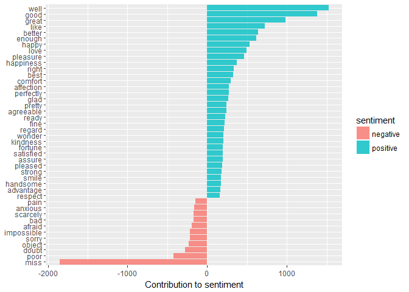
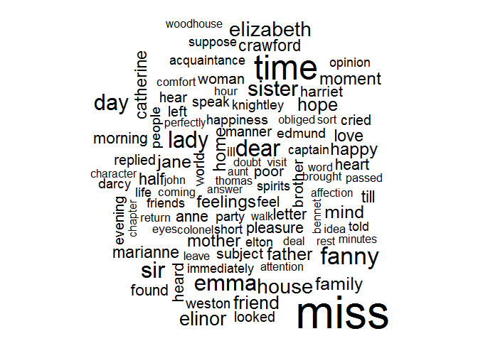
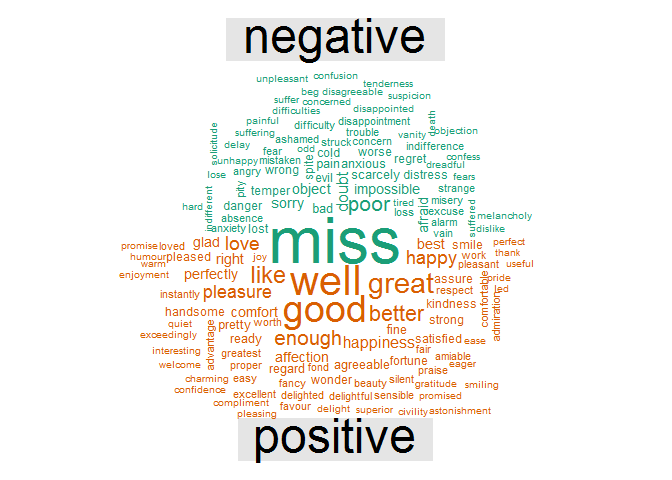

# NLP - Sentiment Analysis using the `tidytext` package
Pier Lorenzo Paracchini  
17 December 2016  


This experiment/ playground activity is based on the content of [chapter 3](http://tidytextmining.com/sentiment.html) of the ["Tidy Text Mining with R"](http://tidytextmining.com) book and it is related to a blog post available at [my personal site](https://pparacch.github.io/posts/). __The code is available in the following [repository](https://github.com/pparacch/DataSciencePosts)__.

The required packages used for this activity are 


```r
require(tidytext)
require(tidyverse)
require(janeaustenr)
require(stringr)
require(wordcloud)
require(reshape2)
```

# Sentiment analysis with tidy data

## The `sentiment` dataset

The `tidytext` package contains 3 sentiment lexicons in the `sentiments` dataset.

    `Three lexicons for sentiment analysis are combined here in a tidy data frame. The lexicons are the NRC Emotion Lexicon from Saif Mohammad and Peter Turney, the sentiment lexicon from Bing Liu and collaborators, and the lexicon of Finn Arup Nielsen. Words with non-ASCII characters were removed from the lexicons.`

The `sentiments` dataset includes the following features

* `word`, an english word (__unigram__)
* `sentiment`, one of either positive, negative, anger, anticipation, disgust, fear, joy, sadness, surprise, trust, or NA. 
    * the Bing lexicon has positive/negative, 
    * the NRC lexicon has all options except NA, and 
    * the AFINN lexicon has only NA.
* `lexicon`, the source either "nrc", "bing" or "AFINN"
* `score`, A numerical score for the sentiment. This value is NA for the Bing and NRC lexicons, and runs between -5 and 5 for the AFINN lexicon.

The `bing` lexicon categorizes words into a `positive` or `negative` flag; the `nrc` lexicon categorizes words into emotions like `anger, disgust, fear, joy, ...`; the `AFINN` lexicon categorizes words using a score, with negative scores indicating a negative sentiment. __Lexicons do not take into account qualifiers before a word, such as in “no good” or “not true”.__


    `These dictionary-based methods find the total sentiment of a piece of text by adding up the individual sentiment scores for each word in the text. Not every English word is in the lexicons because many English words are pretty neutral. It is important to keep in mind that these methods do not take into account qualifiers before a word, such as in “no good” or “not true”; a lexicon-based method like this is based on unigrams only. For many kinds of text (like the narrative examples below), there are not sustained sections of sarcasm or negated text, so this is not an important effect.`

Some more information about the dataset and its content...


```r
#dataset structure
str(sentiments)
## Classes 'tbl_df', 'tbl' and 'data.frame':	23165 obs. of  4 variables:
##  $ word     : chr  "abacus" "abandon" "abandon" "abandon" ...
##  $ sentiment: chr  "trust" "fear" "negative" "sadness" ...
##  $ lexicon  : chr  "nrc" "nrc" "nrc" "nrc" ...
##  $ score    : int  NA NA NA NA NA NA NA NA NA NA ...

#no of entries for the different sources
sentiments %>% 
    group_by(lexicon) %>%
    summarise(noOfWords = n())
## # A tibble: 3 × 2
##   lexicon noOfWords
##     <chr>     <int>
## 1   AFINN      2476
## 2    bing      6788
## 3     nrc     13901

#NRC & BING lexicons use the `sentiment` feature
#no of words by sentiment
sentiments %>% 
    filter(lexicon %in% c("nrc", "bing")) %>%
    group_by(lexicon, sentiment) %>%
    summarise(noOfWords = n())
## Source: local data frame [12 x 3]
## Groups: lexicon [?]
## 
##    lexicon    sentiment noOfWords
##      <chr>        <chr>     <int>
## 1     bing     negative      4782
## 2     bing     positive      2006
## 3      nrc        anger      1247
## 4      nrc anticipation       839
## 5      nrc      disgust      1058
## 6      nrc         fear      1476
## 7      nrc          joy       689
## 8      nrc     negative      3324
## 9      nrc     positive      2312
## 10     nrc      sadness      1191
## 11     nrc     surprise       534
## 12     nrc        trust      1231

#AFINN lexicon uses the `score` feature
#no of words by score
sentiments %>% 
    filter(lexicon %in% c("AFINN")) %>%
    group_by(lexicon) %>%
    count(cut_width(score, 1))
## Source: local data frame [11 x 3]
## Groups: lexicon [?]
## 
##    lexicon `cut_width(score, 1)`     n
##      <chr>                <fctr> <int>
## 1    AFINN           [-5.5,-4.5]    16
## 2    AFINN           (-4.5,-3.5]    43
## 3    AFINN           (-3.5,-2.5]   264
## 4    AFINN           (-2.5,-1.5]   965
## 5    AFINN           (-1.5,-0.5]   309
## 6    AFINN            (-0.5,0.5]     1
## 7    AFINN             (0.5,1.5]   208
## 8    AFINN             (1.5,2.5]   448
## 9    AFINN             (2.5,3.5]   172
## 10   AFINN             (3.5,4.5]    45
## 11   AFINN             (4.5,5.5]     5
```

## __`get_sentiments()`__ function

The __`get_sentiments()`__ function can be used ot get a tidy dataset for a specific lexicon...


```r
#AFINN
afinn_lexicon <- get_sentiments("afinn")
head(afinn_lexicon)
## # A tibble: 6 × 2
##         word score
##        <chr> <int>
## 1    abandon    -2
## 2  abandoned    -2
## 3   abandons    -2
## 4   abducted    -2
## 5  abduction    -2
## 6 abductions    -2

#NRC
nrc_lexicon <- get_sentiments("nrc")
head(nrc_lexicon)
## # A tibble: 6 × 2
##        word sentiment
##       <chr>     <chr>
## 1    abacus     trust
## 2   abandon      fear
## 3   abandon  negative
## 4   abandon   sadness
## 5 abandoned     anger
## 6 abandoned      fear

#BING
bing_lexicon <- get_sentiments("bing")
head(bing_lexicon)
## # A tibble: 6 × 2
##         word sentiment
##        <chr>     <chr>
## 1    2-faced  negative
## 2    2-faces  negative
## 3         a+  positive
## 4   abnormal  negative
## 5    abolish  negative
## 6 abominable  negative
```

## Sentiment analysis: answering a few questions...

__Assumptions__:  

* Not sustained sections of sarcasm or negated text in the following books, so this is not an important effect and it can be not considered.
* Having tidy datasets, specifically one observation for each word, __sentiment analysis can be done as a join operation__. 

### __Q__: What are the most common joy words in `Emma`?

* Get `Emma` book and transform it into a tidy dataset
* Get the `nrc` lexicon and consider only the words tagged as `joy`
* Summarize information connected to the `joy` words used in `Emma` book


```r
#Get the emma book and transform it into a tidy dataset
tidy_books <- austen_books() %>%
    filter(book == "Emma") %>%
    group_by(book) %>%
    mutate(linenumber = row_number(),
           chapter = cumsum(str_detect(text, regex("^chapter [\\divxlc]", 
                                                   ignore_case = TRUE)))) %>%
    ungroup() %>%
    unnest_tokens(word, text)

#Using the nrc lexicon, only the words that are associated to a sentiment of `joy`
nrc_joy <- get_sentiments("nrc") %>%
    filter(sentiment == "joy")

#Summarize the usage of `joy` words
tidy_books %>%
    semi_join(nrc_joy) %>%
    count(word, sort = T)
## # A tibble: 303 × 2
##       word     n
##      <chr> <int>
## 1     good   359
## 2    young   192
## 3   friend   166
## 4     hope   143
## 5    happy   125
## 6     love   117
## 7     deal    92
## 8    found    92
## 9  present    89
## 10    kind    82
## # ... with 293 more rows
```

### __Q__: How does sentiment changes within a novel/ book?

* Get novels/ books and transform them into a tidy dataset
* Get the `bing` lexicon and use for each word a __positive__ or __negative__ contribution
* Introduce an index concept - `index =  row_number %/% 100`, index 0 represents the first 100 lines, index 1 represents the 2nd 100 lines, etc. - and use the index as the atomic unit to evaluate the sentiment
* Calculate a simple measurement for each index as `no of positive words - no of negative words`, and use this index to represent the sentiment changes within the novel.


```r
tidy_books <- austen_books() %>%
    group_by(book) %>%
    mutate(linenumber = row_number(),
           chapter = cumsum(str_detect(text, regex("^chapter [\\divxlc]", 
                                                   ignore_case = TRUE)))) %>%
    ungroup() %>%
    unnest_tokens(word, text)

janeaustensentiment <- tidy_books %>%
  inner_join(get_sentiments("bing")) %>%
  count(book, index = linenumber %/% 100, sentiment) %>%
  spread(sentiment, n, fill = 0) %>%
  mutate(sentiment = positive - negative)

head(janeaustensentiment)
## Source: local data frame [6 x 5]
## Groups: book, index [6]
## 
##                  book index negative positive sentiment
##                <fctr> <dbl>    <dbl>    <dbl>     <dbl>
## 1 Sense & Sensibility     0       20       47        27
## 2 Sense & Sensibility     1       22       54        32
## 3 Sense & Sensibility     2       16       35        19
## 4 Sense & Sensibility     3       20       45        25
## 5 Sense & Sensibility     4       21       63        42
## 6 Sense & Sensibility     5       25       63        38
```


```r
ggplot(data = janeaustensentiment, mapping = aes(x = index, y = sentiment, fill = book)) +
    geom_bar(alpha = 0.8, stat = "identity", show.legend = FALSE) +
    facet_wrap(facets = ~ book, ncol = 2, scales = "free_x")
```

<!-- -->

The plot for each novel allows us to see how sentiment changes toward more positive or negative sentiment during the narration.

## Sentiment Analysis: comparing the three sentiment lexicons

### __Q__: Which is the most appropiate lexicon to be used?  

It all depends on the purposes of the sentiment analysis...

* Get `Pride & Prejudice` and transform into a tidy dataset
* Calculate the sentiment in different ways
    * `afinn` way, an overall score per index based on words used in each index
    * `bing` & `nrc` ways, an overall index based on different nuomber of words used in each index positive - negative)


```r
pride_and_prejudice <- austen_books() %>%
    filter(book == "Pride & Prejudice") %>%
    mutate(linenumber = row_number(),
           chapter = cumsum(str_detect(text, regex("^chapter [\\divxlc]", 
                                                   ignore_case = TRUE)))) %>%
    ungroup() %>%
    unnest_tokens(word, text)

afinn <- pride_and_prejudice %>%
    inner_join(get_sentiments("afinn")) %>%
    group_by(index = linenumber %/% 100) %>%
    summarise(sentiment = sum(score)) %>%
    mutate(method = "AFINN")


bing <- pride_and_prejudice %>%
    inner_join(get_sentiments("bing")) %>%
    group_by(index = linenumber %/% 100) %>%
    count(sentiment) %>%
    spread(sentiment, n, fill = 0) %>%
    mutate(method = "BING", sentiment = positive - negative)

nrc <- pride_and_prejudice %>%
    inner_join(get_sentiments("nrc")) %>%
    filter(sentiment %in% c("positive", "negative")) %>%
    group_by(index = linenumber %/% 100) %>%
    count(sentiment) %>%
    spread(sentiment, n, fill = 0) %>%
    mutate(method = "NRC", sentiment = positive - negative)

cols_idx = c("index", "sentiment", "method")
sentiment_evaluations <- bind_rows(afinn[,cols_idx], bing[,cols_idx], nrc[,cols_idx])

ggplot(data = sentiment_evaluations, mapping = aes(x = index, y = sentiment, fill = method)) +
    geom_bar(alpha = 0.7, stat = "identity", show.legend = F) +
    facet_wrap(facets = ~ method, ncol = 1, scales = "free_y")
```

<!-- -->

    `The three different lexicons for calculating sentiment give results that are different in an absolute sense but have similar relative trajectories through the novel. We see similar dips and peaks in sentiment at about the same places in the novel, but the absolute values are significantly different.`

Something to keep in mind when comparing different lexicons, especially when using `BING` or `NRC`...


```r
get_sentiments("nrc") %>% 
     filter(sentiment %in% c("positive", 
                             "negative")) %>% 
  count(sentiment)
## # A tibble: 2 × 2
##   sentiment     n
##       <chr> <int>
## 1  negative  3324
## 2  positive  2312

get_sentiments("bing") %>% 
  count(sentiment)
## # A tibble: 2 × 2
##   sentiment     n
##       <chr> <int>
## 1  negative  4782
## 2  positive  2006
```

    `Both lexicons have more negative than positive words, but the ratio of negative to positive words is higher in the Bing lexicon than the NRC lexicon. This will contribute to the effect we see in the plot above, as will any systematic difference in word matches, e.g. if the negative words in the NRC lexicon do not match the words that Jane Austen uses very well.`

## Sentiment Analysis: most common positive & negative words

### __Q__: which are the most common positive & negative words in Jane Austen novels?


```r
tidy_books <- austen_books() %>%
  group_by(book) %>%
  mutate(linenumber = row_number(),
         chapter = cumsum(str_detect(text, regex("^chapter [\\divxlc]", 
                                                 ignore_case = TRUE)))) %>%
  ungroup() %>%
  unnest_tokens(word, text)

bing_word_counts <- tidy_books %>%
    inner_join(get_sentiments("bing")) %>%
    count(word, sentiment, sort = T) %>%
    ungroup()

bing_word_counts
## # A tibble: 2,585 × 3
##        word sentiment     n
##       <chr>     <chr> <int>
## 1      miss  negative  1855
## 2      well  positive  1523
## 3      good  positive  1380
## 4     great  positive   981
## 5      like  positive   725
## 6    better  positive   639
## 7    enough  positive   613
## 8     happy  positive   534
## 9      love  positive   495
## 10 pleasure  positive   462
## # ... with 2,575 more rows
```


```r
tmp <- bing_word_counts %>%
    filter(n > 150) %>%
    mutate(n = ifelse(sentiment == "negative", -n, n)) %>%
    mutate(word = reorder(word, n))

ggplot(data = tmp, mapping = aes(x = word, y = n, fill = sentiment)) +
    geom_bar(alpha = 0.8, stat = "identity") +
    labs(y = "Contribution to sentiment", x = NULL) +
    coord_flip()
```

<!-- -->


__Visualization__ is a powerful tool for investigation even when working with unstructured data. It helps to spot anomalies in the analysis with a glance. For example 

    `the word “miss” is coded as negative but it is used as a title for young, unmarried women in Jane Austen’s works. If it were appropriate for our purposes, we could easily add “miss” to a custom stop-words list.`

Another way to visualize information connected with text mining is to use __[wordclouds](https://en.wikipedia.org/wiki/Tag_cloud)__ (alias __tag clouds__).

### __Q__: Which are the most common words in the novels?


```r
tidy_books %>%
    anti_join(stop_words) %>%
    count(word) %>%
    with(wordcloud(word,n,max.words = 100))
```

<!-- -->

### __Q__: Which are the most common positive & negative words in the novels?


```r
tidy_books %>%
    inner_join(get_sentiments("bing")) %>%
    count(word, sentiment, sort = TRUE) %>%
    acast(word ~ sentiment, value.var = "n", fill = 0) %>% 
    comparison.cloud(max.words = 150)
```

<!-- -->

# References

(1) ["Tidy Text Mining with R"](http://tidytextmining.com/)  
(2) ["Wikipedia - Sentiment Analysis"](https://en.wikipedia.org/wiki/Sentiment_analysis)  
